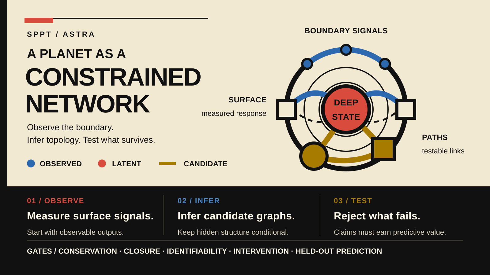

# ASTRA — hidden state, response, and planetary evolution

  

*Reading order: observe boundary signals and measured responses, infer a conditional latent state, then test candidate graphs against declared gates. [Open the full-size vector](docs/sppt-astra-cover.svg). It is a conceptual map, not an observation.*

The sky rarely hands us the interior. We measure light, heat, motion, gravity, fields, chemistry, and delayed change at a boundary, then ask what hidden arrangement could have produced them. Two systems can contain similar ingredients and still evolve differently because their reservoirs connect differently, their phases carry different memories, or their detectors expose different parts of the response.

**ASTRA — Astronomical State-Topology and Reservoir Analysis — starts there.** It treats connectivity, phase, history, and observation as things to infer rather than assume. Its companion theory, Solar-Planetary Phase-Partition Theory (SPPT), describes material and energy reservoirs joined by physically constrained transport and reaction paths. Together they ask a disciplined question: which candidate structures survive conservation, identifiability, counterexamples, and held-out prediction?

> **Status.** SPPT/ASTRA v1.0.7 is the **Current** core reference. The Dark-Medium Response Atlas v0.1.0 and *Earth Is the Instrument* v0.3.0 are **Working paper** publications with their own identities. They are not peer reviewed. The core contains mathematical results under stated hypotheses and reduced synthetic demonstrations; the working papers are methods proposals, not empirical validation. **Draft** and **Archive** materials remain visible in the [publication history](PUBLICATIONS.md).

## Read now

### Current — SPPT/ASTRA v1.0.7

*Phase-Reservoir Topology as a Hidden State Variable in Planetary Evolution* develops the core reservoir-network picture, exact conservation results, state-dependent transport, identifiability limits, and reduced synthetic tests. Its cleanest warning is also one of its most useful results: different hidden networks can produce the same surface response, so a good fit is not automatically a unique interior.

[Read the versioned preprint](https://jkolantree.github.io/astra/v1.0.7/preprint/) · [Read the technical supplement](https://jkolantree.github.io/astra/v1.0.7/supplement/) · [Download the release](https://github.com/jkolantree/astra/releases/tag/v1.0.7) · [Cite the core](CITATION.cff)

The repository retains the release-bound reading copies: [preprint HTML](manuscript/SPPT_ASTRA_preprint_v1.0.7.html), [preprint PDF](manuscript/SPPT_ASTRA_preprint_v1.0.7.pdf), [supplement HTML](manuscript/SPPT_ASTRA_technical_supplement_v1.0.7.html), and [supplement PDF](manuscript/SPPT_ASTRA_technical_supplement_v1.0.7.pdf).

### Working paper — Dark-Medium Response Atlas v0.1.0

*Path, Compensation, Memory, and Observation* asks what an unseen sector would do before deciding what to call it. Dark matter names a gravitational role. Plasma names collective charge response. Aether names a preferred-frame claim. One sector might occupy more than one role, but the words are not evidence of identity.

The Atlas derives a charge-conjugation decoupling result and, under stronger equal-pair fluid assumptions, separate Jeans and Langmuir branches. It also shows why one unbroken gauge symmetry does not automatically provide both a long-range plasma and an ungapped superfluid mode. Three calibration cases — a gravitational pulse, microwave-assisted crystallization, and Centaur 450P/LONEOS — transfer inference structure only: restored controls need not restore state, fitted parameters can compensate, and delayed observations can carry hidden history.

[Read the versioned Atlas](https://jkolantree.github.io/astra/resources/dark-medium-response-atlas/v0.1.0/) · [Download the release](https://github.com/jkolantree/astra/releases/tag/dark-medium-response-atlas-v0.1.0) · [Cite the Atlas](resources/dark-medium-response-atlas/v0.1.0/CITATION.cff)

### Working paper — *Earth Is the Instrument* v0.3.0

This separate, evidence-graded line explores dual-rent seams, local-to-global certificates, geological memory, evidence independence, and bounded arithmetic-seam tests. It is a foundational working paper, not an extension of the core claim matrix.

[Read the versioned edition](https://jkolantree.github.io/astra/resources/earth-is-the-instrument/v0.3.0/) · [Download the release](https://github.com/jkolantree/astra/releases/tag/earth-instrument-framework-v0.3.0) · [Use its citation](resources/earth-is-the-instrument/v0.3.0/#citation)

## What ASTRA notices

A static snapshot often hides the mechanism. A transient can reveal a timescale. A second measurement channel can break an equivalence. An intervention can distinguish two models that fit the same passive record. A missing response can be as informative as a positive one, provided the experiment could have seen what the model predicted.

That is why ASTRA keeps the observation path inside the scientific model. It asks what was forced, what state was prepared, what moved, what remained latent, what the instrument could recover, and which nuisance parameters can imitate the signal. The core synthetic benchmark preserves its negative outcomes: the minimum generating chain wins its training criterion in all 64 frozen realizations, yet an overconnected model has lower held-out error in 23. The point is not to turn one benchmark into a law. It is to make failure visible enough to learn from.

The Atlas extends this response-first discipline to dark-sector questions. Its proposed Causal Residual Spectroscopy protocol begins with a reconstructed gravitational residual, declares the action and symmetries, computes physical response and homogeneous state, identifies parameter equivalence classes, and freezes tests before looking at held-out probes. The protocol is **proposed**. Whether the dominant cosmic residual is particulate, plasma-like, condensed, a preferred-frame field, modified gravity, or a mixture remains **unknown**.

## Read, download, cite, reproduce, or question it

- **Read:** use the versioned links above or enter the [accessible reading room](https://jkolantree.github.io/astra/).
- **Download:** use the tagged release attached to the publication you want; release assets and checksums are the fixed distribution record.
- **Cite:** use that publication’s own citation metadata. The repository-level `CITATION.cff` belongs only to the Current SPPT/ASTRA core.
- **Reproduce:** start with [REPRODUCING.md](REPRODUCING.md), then follow the selected publication’s runtime and package-local instructions.
- **Inspect:** browse the [scientific source tree](resources/README.md), [claim register](CLAIM_MATRIX.json), and [evidence boundary](evidence/README.md).
- **Question it:** [open a scientific, reproducibility, or accessibility issue](https://github.com/jkolantree/astra/issues/new/choose). A useful challenge names the version, claim, observation, and failure mode.

## How the repository is organized

The repository has three connected layers. The reading room serves human-readable editions. The source tree holds manuscripts, code, data, figures, and supplemental packages. The evidence and release tools bind claims and generated bytes to particular versions. Those layers support one another, but they are not interchangeable: a green test is not peer review, a release is not empirical validation, and a draft does not become Current because it is visible in Git.

Use [PUBLICATIONS.md](PUBLICATIONS.md) for the complete publication map, [PROVENANCE.md](PROVENANCE.md) for scope and responsibility, [CONTRIBUTING.md](CONTRIBUTING.md) for public corrections, and [REPRODUCING.md](REPRODUCING.md) for verification routes. Detailed evidence and release records stay in their focused documentation, where they can be precise without making readers learn an internal dialect.

## Authorship, assistance, and rights

Jacko T. chose the questions and final wording and remains responsible for the science, sources, interpretations, code, and publication decisions. OpenAI systems provided substantive assistance with literature organization, adversarial review, equations, code, editing, accessibility, and release engineering. Model output is not a source, experiment, proof, independent verification, or peer review. [Read the full provenance and independence statement](PROVENANCE.md).

Original software is MIT licensed. Original manuscript text, documentation, figures, generated data, and results are generally CC BY 4.0; separately supplied materials retain the terms stated in their package. See [LICENSE_MAP.md](LICENSE_MAP.md) and [THIRD_PARTY_NOTICES.md](THIRD_PARTY_NOTICES.md).
