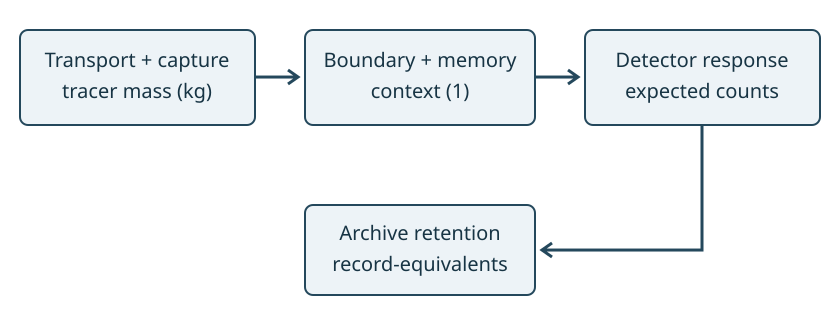

# Status, notation and source roles

**Unversioned review draft. Not peer reviewed. No empirical or runtime admission.**

This supplement describes the reviewed candidate implementation and conditional calculations. It does not relabel the v1.0.7 sources. Source-local claim labels below preserve scientific lineage. The original 93 statements are reproduced here with their scoped candidate support, not archival quotations or blanket validation. The literature section is independent source analysis; no third-party article, data or figure bytes are included.



| Source | Role | Limitation |
|---|---|---|
| `core_contracts.py` | Quantity, stage and calibration declarations | Structure does not authenticate external evidence |
| `integrated_case.py` | Synthetic end-to-end composition | One declared toy case |
| `astra_layers.py`, `boundary_state.py`, `coupling_state.py` | Retained family implementations | Bounded original family scope |
| `finite_scale.py`, `run_scm_checks.py` | SCM controls | Selected finite checks, not all source claims |
| `wki_check_algebra.py`, `evidence_contracts.py` | Identity benchmark and evidence contract | Python 3.12.14 report route checked separately; no runtime admission |
| `admission.py` | Structural bridge declarations | Calibration and empirical readiness remain false |

Table: Implementation roles in the proposed integration.

# Exact synthetic fixture and computation

The source is `data/integrated-core/integrated_case.json`. Values below are copied from that fixture, not newly fitted parameters. The fixture's all-`a` hash and synthetic split names are declared placeholders, not resolved calibration evidence. Identifiability, sampling independence and empirical admission do not follow from those strings.

```json
{
  "case_id": "synthetic:transport-boundary-channel-observation-archive",
  "times_s": [
    0,
    0.5,
    1,
    1.5,
    2
  ],
  "initial_mass_kg": [
    3,
    1
  ],
  "conductance_per_s": 0.2,
  "capture_fraction": 0.25,
  "reference_mass_kg": 1.0,
  "boundary": {
    "bulk_decay": 1.0,
    "boundary_to_bulk": 0.4,
    "direct_gain": 0.5,
    "boundary_drive": 0.8,
    "boundary_time": 0.75
  },
  "channel": {
    "persistence": 0.5,
    "drive": 0.2,
    "direct_gain": 0.6,
    "memory_gain": 0.3,
    "interaction_gain": 0.1,
    "offset": 0.0
  },
  "detector_count_per_kg": 100.0,
  "efficiency": 0.5,
  "reset_after_intervals": 2,
  "archive_retention": 0.25,
  "calibration": {
    "status": "declared-verified",
    "artifact_sha256s": [
      "aaaaaaaaaaaaaaaaaaaaaaaaaaaaaaaaaaaaaaaaaaaaaaaaaaaaaaaaaaaaaaaa"
    ],
    "training_root": "synthetic:training",
    "calibration_root": "synthetic:calibration",
    "holdout_root": "synthetic:holdout",
    "unit": "count/kg"
  }
}
```

For equal unit capacities the two-reservoir preparation has generator

$$G=\begin{pmatrix}-k&k\\k&-k\end{pmatrix},\quad m(t)=e^{Gt}m(0),\quad k=0.2\;\mathrm{s}^{-1}.$$

The retained SPPT weighted-inventory and species-tendency functions independently check the mass rate. At preparation end, capture moves a declared fraction of reservoir two into a separate sample. The external-plus-captured ledger closes against the original mass. No observation count enters this mass equation.

The boundary model takes captured mass/reference mass as a step amplitude. Its bulk coordinate drives the discrete Xi channel. Channel persistence is per uniform exposure interval. The scalar context changes detector efficiency through $\eta_0/(1+c)$; it does not change physical transport. Non-destructive reuse of the sample and the first-moment detector are explicit toy assumptions.

The no-leak archive uses $E_j/\Delta t_j$ as its production rate, adding $E_j$ expected record-equivalents per bin. The retention reset is applied after the declared complete interval. The stock plus erased record-equivalents equals the sum of input expectations within the implementation's finite residual threshold. This is not a claim about realized stochastic counts or historical record preservation.

# Interface failures and scope controls

Negative tests reject mismatched space, unit, quantity and ordered basis; invalid or nonfinite inputs; invalid exposure grids; and unsupported likelihood/exclusion requests. Missing efficiency has unavailable output, while zero expected output is allowed. The zero-denominator normalized composition is null. Calibration declarations remain distinct from authenticated calibration data and independent splits.

Strong lumpability of a supplied finite transition matrix and instantaneous output constancy are distinct diagnostics. They are not a generic criterion for all nonlinear reduced systems. Jacobian rank is first-order sensitivity; $\theta^3$ at zero shows why a zero derivative does not settle local injectivity. No general nonlinear or global identifiability result is claimed.

# Conditional balanced-gradient result

The following project-authored proof is retained with its assumptions and boundaries. It is mathematical reasoning, not an empirical SCM result.

### Proposition

Let an open connected domain Ω in R² carry its Euclidean metric, and let u,v belong to C²(Ω). Suppose, at every point,

\[
|\nabla u|=|\nabla v|,
\qquad \nabla u\cdot\nabla v=0.
\]

Then both u and v are harmonic on all of Ω. The same local statement holds in flat periodic coordinates on a two-dimensional torus. Critical points, critical sets with interior, and possible choices of orientation on different regular components do not invalidate the proof.

### Proof across the critical set

Put K={x:∇u(x)=0}. Equal gradient lengths imply ∇v=0 on K as well. On its open complement $R=\Omega\setminus K$, there is a sign σ in {+1,−1} such that

\[
\nabla v=\sigma J\nabla u,
\qquad J(p,q)=(-q,p).
\]

Indeed, the two equal nonzero orthogonal vectors in R² differ by one of the two ninety-degree rotations. The sign equals det(∇u,∇v)/|∇u|², a continuous function with values in {+1,−1}; it is therefore locally constant on R. Consequently each regular point has a neighborhood on which

\[
v_x=-\sigma u_y,
\qquad v_y=\sigma u_x.
\]

Equality of mixed derivatives gives

\[
0=(v_y)_x-(v_x)_y=\sigma(u_{xx}+u_{yy}),
\qquad v_{xx}+v_{yy}=\sigma(-u_{yx}+u_{xy})=0.
\]

Thus Δu=Δv=0 on R. On the interior of K, both gradients vanish identically, so u and v are locally constant and their Laplacians again vanish. The set R∪int(K) is dense in Ω: its complement is the boundary of the relatively closed set K, which has empty interior. Since u,v are C², their Laplacians are continuous; they therefore vanish on all of Ω. This step explicitly covers the boundary of every critical component. No global orientation assumption is needed.

### Two consequences

**Flat torus.** If u,v are smooth periodic scalar functions on a connected flat torus T², harmonicity and periodic integration by parts imply

\[
\int_{T^2}|\nabla u|^2=-\int_{T^2}u\,\Delta u=0,
\qquad
\int_{T^2}|\nabla v|^2=0.
\]

Hence u and v are constant. Nonconstant globally balanced periodic fields do not exist under these assumptions. Constant normalized wavefunctions do exist: |ψ|²=1/Vol(T²), with arbitrary constant phase. Their gradients and geometric kinetic energy vanish.

**Whole plane.** If u,v belong additionally to L²(R²), the harmonic mean-value property and Cauchy–Schwarz imply, for every x and R>0,

\[
|u(x)|=\left|\frac{1}{\pi R^2}\int_{B_R(x)}u(y)\,dy\right|
\le\frac{\|u\|_{L^2(R^2)}}{\sqrt{\pi}\,R}.
\]

Letting R→∞ gives u(x)=0; the same argument gives v(x)=0. Therefore no nonzero, normalized C²∩L²(R²) state is globally balanced on the whole plane.

### Scope for the finite-scale model

For ψ=u+iv in d=2, the balanced rank-two condition is precisely the pair of equations in the proposition. The algebraic identity A∇ψ=∇ψ remains correct. The new result sharply limits its globally balanced smooth realization: on a flat periodic base only the trivial constant-gradient-zero sector survives; on R² no normalized whole-plane state survives. It strengthens the earlier existence caveat without changing the local energy identity or isolated-point qualification.

This is not a result for d≥3, nonsmooth fields, nontrivial bundles, multivalued fields, or arbitrary boundary conditions. For example, nonconstant balanced fields occur on bounded planar domains: ψ(z)=√(2/π)z on the unit disk is smooth, balanced, and has integral |ψ|² equal to one, though it is not periodic and does not obey homogeneous Dirichlet boundary data. No time-invariance conclusion follows from this static argument.


# Potential-WKI identity and remaining limits

For constant positive parameters, differentiating the potential equation with $w=a\psi_x$ gives

$$iw_t+\beta\partial_x^2\left(\frac{w}{\sqrt{1+|w|^2}}\right)=0.$$

Recovering $\psi$ requires an integration/mean datum and the appropriate boundary conditions. In a local smooth graph chart, $h=a\psi$ has the graph-gauge binormal form described in the retained WKI correction note. Its prior-art demotion is retained as source-reported, not newly verified priority.

For the declared helical background, with $s=a^2A^2k^2$, $g=1+s$, curvature $\chi=aAk^2/g$, torsion $\tau=k/g$ and $p=Q/\sqrt g$, the real continuous-mode expression is

$$\gamma^2=\frac{\beta^2Q^2(k^2s-gQ^2)}{g^3}=\beta^2p^2(\chi^2-p^2),\qquad \gamma_{\max}=\frac{\beta\chi^2}{2}.$$

The normalized $1/8$ substitution is a benchmark. A discrete domain may not admit the maximizing mode. Marginal sectors, nonlinear integration and the transformed-background R6 comparison remain open. The six identity groups do not provide executable support for CVG-06/07 or reaudit CVG-08–12. The existing WKI runtime report contract names Python 3.12.14, SymPy 1.14.0 and mpmath 1.3.0, while the historical Linux baseline uses Python 3.12.10. The proposed unified successor selects Python 3.12.14 with the pinned Linux numerical libraries and a separate uv-based offline contract. Its exact interpreter provenance and complete verification remain outstanding; no validator or historical authority has been relaxed.

SCM controls continue to distinguish norm preservation from common unitarity and retain ordinary-boost, spectator, ensemble and mirror limitations. Density/instrument/no-signalling completion remains unadmitted. Mathematical correspondence is not empirical superiority.

# Comparative study requirements

### Comparative publication boundary

No empirical superiority is admitted by this candidate. Formal identities, numerical residuals, invariant checks, synthetic integration PASS, deliberately mismatched controls and favorable-generator examples are separate evidence classes. A negative control is not a tuned baseline. Equal parameter count is not equal search effort, information, sensor access or deployment cost.

Any performance claim must identify versioned implementations of the proposed method and strong conventional alternatives; disclose each search space, optimizer, validation rule, trials/restarts, failures, training/calibration data and compute budget; freeze preprocessing, metrics, effect thresholds and splits before holdout access; and report paired held-out outcomes, calibration, uncertainty, dependence and multiplicity. Compare at matched information and declared resource budgets, or publish performance-versus-cost curves and explain unavoidable differences. Charge extra boundary sensors, calibration, interventions and prior domain knowledge to the method using them. A small p-value against a weak comparator does not establish superiority over the relevant model class.

Memory comparisons must include conventional state-space/system-identification, appropriately tuned lag/kernel, adaptation/hysteresis, drift/covariate and physical transport alternatives selected for the domain. A one-mode or two-lag straw comparator cannot establish that named boundary or coupling states are preferable; equivalent hidden-state realizations and unidentifiable physical labels remain possible.

SCM comparisons require the same preparation, observable, normalization, boundary conditions, noise and instrument law for linear evolution and appropriate conventional nonlinear laws (including Kerr/cubic NLS where physically applicable, dispersion/interactions and medium models). WKI/Hasimoto identities establish mathematical correspondence, not an empirical win. A lone plane-wave global phase is not an operational quantum observable. Failed boost, spectator and mixture controls remain failures of the naive proposal.

No CMB-to-holography result is supplied. A generic anomaly or low null-model p-value is not p(data|holography), a likelihood ratio, Bayes factor or posterior odds. Any such future claim requires a specific holographic generative/observation model and calibrated alternatives (including the applicable conventional cosmology, foregrounds, instrument/systematic models), common data/masks/statistic selection, nuisance treatment, trials/look-elsewhere accounting, prior sensitivity for evidence ratios, and a frozen predictive test. No likelihood value or inference is invented here.

Any future comparative submission must bind its exact source bytes and claim text, disclose missing comparison evidence, and account for changed or omitted review coverage. This public proposal supplies policy requirements, not an executable comparison-admission gate. Documentation completeness would still require scientific review; it never grants rights, empirical admission or publication authorization. Archival source statements remain outside this public selection. The claims register carries scoped conclusions and test limits; archival quotations must not be promoted.

The proposed G1–G10 comparison policy also requires both best-practice and matched-cost comparisons, prior evaluation exposure history, practical effect margins, dependence-aware paired uncertainty, failed-run and multiplicity accounting, controlled ablations and independent reconstruction. Reusing a benchmark to repair or select a model makes it development evidence; fresh seeds alone do not restore a confirmatory test. Missing evidence is NOT_ASSESSED, and superiority remains BLOCKED. A narrow descriptive or null study can still be reported without a superiority claim. Kerr here means applicable Kerr-medium/cubic-NLS nonlinearity, not the Kerr spacetime metric; analogue-gravity claims are separate. Checklist completeness is not scientific certification.


# Bibliographic verification and proposed bridge tests

Checked 6 October 2026 by independent public-source reviews. Every DOI identity was verified within the access stated below. A published date is not necessarily a final Version of Record. Metadata identity, accessible text, a listed dataset and cryptographically verified bytes are different statuses. No local article/data hashes or target-system numerical reproduction were obtained in these citation reviews. These examples do not establish ASTRA validity, novelty or performance.

The record keys BC001–BC008 denote research questions. BC004 is a method-transfer caution. BC008 uses source/version-tracing test cases rather than an unqualified direct-domain evidence label. The executable bridge fixtures still deny empirical admission. Unresolved access and support issues remain pending.


## Pointer 1 — BC001

**Cassini CDA observes compositional segregation of Enceladus’ ice grains from slow freezing and fragmentation of oceanic spray**. Frank Postberg et al.. Science Advances 12(39), eaee7256; 25 September 2026. [DOI](https://doi.org/10.1126/sciadv.aee7256); [inspected source](https://pubmed.ncbi.nlm.nih.gov/42789710/).

**Version/access:** Published journal article; PubMed abstract inspected; publisher retrieval failed and PMC browser check; full text, supplement and license unverified.

**Bounded mapping (direct-domain-question):** Grain heterogeneity and proposed freezing/fragmentation motivate source reconstruction. The complete transport, selection and detector inverse chain is not established by the abstract.

**Pending:** Full instrument response, uncertainty and identifiability of the complete chain remain unresolved.

## Pointer 2 — BC002

**Visible light leaves evaporation and interfacial structure of neat water unchanged at the air–water interface**. Yucong Chen et al.. PNAS 123(38), e2615377123; online 14 September, issue 22 September 2026. [DOI](https://doi.org/10.1073/pnas.2615377123); [inspected source](https://pmc.ncbi.nlm.nih.gov/articles/PMC13598155/).

**Version/access:** Published article; CC BY 4.0; indexed PMC methods/results inspected, direct browser check; supplement not inspected.

**Bounded mapping (method-transfer):** No measurable enhancement or structural change under the tested planar neat-water conditions. This bounded negative result must accompany the 2024 positive claim; it does not cover every material or geometry.

**Pending:** Supplement detection limits and matched-protocol reconciliation remain unresolved.

## Pointer 3 — BC002

**Photomolecular effect: Visible light interaction with air–water interface**. Guangxin Lv; Yaodong Tu; James H. Zhang; Gang Chen. PNAS 121(18), e2320844121; online 23 April, issue 30 April 2024. [DOI](https://doi.org/10.1073/pnas.2320844121); [inspected source](https://pmc.ncbi.nlm.nih.gov/articles/PMC11067046/).

**Version/access:** Published article; CC BY-NC-ND 4.0; indexed PMC sections inspected, direct browser check; supplement not inspected.

**Bounded mapping (method-transfer):** Authors report enhanced evaporation under particular illumination and removal conditions. Nonthermal cluster ejection is a disputed interpretation; the thermal-limit comparison depends on absorbed fraction.

**Pending:** Independent reanalysis and matched absorption, illumination, temperature, humidity, geometry and transport controls are needed.

## Pointer 4 — BC003

**Largest eigenvalue statistics of wavefront shaping in complex scattering media**. Grégory Schehr; Hasan Yılmaz. Nature Communications 17, 10129; 30 September 2026. [DOI](https://doi.org/10.1038/s41467-026-77933-y); [inspected source](https://www.nature.com/articles/s41467-026-77933-y).

**Version/access:** Version of Record; CC BY 4.0; publisher Results/Discussion/Methods inspected; supplements not inspected; raw matrices on request.

**Bounded mapping (direct-domain-question):** Finite-channel distribution theory applies when long-range correlations are negligible; excess fluctuations appear in strongly scattering cases. Finite channel count is not a general detector-aperture correction theorem.

**Pending:** Correlated extreme-eigenvalue prediction, detector-specific mapping and raw-data reproduction remain open.

## Pointer 5 — BC004

**Singular Basins in Multiscale Systems: Tunneling between Stable States**. S. Yanchuk; S. Wieczorek; H. Jardón-Kojakhmetov; H. Alkhayuon. Physical Review Letters 137, 147202; published 28 September, issue 2 October 2026. [DOI](https://doi.org/10.1103/jtkh-9lz5); [inspected source](https://journals.aps.org/prl/abstract/10.1103/jtkh-9lz5).

**Version/access:** Published article; CC BY 4.0; seven-page publisher PDF inspected; supplement not inspected.

**Bounded mapping (method-transfer):** Singular funnels can change full-system basin geometry relative to a reduced model. This challenges a basin-preservation assumption; it does not show that ASTRA has or avoids such funnels.

**Pending:** Specify target equations, small parameter, perturbations and time horizon. Asymptotic basins are not finite observation-time guarantees.

## Pointer 6 — BC004

**Canard Cascading in Networks with Adaptive Mean-Field Coupling**. Juan Balzer; Rico Berner; Kathy Lüdge; Sebastian Wieczorek; Jürgen Kurths; Serhiy Yanchuk. Physical Review Letters 133, 237401; published 2 December, issue 6 December 2024. [DOI](https://doi.org/10.1103/PhysRevLett.133.237401); [inspected source](https://journals.aps.org/prl/abstract/10.1103/PhysRevLett.133.237401).

**Version/access:** APS abstract inspected; journal PDF failed; Cork identifies an accepted manuscript not fetched; arXiv:2407.20758v1 is a separate preprint.

**Bounded mapping (method-transfer):** Adaptive laser networks exhibit sequential slow-fast switching through canard dynamics. The example is not a basin-preservation theorem.

**Pending:** Journal full text and supplements are needed before assigning finite-timescale thresholds to the target model.

## Pointer 7 — BC005

**Anthropogenic warming-driven atmospheric circulation shifts and angular momentum increase: influence on the Earth’s rotation**. Susmit Subhransu Satpathy et al.. npj Climate and Atmospheric Science 9, 101; first publication 20 March; Version of Record 22 April 2026. [DOI](https://doi.org/10.1038/s41612-026-01382-z); [inspected source](https://www.nature.com/articles/s41612-026-01382-z).

**Version/access:** Publisher full text inspected; Crossmark current in the audit; CC BY-NC-ND 4.0; earlier unedited PDF is a different version; code on request.

**Bounded mapping (direct-domain-question):** Explicit atmospheric mass/motion bookkeeping and a simplified atmosphere/shell exchange motivate reservoir accounting. The scenarios do not certify an arbitrary combined rotation budget.

**Pending:** Combining with surface-mass transport requires compatible baselines, loading and pressure conventions and overlap checks.

## Pointer 8 — BC005

**The increasingly dominant role of climate change on length of day variations**. Mostafa Kiani Shahvandi; Surendra Adhikari; Mathieu Dumberry; Siddhartha Mishra; Benedikt Soja. PNAS 121(30), e2406930121; online 15 July, issue 23 July 2024. [DOI](https://doi.org/10.1073/pnas.2406930121); [inspected source](https://pmc.ncbi.nlm.nih.gov/articles/PMC11287281/).

**Version/access:** Published article; CC BY-NC-ND 4.0; ETH-hosted publisher PDF inspected (cover plus seven article pages); supplement not inspected.

**Bounded mapping (direct-domain-question):** Surface-mass contributions are compared with satellite-laser-ranging J2 and residual GIA treatment. Our accounting inference is that geodetic observables constrain a budget rather than form extra reservoirs.

**Pending:** Joint accounting still requires shared conventions, covariance and explicit overlap tests.

## Pointer 9 — BC006

**An anatomical map of squid lateral lines**. Haoming Wang; Carsten Wolff; Nicolas Pintozzi; Anna-Maria Petriv; Brian M. McDermott Jr.. Current Biology 36(18), R971–R972; 21 September 2026. [DOI](https://doi.org/10.1016/j.cub.2026.07.056); [inspected source](https://pubmed.ncbi.nlm.nih.gov/42767195/).

**Version/access:** Published article; PubMed bibliography/abstract inspected; publisher full text failed; license, supplement and perturbation protocol unverified.

**Bounded mapping (method-transfer):** An anatomical map and projections in Doryteuthis pealeii paralarvae motivate functional tests. The likely sensory function is not a measured frequency-tuning law or demonstrated intervention effect.

**Pending:** Within-species response and perturbation evidence is needed; no human-hearing or cross-species mechanism transfer is established.

## Pointer 10 — BC006

**Auditory pathway for detection of vibration in the tokay gecko**. Dawei Han; Catherine E. Carr. Current Biology 34(21), 4908–4919.e3; online 4 October, issue 4 November 2024. [DOI](https://doi.org/10.1016/j.cub.2024.09.016); [inspected source](https://pmc.ncbi.nlm.nih.gov/articles/PMC11537832/).

**Version/access:** PMC text is an author manuscript, available 4 November 2025, not publisher Version of Record. Dataset v1 landing page inspected, raw downloads/code not inspected.

**Bounded mapping (method-transfer):** Tract tracing and single-unit recordings connect anatomy with low-frequency vibration responses. Selectively altering the anatomy requires a separate causal experiment.

**Pending:** Mendeley r6fnxpnmmc/1 lists raw recordings under CC BY 4.0; actual bytes and analysis code need verification.

## Pointer 11 — BC006

**Thermodynamic Signatures of Sensing and Amplification by Periodically Driven Hair-Cell Bundles**. Yanathip Thipmaungprom; Laila Saliekh; Rodrigo Alonso; Édgar Roldán; Florian Berger; Roman Belousov. PRX Life 4, 013039; 31 March 2026. [DOI](https://doi.org/10.1103/6wcm-z333); [inspected source](https://journals.aps.org/prxlife/abstract/10.1103/6wcm-z333).

**Version/access:** Publisher 13-page PDF inspected; CC BY 4.0. Supplement link redirected to article; individual data files not verified.

**Bounded mapping (method-transfer):** Bullfrog recordings inform a stochastic model with distinct energy-flow regimes under forcing. Separate measured outputs from latent model states and predictions.

**Pending:** This is not a squid/gecko perturbation study; no paper efficiency is ASTRA performance. Target-system transfer remains untested.

## Pointer 12 — BC007

**The role of group attachment security in minority opinion expression in decision making groups**. Tae Hyun Kim; Sujin Lee; Zoe Kinias; Seungwon Jeong. Scientific Reports; published 4 August 2026; final volume/article number unverified. [DOI](https://doi.org/10.1038/s41598-026-65147-7); [inspected source](https://www.nature.com/articles/s41598-026-65147-7).

**Version/access:** Publisher explicitly labels early peer-reviewed accepted version, to be replaced by final Version of Record; abstract inspected; linked PDF failed; underlying data access unverified.

**Bounded mapping (method-transfer):** Two experiments concern dissent focus, persuasiveness and uptake. Argument quality differs and omnibus interactions are generally non-significant. These outcomes are not independently verified correction quality.

**Pending:** A protected-challenge test needs matched resources, randomized conditions, independent answers, blinded scoring and false-correction costs.

## Pointer 13 — BC008

**Mini-breaths and vocal-fry-like laryngeal register alleviate respiratory constraints on tokay (Gekko gecko) mating vocalizations**. Mathilde S. Fuglsang Thastum; Danuta M. Wisniewska; Jakob Christensen-Dalsgaard; Coen P. H. Elemans. Proceedings of the Royal Society B 293(2079), 20261077; 23 September 2026. [DOI](https://doi.org/10.1098/rspb.2026.1077); [inspected source](https://pubmed.ncbi.nlm.nih.gov/42772768/).

**Version/access:** PubMed abstract inspected; publisher/university full-text retrieval failed; final CC BY PDF listing does not verify its bytes.

**Bounded mapping (source-version-tracing-test-case):** Calling/respiratory associations and interpretation strength make a source-tracing case. Zenodo v1 lists 370.9 MB; v2 rendered a 7.2 kB README listing, which does not prove deletion or completeness.

**Pending:** Pin an exact statement, analysis and dataset version; retrieve/hash bytes. Listing and availability statements are not a completed provenance test.

## Pointer 14 — BC008

**Observation of Time-Reversal Symmetry Breaking in the Type-I Superconductor YbSb2**. Anshu Kataria et al.. Physical Review Letters 137, 136002; published 23 September 2026. [DOI](https://doi.org/10.1103/drzq-lfn5); [inspected source](https://journals.aps.org/prl/abstract/10.1103/drzq-lfn5).

**Version/access:** Published APS abstract inspected; full text and supplements require subscription. arXiv:2601.07460v1 (12 January 2026) is a distinct preprint, not the journal version.

**Bounded mapping (source-version-tracing-test-case):** Published language treats topological superconductivity/Majorana modes as possibilities; the preprint claims more strongly. Bind claim strength to version; broken time-reversal symmetry is not reversal of time or observed Majorana modes.

**Pending:** Exact source location and artifact bytes remain to be verified for a target provenance evaluation.

## Pointer 15 — BC008

**Dark Matter Search Results from 4.2 Tonne–Years of Exposure of the LUX-ZEPLIN (LZ) Experiment**. J. Aalbers et al. (LZ Collaboration). Physical Review Letters 135, 011802; published 1 July, issue 2 July 2025; corrected 13 August 2025. [DOI](https://doi.org/10.1103/4dyc-z8zf); [inspected source](https://journals.aps.org/prl/abstract/10.1103/4dyc-z8zf).

**Version/access:** Publisher 11-page PDF inspected; CC BY 4.0; correction concerns a production typo in an inline equation after Table I. Supplement/raw-data reanalysis not performed.

**Bounded mapping (source-version-tracing-test-case):** No excess over expected backgrounds and exclusion constraints, not a discovery. Use the corrected article as a version-grounding test; the correction does not imply changed detection conclusions.

**Pending:** A DOI is not an immutable byte identity. Pin selected corrected equation and supporting files; no local article/data hashes were computed in the citation audit.


## Target-system questions

BC006 should ask whether a target-system anatomical map, independently measured sensory response and controlled perturbation distinguish specified structure–function hypotheses. The squid, gecko and bullfrog papers supply different methodological components, not a common validated mechanism.

BC007 should ask whether a predefined protected-challenge protocol improves independently verified correction quality at matched time and resources, including false-correction cost. Dissent uptake or persuasiveness is not its endpoint.

BC008 should test retrieval of the exact supporting version, location and bytes for each selected consequential statement, including changed claim strength, corrections and unavailable evidence. Record DOI, version/date, retrieval timestamp, resolved URL, format, byte count, locally computed hash and supporting location. These are proposed evaluation requirements, not completed ASTRA properties.

# New-edition diagram atlas and source bindings

These thirteen explanatory diagrams describe the implemented synthetic contracts and bounded mathematics. Each is generated from `diagram-specs.json` by the reviewed Matplotlib renderer. The figure-input record binds each SVG's exact bytes before document embedding. The source snapshot binds the specification, renderer, claim records and cited implementation files. Byte identity establishes repeatability; it does not establish empirical truth or historical equivalence.

All 93 claim records below retain their existing statements and support labels. A source reference connects a diagram to its implementation context, not to blanket validation of the source family's claims. Expected counts and record-equivalents are not observations, and no common microscopic completion follows.

## One synthetic integrated pipeline


**Status:** implemented synthetic fixture.

**Readable diagram content:** Preparation: Two tracer reservoirs; closed linear exchange; Capture / context: Fractional sample capture; normalized boundary drive; Observation: Discrete context channel; expected detector counts; Archive: Expected record-equivalents; retention reset.

**Equation or boundary:** physical mass → declared response → expected counts → record-equivalents.

**Directed connections:** Preparation to Capture / context; Capture / context to Observation; Observation to Archive.

**Source paths:** `src/integrated_case.py`, `docs/integrated-core/model-contract.md`, `docs/integrated-core/claims.json`, `docs/integrated-core/claim-test-map.json`, `tests/test_integration.py`. Exact hashes are in the source-bound specification.

Arrows denote declared interfaces, not one shared microscopic law. No fitted or observed data.

## Conservative preparation and capture


**Status:** implemented mass ledger.

**Readable diagram content:** Reservoir 0: Tracer mass m0 [kg]; Reservoir 1: Tracer mass m1 [kg]; Remaining: (1 − f) of selected sample; Captured: f of selected sample.

**Equation or boundary:** dm0/dt = −k(m0 − m1);   dm1/dt = +k(m0 − m1).

**Directed connections:** Reservoir 0 to Reservoir 1 (exchange); Reservoir 1 to Reservoir 0 (exchange); Reservoir 1 to Remaining (capture split); Reservoir 1 to Captured (capture split).

**Source paths:** `src/integrated_case.py`, `src/astra_reservoir.py`, `src/boundary_state.py`, `docs/integrated-core/claims.json`, `docs/integrated-core/claim-test-map.json`, `tests/test_integration.py`. Exact hashes are in the source-bound specification.

Equal unit capacities and a closed two-reservoir fixture. Capture redistributes declared mass; it does not create it.

## Types constrain each interface


**Status:** implemented engineering contract.

**Readable diagram content:** Input identity: Space · quantity · unit; ordered basis · finite values; Stage contract: Edge type and mechanism; model identity and claim keys; Composition: All type coordinates match; context declared separately; Certificate: Only named ledger checks; explicit failure scope.

**Equation or boundary:** physical transport cannot cast mass into counts or energy.

**Directed connections:** Input identity to Stage contract; Stage contract to Composition; Composition to Certificate.

**Source paths:** `src/core_contracts.py`, `src/integrated_case.py`, `docs/integrated-core/claims.json`, `docs/integrated-core/claim-test-map.json`, `tests/test_integration.py`. Exact hashes are in the source-bound specification.

Type agreement is an engineering condition; it does not calibrate a detector or establish physical validity.

## A relaxing boundary is an explicit state


**Status:** bounded linear model.

**Readable diagram content:** Declared forcing u: Captured mass / reference mass; constant during this exposure; Boundary state b: db/dt = (q u − b) / τ; finite relaxation time τ > 0; Bulk context x: dx/dt = −a x + c b + d u; a > 0; Output context: Bulk x feeds discrete channel; no mass-to-count transport.

**Equation or boundary:** a = bulk_decay; c = boundary_to_bulk; d = direct_gain; q = boundary_drive.

**Directed connections:** Declared forcing u to Boundary state b (drive); Declared forcing u to Bulk context x (direct); Boundary state b to Bulk context x (coupling); Bulk context x to Output context (readout).

**Source paths:** `src/boundary_state.py`, `src/integrated_case.py`, `docs/integrated-core/claims.json`, `docs/integrated-core/claim-test-map.json`, `tests/test_integration.py`. Exact hashes are in the source-bound specification.

This is the selected synthetic constitutive model. It is not a universal interface law or calibrated response.

## Memory is per exposure interval


**Status:** bounded discrete recurrence.

**Readable diagram content:** Input x[n]: Bulk context at sample n; Stored m[n]: Memory before the update; Output y[n]: Direct + memory + interaction; plus declared offset; Next memory: m[n+1] = r m[n] + d x[n]; 0 ≤ r < 1.

**Equation or boundary:** y[n] = offset + direct_gain x[n] + memory_gain m[n] + interaction_gain x[n] m[n].

**Directed connections:** Input x[n] to Output y[n] (direct); Stored m[n] to Output y[n] (memory); Input x[n] to Next memory (drive); Stored m[n] to Next memory (persistence).

**Source paths:** `src/coupling_state.py`, `src/integrated_case.py`, `docs/integrated-core/claims.json`, `docs/integrated-core/claim-test-map.json`, `tests/test_integration.py`. Exact hashes are in the source-bound specification.

Persistence belongs to the declared interval; changing the grid is not automatically the same physical model.

## Expected counts need an observation law


**Status:** implemented first moment only.

**Readable diagram content:** Captured mass: Same non-destructive sample; reused each exposure; Detector response: Declared count/kg scale; efficiency / (1 + context); First moment: Expected count per interval; zero is a valid expectation; Missing efficiency: Unavailable expectation; no invented archive stock.

**Equation or boundary:** expected count = mass × count-per-kg response × effective efficiency.

**Directed connections:** Captured mass to Detector response (input); Detector response to First moment (known efficiency); Detector response to Missing efficiency (unknown efficiency).

**Source paths:** `src/core_contracts.py`, `src/integrated_case.py`, `docs/integrated-core/claims.json`, `docs/integrated-core/claim-test-map.json`, `tests/test_integration.py`. Exact hashes are in the source-bound specification.

This does not specify Poisson noise, realized observations, likelihoods, posterior odds or null exclusion.

## A record ledger is not an observation likelihood


**Status:** implemented expected-stock ledger.

**Readable diagram content:** Interval expectation: Expected count in each bin; Production rate: Bin expectation / duration; no-leak archive model; Retention reset: Keep declared fraction; record erased expectation; Ledger closure: Stock = produced − erased; record-equivalent units.

**Equation or boundary:** one expected count maps to one expected record-equivalent in this toy adapter.

**Directed connections:** Interval expectation to Production rate; Production rate to Retention reset; Retention reset to Ledger closure.

**Source paths:** `src/integrated_case.py`, `docs/integrated-core/scientific-boundaries.md`, `docs/integrated-core/claims.json`, `docs/integrated-core/claim-test-map.json`, `tests/test_integration.py`. Exact hashes are in the source-bound specification.

Record-equivalents are neither physical mass nor measured records. Missingness does not identify its cause.

## The executable result has a bounded meaning


**Status:** synthetic computation and controls.

**Readable diagram content:** Frozen input: Explicit times and parameters; synthetic case identity; Actual calculation: Reservoir and boundary solve; discrete memory / response; Finite checks: Mass and record ledgers; source-bound result report; Unmet evidence: Calibration and empirical flags; remain false.

**Equation or boundary:** COMPLETED_SYNTHETIC does not mean empirical admission.

**Directed connections:** Frozen input to Actual calculation; Actual calculation to Finite checks; Finite checks to Unmet evidence.

**Source paths:** `data/integrated-core/integrated_case.json`, `src/integrated_case.py`, `docs/integrated-core/scientific-boundaries.md`, `docs/integrated-core/claims.json`, `docs/integrated-core/claim-test-map.json`, `tests/test_integration.py`. Exact hashes are in the source-bound specification.

The new runs execute the fixture. No random realization, planetary validation or SCM-to-core physical identification is supplied.

## SCM checks retain their counterexamples


**Status:** nine finite replay families.

**Readable diagram content:** Finite controls: Selected algebra / residuals; not all 32 source claims; Norm boundary: Norm preservation is not; common linear unitarity; Failure controls: Ordinary boost failure; spectator / ensemble dependence; Open completion: Density and instrument law; no-signalling not admitted.

**Equation or boundary:** a passed control can demonstrate a failure of a naive proposal.

**Directed connections:** Finite controls to Norm boundary; Norm boundary to Failure controls; Failure controls to Open completion.

**Source paths:** `scripts/scm_replay_checks.py`, `docs/integrated-core/scientific-boundaries.md`, `docs/integrated-core/claims.json`, `docs/integrated-core/claim-test-map.json`. Exact hashes are in the source-bound specification.

No empirical quantum or gravity validation. Companion recurrence remains prose/proposed tests, without ODE/data replay.

## Balanced gradients: a conditional d = 2 result


**Status:** bounded mathematical proposition.

**Readable diagram content:** Assumptions: u, v ∈ C² on connected planar Ω; equal orthogonal gradients; Local result: Δu = Δv = 0; including critical-set boundary; Flat torus: Smooth periodic scalar fields; are constant; Whole plane: Additional L²(R²) assumption; forces u = v = 0.

**Equation or boundary:** |∇u| = |∇v|   and   ∇u · ∇v = 0.

**Directed connections:** Assumptions to Local result (proof); Local result to Flat torus (periodic); Local result to Whole plane (square integrable).

**Source paths:** `docs/integrated-core/balanced-d2-proof.md`, `docs/integrated-core/scientific-boundaries.md`, `docs/integrated-core/claims.json`, `docs/integrated-core/claim-test-map.json`. Exact hashes are in the source-bound specification.

No d ≥ 3, arbitrary-boundary or nonsmooth theorem. No claim that balance persists under evolution.

## Potential WKI: local correspondence


**Status:** known-family identity; no novelty priority.

**Readable diagram content:** Potential equation: i ψ_t = −β ∂x[ψ_x / √(1+a²|ψ_x|²)]; Differentiate: w = a ψ_x; constant a > 0 and β > 0; WKI slope equation: i w_t + β ∂xx[w / √(1+|w|²)] = 0; Recovery boundary: Spatial mean / integration data; needed to recover the potential.

**Equation or boundary:** smooth local graph chart; a = 0 is a separate linear limit.

**Directed connections:** Potential equation to Differentiate; Differentiate to WKI slope equation; WKI slope equation to Recovery boundary.

**Source paths:** `scripts/wki_check_algebra.py`, `docs/integrated-core/wki-correction.md`, `docs/integrated-core/scientific-boundaries.md`, `docs/integrated-core/claims.json`, `docs/integrated-core/claim-test-map.json`. Exact hashes are in the source-bound specification.

The inherited correction records antecedents and incomplete access. This edition adds no literature-priority finding or global boundary equivalence.

## Growth identity: what 1/8 does and does not show


**Status:** six finite symbolic groups.

**Readable diagram content:** Helical background: Declared constant parameters; curvature χ, axial wave Q; Coordinate relation: p = Q / √g; on the unperturbed helix; Growth identity: γ² = β² p²(χ² − p²); continuous-mode maximum; Normalized value: γmax = βχ² / 2 = 1/8; when β = a = A = k = 1.

**Equation or boundary:** finite symbolic equality ≠ a PDE spectrum or nonlinear integration.

**Directed connections:** Helical background to Coordinate relation; Coordinate relation to Growth identity; Growth identity to Normalized value.

**Source paths:** `scripts/wki_check_algebra.py`, `docs/integrated-core/wki-correction.md`, `docs/integrated-core/scientific-boundaries.md`, `docs/integrated-core/claims.json`, `docs/integrated-core/claim-test-map.json`. Exact hashes are in the source-bound specification.

Discrete-domain attainability, marginal sectors and the R6 transformed-background comparison remain unresolved.

## Reproducibility and admission are separate


**Status:** private successor proposal.

**Readable diagram content:** Source / runtime: Exact source and tool identities; explicit split interpreter routes; Fresh production: Empty output locations twice; exact inventory and byte comparison; Scientific boundary: Historical comparisons retained; new schematics non-equivalent; Review / publication: Source, runtime, Pages admission; then separately authorized release.

**Equation or boundary:** no version, tag, clean committed release identity or public admission is selected.

**Directed connections:** Source / runtime to Fresh production; Fresh production to Scientific boundary; Scientific boundary to Review / publication.

**Source paths:** `docs/integrated-core/scientific-boundaries.md`, `docs/integrated-core/model-contract.md`, `docs/integrated-core/claims.json`, `docs/integrated-core/claim-test-map.json`, `tests/test_integrated_claim_scope.py`, `tests/test_integration.py`. Exact hashes are in the source-bound specification.

The historical v1.0.7 gate and failed comparisons stay authoritative for that edition. This proposal does not turn them into PASS.

# Scoped claim register

The following 93 statements are transcribed from `docs/integrated-core/claims.json`. Every record retains `empirical_admission=false`, `novelty_priority_established=false`, `whole_source_claim_validated=false` and `NO_EMPIRICAL_SUPERIORITY_ADMITTED`. The candidate-support label describes a finite subcheck or a source-reported/unadmitted statement. Empty test lists do not become evidence because a statement is printed here. Exact executable locator mappings remain in `claim-test-map.json`.


## Layers

**Layers:C-01 — BOUNDED_SYNTHETIC_SUBCHECK**

Typed physical/control/observation/archive/certificate edges prevent declared quantity casts in this finite case.

**Layers:C-02 — SOURCE_REPORTED_NOT_ADMITTED**

Identical observation laws under all legal interventions preserve prior model odds.

**Layers:C-03 — SOURCE_REPORTED_NOT_ADMITTED**

A legal intervention with positive KL divergence accumulates expected log evidence linearly under independent repetition.

**Layers:C-04 — SOURCE_REPORTED_NOT_ADMITTED**

Passive scalar linear feedback identifies only the composite coefficient a-bk.

**Layers:C-05 — BOUNDED_SYNTHETIC_SUBCHECK**

A finite expected-record ledger with retention is computed; unrestricted history uniqueness is not inferred.

**Layers:C-06 — BOUNDED_SYNTHETIC_SUBCHECK**

The receipt covers explicitly injected mass and record-accounting failures only.

**Layers:C-07 — SOURCE_REPORTED_NOT_ADMITTED**

Under monotone likelihood-ratio ordering, stronger threshold selection decreases yield and increases accepted quality.

**Layers:C-08 — SOURCE_REPORTED_NOT_ADMITTED**

Hypothesis: typed active design may improve a declared discrimination task. No gain over tuned conventional experimental design, matched interventions and sensor budgets is established here.

**Layers:C-09 — SOURCE_REPORTED_NOT_ADMITTED**

The source proposes treating the moonlight/pelage/plumage case as observation-layer calibration; no best-representation or comparative inference result is admitted.

**Layers:C-10 — SOURCE_REPORTED_NOT_ADMITTED**

Structured quantum sampling illustrates failure-typed certificate design.

**Layers:C-11 — SOURCE_REPORTED_NOT_ADMITTED**

The diamond inclusion illustrates sealing and path-dependent archive inference.

**Layers:C-12 — SOURCE_REPORTED_NOT_ADMITTED**

Xenophagocytosis illustrates an active control layer separate from physical elimination flux.

**Layers:C-13 — SOURCE_REPORTED_NOT_ADMITTED**

Unconfirmed hypothesis: typed layers may improve a prespecified inference task. No real-data advantage over tuned conventional models is established.

**Layers:C-14 — SOURCE_REPORTED_NOT_ADMITTED**

Proposed planetary retrieval application. No held-out predictive, calibration or mission-design benefit over matched conventional transport/retrieval models is established.

## Gamma

**Gamma:C1 — SOURCE_REPORTED_NOT_ADMITTED**

Proposed state-selection criterion. Retaining a named boundary state requires task-specific evidence against strong conventional hidden-state, adaptation and transport alternatives; a fit does not locate the state physically.

**Gamma:C2 — BOUNDED_SYNTHETIC_SUBCHECK**

The included capture reset reallocates existing tracer mass and preserves its ledger.

**Gamma:C3 — SOURCE_REPORTED_NOT_ADMITTED**

Surface free energy and surface stress are not generally interchangeable in strained solids.

**Gamma:C4 — SOURCE_REPORTED_NOT_ADMITTED**

Boundary influence has leading area-to-volume leverage, but no universal value of the boundary-dominance coordinate marks all transitions.

**Gamma:C5 — SOURCE_REPORTED_NOT_ADMITTED**

Relaxation of a stable coupled boundary weakens the static bulk stiffness by the Schur complement, within the stated quadratic model.

**Gamma:C6 — BOUNDED_SYNTHETIC_SUBCHECK**

Specified stable two-state boundary response agrees between exact and numerical implementations; no unique physical boundary identification.

**Gamma:C7 — SOURCE_REPORTED_NOT_ADMITTED**

A visible geometric closure creates a distinct model reservoir only when exchange is slow on the declared observation timescale and resolution.

**Gamma:C8 — SOURCE_REPORTED_NOT_ADMITTED**

Coexistence, loss of local stability, and realized transition time are distinct events; a deterministic threshold does not supply a first-passage distribution.

**Gamma:C9 — SOURCE_REPORTED_NOT_ADMITTED**

Broken symmetry, shape change, geometric topology change, and transport-graph change must be typed separately.

**Gamma:C10 — SOURCE_REPORTED_NOT_ADMITTED**

Proposed decision rule: retain boundary states only after a frozen, fairly resourced comparison, including strong conventional dynamic alternatives and calibration, supports their declared task value.

**Gamma:R1 — SOURCE_REPORTED_NOT_ADMITTED**

The ultrathin strained RuO2 case is consistent with boundary-conditioned broken time-reversal symmetry and altered spin transport.

**Gamma:R2 — SOURCE_REPORTED_NOT_ADMITTED**

A reversible strain experiment at fixed thickness and chemistry can test whether strain controls the RuO2 order parameter.

**Gamma:D1 — SOURCE_REPORTED_NOT_ADMITTED**

P123-bearing oil droplets demonstrate passive interface remodeling, activated shape transitions, and geometry-created capture under the reported conditions.

**Gamma:D2 — SOURCE_REPORTED_NOT_ADMITTED**

Unconfirmed cross-size hypothesis: compare area-normalized coverage and mechanical coordinates against tuned concentration, geometry, transport and covariate models. No comparative empirical result is supplied.

**Gamma:S1 — SOURCE_REPORTED_NOT_ADMITTED**

Source-reported favorable synthetic example: a two-mode generator defeats a first-order comparator. The same source reports an exactly matching two-mode black box. This does not establish superiority over strong conventional dynamic models.

**Gamma:S2 — SOURCE_REPORTED_NOT_ADMITTED**

Source-reported algebraically equivalent two-mode models match the bulk readout. This is an equivalence control, not an ASTRA predictive advantage or physical boundary identification.

**Gamma:S3 — SOURCE_REPORTED_NOT_ADMITTED**

Source-reported generated example adds 26 boundary observations and recovers a chosen factorization. Extra data and sensor cost prevent attributing its lower error to method superiority without a matched-information comparison.

**Gamma:S4 — SOURCE_REPORTED_NOT_ADMITTED**

Source-reported synthetic hazard generator favors an activated law over a rate-independent threshold. No advantage over tuned conventional survival, adaptation or rate-dependent transport models is established.

## Xi

**Xi:C1 — BOUNDED_SYNTHETIC_SUBCHECK**

Task-output sufficiency and reduced-state Markov behavior are different questions; a constant reduced Markov state can omit a hidden variable controlling a declared output.

**Xi:C2 — SOURCE_REPORTED_NOT_ADMITTED**

Finite-dimensional linear realizations are identifiable only up to similarity without physical coordinate anchors.

**Xi:C3 — SOURCE_REPORTED_NOT_ADMITTED**

Quasistatic elimination of a stable contextual subsystem changes the focal quadratic response through a Schur complement.

**Xi:C4 — BOUNDED_SYNTHETIC_SUBCHECK**

The supplied discrete stateful channel changes expected observations while the physical mass ledger is fixed.

**Xi:C5 — SOURCE_REPORTED_NOT_ADMITTED**

Repeated-event precision depends on effective sample size and a systematic floor, not nominal count alone.

**Xi:C6 — SOURCE_REPORTED_NOT_ADMITTED**

Distinct accretion duration-flux pairs can produce the same element snapshot in the toy disclosure model.

**Xi:C7 — SOURCE_REPORTED_NOT_ADMITTED**

U-STORM, the stateful nanopore, Fe-S clusters, floral chirality, polluted white dwarfs, and TW Hya each expose a different coupling-state or observation-channel problem.

**Xi:C8 — SOURCE_REPORTED_NOT_ADMITTED**

Proposed methodological benefit of type separation; reduced error rates relative to existing practice have not been measured in a controlled comparative study.

**Xi:C9 — SOURCE_REPORTED_NOT_ADMITTED**

Unconfirmed protocol-transfer hypothesis. No superiority over tuned state-space, finite-lag, adaptive, hysteretic, kernel or transport models is established; equal parameter count alone is not equal tuning or information budget.

**Xi:C10 — BOUNDED_SYNTHETIC_SUBCHECK**

Numerical Jacobian rank measures first-order sensitivity only; no nonlinear/local or global identifiability certificate follows.

**Xi:C11 — SOURCE_REPORTED_NOT_ADMITTED**

Rejected source claim: the six calibration cases do not establish one universal microscopic coupling law.

**Xi:C12 — SOURCE_REPORTED_NOT_ADMITTED**

Rejected source claim: synthetic implementation benchmarks do not empirically validate ASTRA-Xi.

## scm_corrected

**scm_corrected:G01 — BOUNDED_SYNTHETIC_SUBCHECK**

Finite d1 graph-gauge replay only; general codimension-two derivation not supplied here.

**scm_corrected:G02 — BOUNDED_SYNTHETIC_SUBCHECK**

Finite directional variation under the supplied periodic discretization; no arbitrary-boundary theorem.

**scm_corrected:G03 — BOUNDED_SYNTHETIC_SUBCHECK**

Instantaneous finite norm-rate residual in the supplied variational replay only; autonomous energy conservation is untested. No common-unitary or empirical probability conclusion.

**scm_corrected:G04 — BOUNDED_SYNTHETIC_SUBCHECK**

Supplied rank-two determinant/energy identity cases.

**scm_corrected:G05 — BOUNDED_SYNTHETIC_SUBCHECK**

Fixed-gradient finite small-scale expansion cases; no uniform expansion in arbitrary gradients.

**scm_corrected:G06 — BOUNDED_SYNTHETIC_SUBCHECK**

Instantaneous balanced-gradient algebra; persistence is not established.

**scm_corrected:G07 — BOUNDED_SYNTHETIC_SUBCHECK**

Finite plane-wave flux/frequency and small-scale dispersion subchecks only; the energy derivative with respect to norm is not tested here.

**scm_corrected:G08 — BOUNDED_SYNTHETIC_SUBCHECK**

Specified two-mode witness against common transition-probability-preserving unitary dynamics.

**scm_corrected:G09 — BOUNDED_SYNTHETIC_SUBCHECK**

Branchwise mixture law gives ensemble-dependent evolution in the specified witness.

**scm_corrected:G10 — DEFERRED_OR_SOURCE_REPORTED**

No new candidate admission: Norm normalized global phase equivariant flow defines ray evolution

**scm_corrected:G11 — BOUNDED_SYNTHETIC_SUBCHECK**

The naive joint extension violates spectator independence in the supplied product-state control.

**scm_corrected:G12 — BOUNDED_SYNTHETIC_SUBCHECK**

The original finite-scale PDE fails the ordinary Galilean boost control.

**scm_corrected:G13 — DEFERRED_OR_SOURCE_REPORTED**

No new candidate admission: Kernel density area commutator reproduces pure ray dynamics

**scm_corrected:G14 — DEFERRED_OR_SOURCE_REPORTED**

No new candidate admission: Marginal Hamiltonian closes independent reduced equations

**scm_corrected:G15 — DEFERRED_OR_SOURCE_REPORTED**

No new candidate admission: Full density candidate is an operational no signalling theory

**scm_corrected:G16 — DEFERRED_OR_SOURCE_REPORTED**

No new candidate admission: External covariant derivative imports a gauge field

**scm_corrected:G17 — DEFERRED_OR_SOURCE_REPORTED**

No new candidate admission: Regular nodal defect and full graph are distinct codimension two objects

**scm_corrected:G18 — DEFERRED_OR_SOURCE_REPORTED**

No new candidate admission: Nodal topology correspondence has a generic strong solution regime

**scm_corrected:G19 — DEFERRED_OR_SOURCE_REPORTED**

No new candidate admission: Free curve kinetic functional requires a specified Poisson transfer

**scm_corrected:G20 — BOUNDED_SYNTHETIC_SUBCHECK**

Isotropic scalar intensity is mirror blind in the supplied symmetry control; no polarized/parity-sensitive inference.

**scm_corrected:G21 — INSPECTED_SCOPED_DERIVATION**

C2 globally balanced fields are harmonic in d2; constants on a connected flat periodic torus, and zero on the whole plane with L2. No d>=3, arbitrary-boundary or time-invariance conclusion.

**scm_corrected:IG01 — DEFERRED_OR_SOURCE_REPORTED**

No new candidate admission: Encoding claims need dynamics and observation intertwining

**scm_corrected:IG02 — DEFERRED_OR_SOURCE_REPORTED**

No new candidate admission: Conditioning can be nonlinear without nonlinear source dynamics

**scm_corrected:IG03 — DEFERRED_OR_SOURCE_REPORTED**

No new candidate admission: Success and failure information obey the stated KL partition identity

**scm_corrected:IG04 — DEFERRED_OR_SOURCE_REPORTED**

No new candidate admission: Complete quantum benchmark observations require instruments when update matters

**scm_corrected:IG05 — DEFERRED_OR_SOURCE_REPORTED**

No new candidate admission: Source and unknown selection admit observational equivalence families

**scm_corrected:IG06 — DEFERRED_OR_SOURCE_REPORTED**

No new candidate admission: Hidden linear state elimination can produce reduced memory

**scm_corrected:IG07 — DEFERRED_OR_SOURCE_REPORTED**

No new candidate admission: Classical and quantum memory use separate adapters

**scm_corrected:IG08 — DEFERRED_OR_SOURCE_REPORTED**

No new candidate admission: Energy material probability and provenance edges retain separate types

**scm_corrected:IG09 — DEFERRED_OR_SOURCE_REPORTED**

No new candidate admission: Null exclusions require nonzero candidate response and a likelihood

**scm_corrected:IG10 — DEFERRED_OR_SOURCE_REPORTED**

No new candidate admission: Record separation is evaluated after independently bounded nuisance variation

**scm_corrected:R01 — DEFERRED_OR_SOURCE_REPORTED**

No new candidate admission: Canonical stable framework promotion is established by this package

## october_framework

**october_framework:RI001 — BOUNDED_SYNTHETIC_SUBCHECK**

The selected typed adapter computes tracer mass and first moments only; no count/no-record/correlated-daughter likelihood or empirical Enceladus forward law.

**october_framework:RI002 — SOURCE_REPORTED_NOT_ADMITTED**

In the delivered v0.1.0 diagonal selection model, different source fractions and selection efficiencies yield identical per-tracer selected masses and total yield; source composition is unidentifiable without calibration or a separating measurement on that support.

**october_framework:RI003 — BOUNDED_SYNTHETIC_SUBCHECK**

A calibration declaration permits structural inspection only and cannot confer readiness, contradiction or null exclusion.

**october_framework:RI004 — SOURCE_REPORTED_NOT_ADMITTED**

Optical adapters must retain full-distribution outcomes and distinguish physical material, encoded emulator state, probe measurements, reconstruction, inferred invariant and predicted excitation. These are proposal obligations, not new empirical optical results.

**october_framework:RI005 — SOURCE_REPORTED_NOT_ADMITTED**

A reduced-model certificate must record its reduction map and finite-timescale regime and test basin geometry against the full model; local stability alone does not certify global resilience. No external funnel or canard paper is numerically reproduced here.

**october_framework:RI006 — SOURCE_REPORTED_NOT_ADMITTED**

A planetary rotation adapter must distinguish angular momentum, inertia and external torque, retain common-input covariance and compatible epochs, and test joint budget closure before causal attribution. No new geodetic fit is performed here.

**october_framework:RI007 — SOURCE_REPORTED_NOT_ADMITTED**

Morphology, experimentally perturbed sensory function and cross-species clinical translation are separate claim levels. Active-sensor energetics require a declared boundary; the supplied squid anatomy is not evidence of a human therapy.

**october_framework:RI008 — BOUNDED_SYNTHETIC_SUBCHECK**

Source-local IDs and statement/artifact hashes preserve identity, not entailment or empirical admission.

**october_framework:RI009 — BOUNDED_SYNTHETIC_SUBCHECK**

The scoped frozen-transfer interface fits on source/calibration declarations and uses held-out labels only for scoring; authenticated empirical split independence is absent.

**october_framework:RI010 — SOURCE_REPORTED_NOT_ADMITTED**

The stable v1.0.7 annotated tag dereferences to 7454b8134cf28c233fe54a11ae4b65e256844821; its 254 manifest entries pass and 119 focused scientific tests pass in the recorded noncanonical environment. Canonical Windows runtime replay and full release verification are not claimed.

## wki_correction

**wki_correction:CVG-01–02 — BOUNDED_SYMBOLIC_SUBCHECK**

Conditional Gaussian Schur-complement identity only; calibration, independence and causal/sensor performance claims untested.

**wki_correction:CVG-03 — BOUNDED_SYMBOLIC_SUBCHECK**

Displayed graph-gauge and real-growth/max-formula equalities only; no independent PDE dispersion derivation/evolution or admissible discrete-spectrum proof.

**wki_correction:CVG-04 — BOUNDED_SYMBOLIC_SUBCHECK**

Reported continuous-mode maximum formula and normalized substitution 1/8; boundary/discrete-mode attainability and marginal sectors untested.

**wki_correction:CVG-05 — BOUNDED_SYMBOLIC_SUBCHECK**

Stated finite scalar chain rule with signed coefficient work only; positive storage, passivity, device and Maxwell PDE claims untested.

**wki_correction:CVG-06 — SOURCE_REPORTED_CORRECTION_ONLY**

Not covered by the six WKI groups; source-reported mixed-Poisson/Jensen correction retained without new executable support.

**wki_correction:CVG-07 — SOURCE_REPORTED_CORRECTION_ONLY**

Not covered by the six WKI groups; source-reported lower-tail correction retained without new executable support.

**wki_correction:CVG-08–12 — SOURCE_REPORTED_CORRECTION_ONLY**

Not independently reaudited; no new verdict on original contribution.


# Reproduction and admission boundaries

The distinct new-edition experiment has an exact 61-output contract: 31 retained scientific/Atlas outputs, thirteen newly named PNG/SVG pairs, one local gallery and three bounded JSON reports. Preparation 019 completed two genuinely fresh runs with identical hashes for every output; all 486 copied inputs retained their hashes and all 31 retained outputs matched frozen Linux hashes. The 26 historical schematics were absent from both run trees. New diagrams are explicitly non-equivalent to those historical figures.

| Evidence class | Completed bounded evidence | What remains unestablished |
|---|---|---|
| Synthetic integration and claims | 33 methods and 56 reported subtests per mode passed in 019 | Empirical calibration, general API theorem or whole-source validation |
| New freshness/report controls | 28 methods per mode passed in 019 | Historical 57-output gate or arbitrary input validity |
| WKI/report controls | 19 methods and 13 reported subtests per mode passed in 019 | PDE spectrum, boundary recovery, global dynamics or novelty |
| Complete historical suite | 689 pass / 23 fail on Python 3.12.10; 674 pass / 38 fail on 3.12.14, in both modes | Full-suite PASS or source/runtime/Pages admission |
| Literature | Fifteen bounded identity/access reviews with explicit source-specific gaps | Raw-data reproduction, generic cross-domain support or ASTRA performance |

Table: Engineering evidence is separated from scientific and release admission.

The proposed split route uses Python 3.12.10 for retained science, Atlas, SCM, synthetic integration and rendering, and Python 3.12.14 for WKI. Actual WKI reports from the latter passed the unchanged six-group validator. These are separate interpreters communicating through source-bound JSON reports; there is no implied unified runtime. The successor portable bootstrap is an offline proposal using already acquired inputs, with its own construction and relocation receipts. A locally packed 3.12.10 installation is not relabeled as the unavailable original provider archive.

The four reading assets (manuscript and supplement, each HTML and PDF) are a separate output family. They are rebuilt from these successor sources and declared diagram bytes; they are not silently counted among the 61 experimental outputs. Their two identity/inspection receipts and two full font notices are auxiliary files. The accompanying build records determine success; this prose does not predeclare a future build PASS.

Historical copied-output Linux PASS records retain their original scope; 018 diagnosed 31 fresh outputs and 26 missing schematics. The historical Windows scientific comparison still FAILS, including the retained benchmark value 1.3938628 versus 1.3938627 under unchanged tolerances. This is not a new Windows OS execution. The 019 distinct contract does not satisfy the old 57-output requirement. The companion's math controls passed, while 18 rendered media failed byte matching across Matplotlib 3.10.8 and 3.11.1; all original bytes remain unchanged. Recurrence remains prose/proposed tests without ODE or data replay. Six specialist companion browser checks remain not tested despite prior owner appearance approval. No empirical SCM/QG validation or novelty priority is claimed.

# Rights and assistance

Copyright 2026 Jacko T., to the extent of rights controlled by the author. Original draft prose and the inherited flow diagram retain their CC BY 4.0 mapping. Newly authored edition diagrams retain the package's private-review boundary with no new blanket reuse grant; embedding does not relicense them. Substantial ChatGPT/Codex assistance is disclosed; no exclusive ownership of AI output is asserted. Cited works and factual metadata retain their own terms. No third-party article, data or figure bytes are included. Embedded DejaVu/Bitstream Vera/Arev and STIX fonts retain their supplied notices; the full notices accompany the reading editions. Code remains MIT. This is an unpublished, unversioned review draft, not external peer review, runtime admission or release authority.
