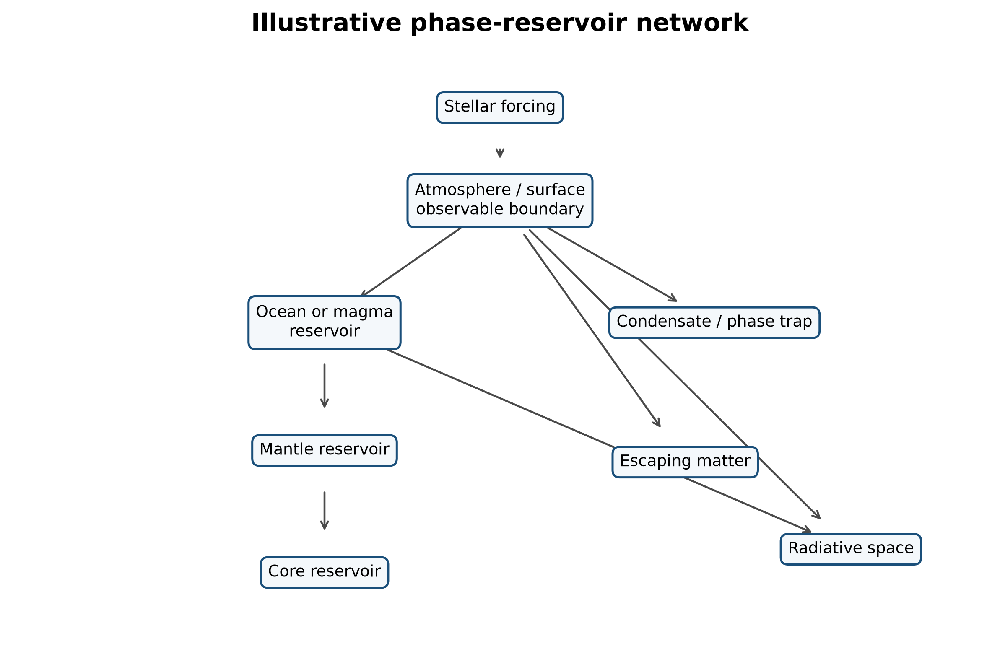
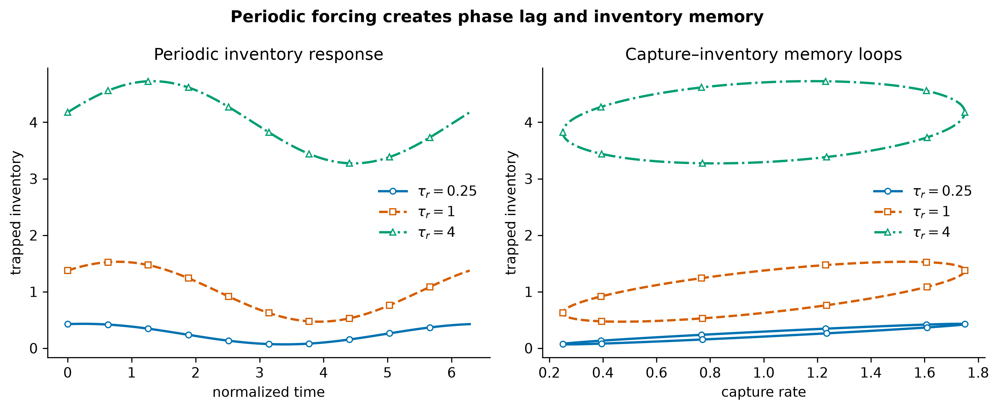
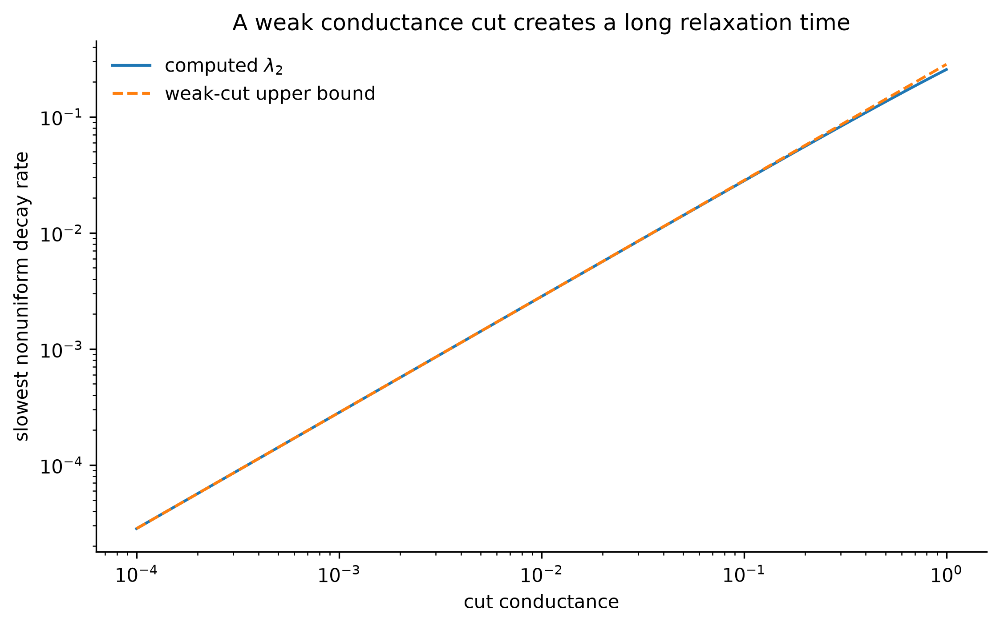
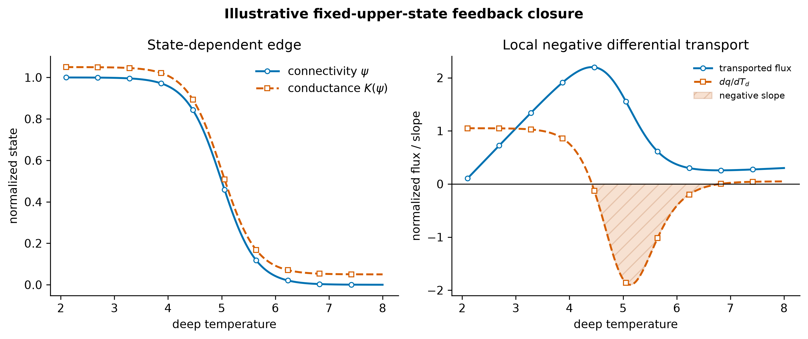
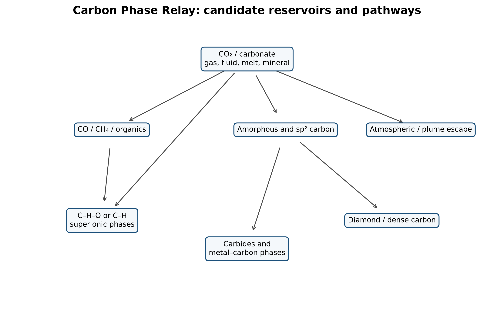
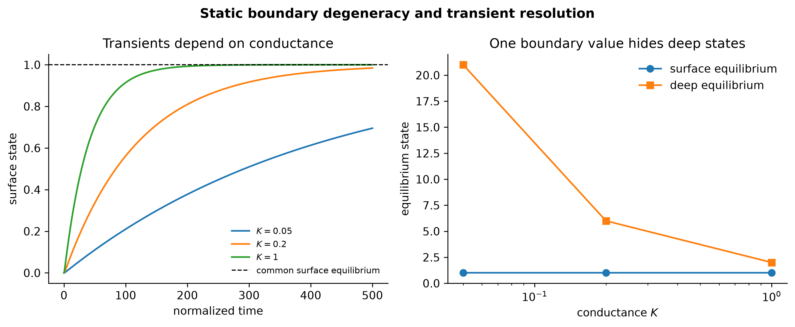
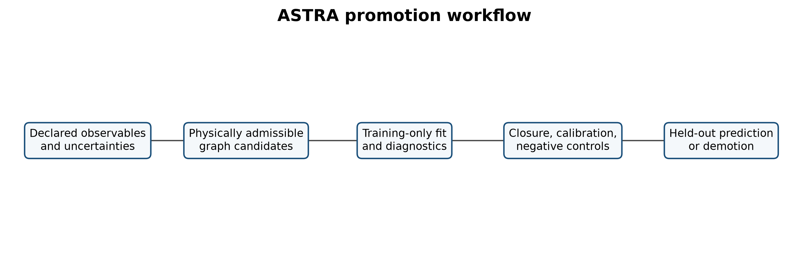

**Preprint v1.0.1 · Perspective and mathematical framework · Not peer reviewed**

**Correspondence:** [GitHub Issues for this repository](https://github.com/jkolantree/astra/issues)  
**License:** Text and original figures, CC BY 4.0. Source code, MIT License.

> **Status statement.** This article proposes a mathematical framework, derives several reduced analytic consequences, supplies executable reference calculations, and states falsifiers. It does **not** prove general well-posedness of topology-changing dynamics, report a new astronomical detection, complete a mission-data retrieval, or show that one universal phase topology governs all planets.

# Plain-language summary {.unnumbered}

Planetary models usually specify a planet's mass, radius, composition, temperature profile, and a chosen arrangement of layers. Those choices are physically necessary, but two planets with similar bulk properties can still evolve differently if the same materials are connected differently. A conducting phase may form isolated droplets in one planet and a planet-spanning shell in another. A composition gradient may permit vigorous convection or block it. A volatile may remain mobile, condense into a long-lived trap, react into a mineral, sink gravitationally, or escape. These differences are not captured by total inventory alone.

This paper proposes treating that physical connectivity as an explicit hidden state. A planet is represented by a directed network whose nodes are material or energy reservoirs and whose edges are allowed transport and transformation pathways. The network is constrained by mass conservation, energy accounting, nonnegative entropy production, phase equilibrium, reaction kinetics, and known equations of state. Its topology can change when phases appear, disappear, connect, disconnect, or cross a percolation threshold.

The framework is called **Solar–Planetary Phase-Partition Theory (SPPT)**. Its inference and validation layer is called **ASTRA — Astronomical State-Topology and Reservoir Analysis**. SPPT specifies the physical state and admissibility rules; ASTRA compares candidate reservoir graphs against observations and simpler baselines. Neither name implies that heat moves through the Solar System from planet to planet. Each planet remains an independent open system subject to stellar forcing, internal heat, tides, escape, and radiation to space. The planetary names are comparative examples of regimes: lunar geometric trapping, Mercurian carbon partitioning, Saturnian hydrogen–helium separation, Uranian inhibited transport, and Neptunian deep-to-surface connectivity.

The central astronomical proposal is testable: allow phase-reservoir topology to vary in planetary forward models and Bayesian retrievals, then ask whether it improves calibrated predictions of independent observables over conventional fixed-layer and smooth-gradient models. If it does not, the topological extension should be removed. Four newly assessed studies motivate a separately labeled ASTRA research outlook in which physical flux, active control, observation, archival preservation, and verification are typed separately. Only a sealed deep-diamond inclusion bears direct planetary relevance; none of the four studies validates SPPT.

# Abstract {.unnumbered}

Planetary evolution depends on more than bulk composition and total energy. The phase identity, physical connectivity, interfacial kinetics, and release times of material reservoirs determine whether energy and species circulate, remain trapped, segregate gravitationally, participate in magnetic-field generation, enter an atmosphere, or escape. We formulate the **Solar–Planetary Phase-Partition Theory (SPPT)** as a thermodynamically constrained, hybrid graph model in which a planet is described by a continuous state coupled to a directed phase-reservoir network. Its inference layer, **ASTRA — Astronomical State-Topology and Reservoir Analysis**, treats candidate reservoir graphs as latent states subject to physical legality, closure, calibration, and held-out prediction. We derive a matrix species balance, an exact conserved-inventory result, local entropy-production conditions, a retention criterion for generalized phase-partition traps, an analytic hysteresis law for periodically forced traps, a spectral bound linking weak transport cuts to long relaxation times, and a static non-identifiability result showing why equilibrium boundary observables can conceal deep transport conductance. We define the **Carbon Phase Relay**, motivated in part by 2026 operando evidence for a peroxide intermediate during molten-carbonate CO2-to-carbon electroreduction, while distinguishing that supplied electrochemical free-energy conversion from latent heat. In a transparent, deliberately favorable three-reservoir benchmark, training-set BIC selects the minimum generating graph in 64 of 64 frozen noise realizations; a separate post-selection unseen-forcing comparison preserves both positive and negative outcomes. This is a synthetic implementation check, not planetary evidence. We map the framework onto measured or modeled regimes in the Moon, Mercury, terrestrial planets, Jupiter, Saturn, Uranus, Neptune, and exoplanets. Recent results showing static interior degeneracy, strong conductivity sensitivity, hydrogen–water demixing, rock-rich ice-giant solutions, and evolutionary Bayesian retrieval motivate topology-aware inference but do not establish its predictive value. The proposed novelty is therefore narrow: infer phase-reservoir connectivity as a discrete or hybrid latent state, and promote it only when it yields held-out predictive gain beyond fixed-topology baselines. Eight falsifiable hypotheses and a laboratory, computational, and observational program are supplied.

# 1. Claim, scope, and novelty boundary

## 1.1 Central claim

The SPPT claim is:

> **A planet's observable and evolutionary state is determined not only by bulk inventories and continuous thermodynamic fields, but also by the physical topology of its phase and reservoir network: which reservoirs exist, which are connected, what processes occupy each connection, and how those connections change through time.**

A compact state description is

$$
\mathscr P(t)=\bigl(\mathcal G(t),\,x(t),\,\theta,\,u(t)\bigr),
\qquad
\mathcal G(t)=(V(t),E(t)),
\qquad\text{(1)}
$$

where $V$ is a set of reservoirs or phases, $E$ a set of physically admissible transport or transformation pathways, $x$ the continuous state, $\theta$ constitutive parameters, and $u$ external forcing. “Topology” here means **physical connectivity**, not orbital ordering, symbolic correspondence, or an assertion that the planets form one literal heat engine.

## 1.2 What is established and what is proposed

The ingredients are established: conservation laws, phase equilibria, chemical potentials, nonequilibrium thermodynamics, reaction networks, graph Laplacians, percolation, atmospheric escape, interior evolution, and Bayesian inference. Network thermodynamics has a long history in other fields [@oster1971; @perelson1975], and planetary models already use layered reservoirs, phase diagrams, transport closures, and coupled atmosphere–interior evolution [@lichtenberg2021; @nicholls2024redox].

The proposed contribution is their **specific integration as an inferable planetary hidden state**:

1. the graph $\mathcal G$ is part of the state rather than fixed preprocessing;
2. each edge carries a declared physical law and entropy test;
3. topology changes are represented explicitly;
4. graph-dependent slow modes and observability are quantified;
5. candidate topologies compete against fixed-layer and smooth-gradient baselines on held-out data.

This is a framework-level novelty claim, not a priority claim for graph theory, thermodynamics, or phase modeling individually.

## 1.3 Why the question is timely

Current work exposes the size of the inverse problem. Static giant-planet structures can preserve nearly the same radius under substantially different heavy-element gradient shapes when boundary metallicity and integrated heavy-element budget are matched [@wilkinson2026]. Non-convective conductivity assumptions can change modeled Neptune/sub-Neptune radii by roughly 20%, while primordial entropy uncertainty can shift radii by roughly 25% [@eberlein2025]. Hydrogen–water demixing can strongly alter outer composition and modeled radius [@howard2025demixing]. Evolutionary Bayesian retrievals can recover some histories that static retrievals cannot, while leaving other degeneracies intact [@nicholls2026retrieval]. These results support a specific inference principle:

> **Static boundary agreement is insufficient evidence that deep transport architecture has been identified.**

SPPT asks whether physically constrained topology and transient information can reduce that ambiguity.

## 1.4 Resolution status

This paper supplies a bounded proposed formulation:

- a type-correct state space;
- exact conservation and entropy conditions;
- analytic memory and bottleneck results;
- a schematic hybrid topology-transition syntax;
- an explicit inverse problem;
- measurable dimensionless coordinates;
- executable reduced models and unit tests;
- predictions, negative controls, and demotion conditions.

It does not establish general existence, uniqueness, simultaneous-guard priority, reset-map closure, or non-Zeno behavior for the hybrid dynamics. Empirical validation also remains open by design.

# 2. Planet as a phase-reservoir network

## 2.1 Nodes, edges, and continuous state

**Definition 1 (reservoir node).** A node $v\in V$ is a spatially or thermodynamically distinguishable reservoir for which state variables and inventories can be assigned over the model resolution. A node may represent an atmosphere, ocean, magma layer, silicate mantle region, metallic core, condensate, ice shell, plume, surface deposit, or the external radiation/escape boundary.

**Definition 2 (process edge).** A directed edge $e=(a\rightarrow b,p)\in E$ states that process $p$ can transfer matter, charge, momentum, or energy from node $a$ to node $b$. Examples include radiation, convection, conduction, diffusion, phase change, dissolution, precipitation, redox reaction, electrochemical current, gravitational rainout, outgassing, erosion, and escape.

The local continuous state may be written

$$
x(\mathbf r,t)=
\left(
T,P,\rho,\mathbf u,\mathbf B,\Phi_g,\Phi_e,
\{x_i\},\{\phi_\alpha\},\xi
\right),
\qquad\text{(2)}
$$

where $x_i$ are species abundances, $\phi_\alpha$ phase fractions, and $\xi$ internal variables such as grain size, damage, porosity, redox state, or reaction progress.

{#fig:network width=94%}

## 2.2 Five admissibility axioms

**Axiom A1 — inventory closure.** Every modeled species or conserved elemental combination has a declared source, sink, internal reaction, or transport path. Apparent creation inside a closed subgraph is forbidden.

**Axiom A2 — energy closure.** Every thermal, chemical, gravitational, electrical, radiative, and mechanical term is counted once. Radioactive decay, gravitational differentiation, and chemical reaction are internal conversions when their source reservoirs are represented; they may be entered as source terms only in a reduced thermal subsystem whose depleted reservoirs are outside the state.

**Axiom A3 — thermodynamic admissibility.** Constitutive laws must not generate negative total entropy production over their declared domain.

**Axiom A4 — topology legality.** An edge may activate only when its phase, geometry, kinetic, and connectivity conditions are satisfied. A possible reaction is not automatically a macroscopically connected transport channel.

**Axiom A5 — inferential rent.** An added topology, state variable, or operator must improve predeclared held-out prediction, calibration, or intervention discrimination over a simpler equal-budget baseline. Otherwise it is demoted.

## 2.3 Matrix species balance

Let there be $n$ nodes, $m$ transport edges, $s$ species, and $r$ reactions. Let

- $M\in\mathbb R^{n\times s}$ contain node inventories;
- $B\in\mathbb R^{n\times m}$ be the directed incidence matrix, with $-1$ at an edge tail and $+1$ at its head;
- $J\in\mathbb R^{m\times s}$ contain edge species fluxes;
- $R\in\mathbb R^{n\times r}$ contain local reaction rates;
- $N\in\mathbb R^{s\times r}$ be the stoichiometric matrix;
- $S,E\in\mathbb R^{n\times s}$ contain external supply and escape or removal.

Then

$$
\dot M=BJ+RN^{\mathsf T}+S-E.
\qquad\text{(3)}
$$

This equation is bookkeeping, but it prevents a frequent category error: phase transfer, chemical conversion, and planetary escape are not interchangeable terms.

**Proposition 1 (network conservation).** Let $w\in\mathbb R^s$ encode a conserved elemental or charge combination such that $N^{\mathsf T}w=0$. Define

$$
I_w=\mathbf 1^{\mathsf T}Mw.
$$

Then

$$
\dot I_w=\mathbf 1^{\mathsf T}(S-E)w.
\qquad\text{(4)}
$$

**Proof.** Left-multiplying Eq. (3) by $\mathbf1^{\mathsf T}$ and right-multiplying by $w$ gives

$$
\dot I_w=\mathbf1^{\mathsf T}BJw+
\mathbf1^{\mathsf T}RN^{\mathsf T}w+
\mathbf1^{\mathsf T}(S-E)w.
$$

Every incidence-matrix column sums to zero, so $\mathbf1^{\mathsf T}B=0$. The reaction term vanishes because $N^{\mathsf T}w=0$. Only exchange with the exterior remains. $\square$

This result is exact for any nonlinear edge law and any reaction kinetics consistent with the declared stoichiometry.

# 3. Thermodynamic closure

## 3.1 Generalized chemical potential

For species $i$ in phase $\alpha$, define

$$
\widetilde\mu_i^\alpha
=
\mu_i^\alpha(T,P,\{x_j\})
+\overline M_i\Phi_g
+z_iF\Phi_e,
\qquad\text{(5)}
$$

where $\overline M_i$ is molar mass, $z_i$ ionic charge, and $F$ the Faraday constant. The same expression makes explicit that a “trap” may be thermal, chemical, electrical, gravitational, interfacial, or kinetic.

At local phase equilibrium,

$$
\widetilde\mu_i^\alpha=\widetilde\mu_i^\beta.
\qquad\text{(6)}
$$

Away from equilibrium, nucleation barriers, low diffusivity, inhibited convection, or absent circuit closure can preserve metastable states for geological durations.

## 3.2 Flux–force closure and entropy production

Near local equilibrium, gather independent thermodynamic forces on edge $e$ into $X_e$ and conjugate fluxes into $f_e$. A linear closure is

$$
f_e=L_eX_e.
\qquad\text{(7)}
$$

The edge entropy-production rate is

$$
\dot S_{\mathrm{gen},e}=X_e^{\mathsf T}f_e
=X_e^{\mathsf T}L_e^{(s)}X_e\ge0,
\qquad
L_e^{(s)}=\tfrac12(L_e+L_e^{\mathsf T}),
\qquad\text{(8)}
$$

provided the symmetric part $L_e^{(s)}$ is positive semidefinite. The antisymmetric Onsager–Casimir component can redirect coupled fluxes without directly producing entropy [@onsager1931a; @onsager1931b; @casimir1945; @degroot1984]. Far from equilibrium, Eq. (8) becomes a local gate rather than a complete constitutive theory; nonlinear laws must still satisfy nonnegative integrated entropy production.

## 3.3 Global energy ledger

For a planet $p$,

$$
\frac{dE_p}{dt}
=P_{\star,\mathrm{abs}}
+P_{\mathrm{tide}}
+P_{\mathrm{ext}}
-L_{\mathrm{rad}}
-P_{\mathrm{escape}},
\qquad\text{(9)}
$$

when $E_p$ includes all internal thermal, chemical, elastic, gravitational, rotational, and radioactive reservoirs. In a reduced thermal state, one may instead write internal conversion terms explicitly:

$$
\frac{dE_{\mathrm{th}}}{dt}
=P_{\star,\mathrm{abs}}
+P_{\mathrm{radio}}
+P_{\mathrm{grav}}
+P_{\mathrm{rxn}}
+P_{\mathrm{tide}}
-L_{\mathrm{rad}}
-P_{\mathrm{adv,escape}}.
\qquad\text{(10)}
$$

Equation (10) is legal only if the reservoirs depleted by $P_{\mathrm{radio}}$, $P_{\mathrm{grav}}$, and $P_{\mathrm{rxn}}$ are not counted again inside $E_{\mathrm{th}}$ as unchanged energy.

## 3.4 Black, Carnot, and exergy

Black's latent heat concerns physical phase change:

$$
\dot E_{\mathrm{latent}}=\sum_\alpha L_\alpha\dot M_\alpha.
\qquad\text{(11)}
$$

A sign convention is required: here $L_\alpha>0$ has units of energy per mass and $\dot M_\alpha>0$ denotes formation of a phase whose transition releases $L_\alpha$ into the tracked thermal reservoir. Reversing the phase-change direction reverses the sign.

A large energy transfer can occur while temperature changes little [@black1803]. Carnot's result concerns the maximum work obtainable from heat transferred across a temperature difference [@carnot1824]. Relative to environment $T_0$, heat $\dot Q$ supplied at $T$ carries ideal exergy

$$
\dot X_Q=\dot Q\left(1-\frac{T_0}{T}\right).
\qquad\text{(12)}
$$

Equation (12) uses absolute temperatures $T>0$ and $T_0>0$, with $\dot Q>0$ defined as heat supplied to the modeled system.

Planetary free energy also includes chemical, electrical, gravitational, and mechanical forms:

$$
\dot X_{\mathrm{chem}}=-\sum_r\Delta G_rR_r,
\qquad
\dot X_{\mathrm{electric}}=I\Delta V,
\qquad
\dot X_{\mathrm{grav}}=\sum_i\dot M_i\Delta\Phi_{g,i}.
\qquad\text{(13)}
$$

In Eq. (13), $R_r>0$ denotes the declared forward reaction, current $I$ is positive in the declared voltage-drop direction, and $\dot M_i\Delta\Phi_{g,i}>0$ denotes gravitational free energy delivered to the tracked system. Alternative conventions are legal only if used consistently in the reservoir balance.

The exergy destruction rate is

$$
\dot X_{\mathrm{dest}}=T_0\dot S_{\mathrm{gen}}\ge0.
\qquad\text{(14)}
$$

This distinction matters for the 2026 graphite result discussed below: CO2-to-carbon electroreduction stores supplied electrochemical free energy; it is not latent heat.

# 4. Phase-partition traps, retention, and memory

## 4.1 General definition

**Definition 3 (phase-partition trap).** Let $S\subseteq V$ be a reservoir subgraph and $M_{i,S}$ the inventory of species $i$ within it. Define total outflow $\Phi_{i,S}^{\mathrm{out}}>0$ and retention time

$$
\tau_{\mathrm{ret},i,S}
=\frac{M_{i,S}}{\Phi_{i,S}^{\mathrm{out}}}.
\qquad\text{(15)}
$$

An exactly closed trap with $\Phi_{i,S}^{\mathrm{out}}=0$ lies outside the finite-ratio domain of Eq. (15) and is assigned infinite retention time by convention.

For forcing timescale $\tau_{\mathrm{force}}$, define the **retention number**

$$
\Theta_{i,S}
=\frac{\tau_{\mathrm{ret},i,S}}{\tau_{\mathrm{force}}}.
\qquad\text{(16)}
$$

A subgraph is a persistent trap over the declared forcing regime when it has a positive charging interval and $\Theta_{i,S}\gg1$ after charging. A momentary accumulation with rapid release is not a persistent trap.

The framework distinguishes seven mechanisms:

| Trap class | Dominant condition | Example |
|---|---|---|
| Thermal | saturation or freezing boundary crossed | atmospheric condensate, snow line |
| Geometric | restricted illumination or heat exchange | lunar polar cold trap |
| Chemical/redox | mobile species converted to less mobile phase | carbonate, graphite, sulfide |
| Electrochemical | imposed or natural potential drives partition | molten-carbonate deposition candidate |
| Gravitational | density separation, rainout, flotation, core formation | helium rain, graphite flotation |
| Stratification | stable gradient suppresses advective exchange | non-convective ice-giant region |
| Kinetic/interfacial | nucleation or reaction barrier controls access | metastable polymorph or surface-selected carbon |

## 4.2 Exact periodically forced trap

Consider the minimal trap

$$
\dot M=c_0+c_1\cos(\omega t)-\frac{M}{\tau_r}.
\qquad\text{(17)}
$$

The steady periodic solution is

$$
M(t)=c_0\tau_r+
\frac{c_1\tau_r}{\sqrt{1+(\omega\tau_r)^2}}
\cos\!\left(\omega t-\arctan(\omega\tau_r)\right).
\qquad\text{(18)}
$$

The forcing–inventory phase loop has exact signed area

$$
\oint M\,dc
=-\pi\frac{c_1^2\omega\tau_r^2}{1+(\omega\tau_r)^2}.
\qquad\text{(19)}
$$

At fixed $c_1$ and $\omega$, the raw inventory-loop magnitude increases monotonically with $\tau_r$ and approaches $\pi c_1^2/\omega$. For the release-equivalent state $q_r=M/\tau_r$, however,

$$
\left|\oint q_r\,dc\right|
=\pi c_1^2\frac{\omega\tau_r}{1+(\omega\tau_r)^2},
$$

which is maximal at $\omega\tau_r=1$. Thus the raw area measures retained inventory, whereas the normalized area isolates the strongest forcing–release phase mismatch.

{#fig:memory width=94%}

## 4.3 Trap failure and release

A trap can fail through at least four routes:

1. the stable phase disappears;
2. the release edge conductance increases;
3. a formerly disconnected phase percolates;
4. a chemical or electrical pathway reverses sign.

Accordingly, release need not track temperature alone. A deep layer may warm while remaining isolated, or maintain nearly constant temperature while composition and connectivity cross a threshold.

# 5. Connectivity, slow modes, and percolation

## 5.1 Linear transport graph

For a conserved scalar $x$ stored in nodes with positive capacities $C_i$, a near-equilibrium transport model is

$$
C\dot x=-Lx,
\qquad
L=BKB^{\mathsf T},
\qquad\text{(20)}
$$

where $C=\mathrm{diag}(C_i)$ and $K=\mathrm{diag}(k_e)$ contains nonnegative edge conductances. Relaxation modes solve

$$
Lv_k=\lambda_kCv_k.
\qquad\text{(21)}
$$

For a graph connected by strictly positive-weight edges, $\lambda_1=0$ is the conserved uniform mode, $\lambda_2>0$, and the slowest nonuniform timescale is

$$
\tau_2=\lambda_2^{-1}.
\qquad\text{(22)}
$$

## 5.2 Weak-cut bound

**Proposition 2 (transport bottleneck bound).** Let every node capacity be strictly positive and let the positive-weight conductance graph be connected. For any nonempty proper node set $S$, with complement $\bar S$, let $K_{\partial S}$ be the sum of conductances crossing the cut, and let $C_S$ and $C_{\bar S}$ be the summed capacities on each side. Then

$$
\lambda_2
\le
K_{\partial S}
\left(\frac{1}{C_S}+\frac{1}{C_{\bar S}}\right).
\qquad\text{(23)}
$$

**Proof.** Use the generalized Rayleigh quotient

$$
\lambda_2=\min_{z\perp_C\mathbf1}
\frac{z^{\mathsf T}Lz}{z^{\mathsf T}Cz}.
$$

Choose a trial vector constant on each side of the cut and $C$-orthogonal to $\mathbf1$. Only cut edges contribute to the numerator. Direct substitution gives Eq. (23). $\square$

A weak connection therefore bounds a slow mode even when transport inside each region is efficient, subject to the positivity and weighted-connectivity hypotheses above.

{#fig:bottleneck width=94%}

## 5.3 Minority phases and percolation

A phase need not dominate mass to dominate transport. If a conducting phase of volume fraction $\phi$ crosses a connectivity threshold $\phi_c$, a common near-threshold scaling is

$$
\sigma_{\mathrm{eff}}
\sim
\sigma_\alpha(\phi-\phi_c)^t,
\qquad \phi>\phi_c,
\qquad\text{(24)}
$$

with exponent $t$ set by geometry and universality class [@stauffer1994]. Below $\phi_c$, the same phase may exist only as disconnected pockets. This is the core reason that composition fraction and physical function are not equivalent. A minority ionic, metallic, or carbon-bearing phase could control dynamo conductivity, heat transport, or chemical exchange if it forms a connected shell or channel network.

## 5.4 State-dependent edges and topology transitions

Let $\psi\in[0,1]$ denote an edge-connectivity state and $K(\psi)$ its conductance. A minimal two-reservoir model is

$$
C_d\dot T_d=H_d-K(\psi)(T_d-T_u),
\qquad\text{(25)}
$$

$$
C_u\dot T_u=K(\psi)(T_d-T_u)+F_\star-L(T_u),
\qquad\text{(26)}
$$

$$
\tau_\psi\dot\psi=\psi_{\mathrm{eq}}(T_d,P,x)-\psi.
\qquad\text{(27)}
$$

Along a quasi-equilibrium branch, the local derivative of transported flux $q=K(\psi_{\mathrm{eq}})(T_d-T_u)$ is

$$
\frac{dq}{dT_d}
=K\left(1-\frac{dT_u}{dT_d}\right)
+(T_d-T_u)K'(\psi)
\frac{d\psi_{\mathrm{eq}}}{dT_d}.
\qquad\text{(28)}
$$

The toy closure shown in the accompanying figure holds $T_u$ fixed locally, so the first factor reduces to $K$.

A negative value is a **negative differential transport region** and a possible fold precursor in a reduced closure. It is not, by itself, proof of global bistability or a fit to Uranus or Neptune.

{#fig:feedback width=94%}

# 6. Hybrid planetary dynamics

A fixed graph cannot represent the birth or loss of a phase, percolation, crustal breach, convective shutdown, or an atmospheric escape transition. SPPT therefore uses a hybrid state:

$$
\dot x=f_{\mathcal G}(x,\theta,u,t),
\qquad\text{while }g_j(x,\theta)<0,
\qquad\text{(29)}
$$

and, when guard $g_j=0$ is crossed,

$$
\mathcal G^+=\mathcal T_j(\mathcal G^-,x^-,\theta),
\qquad
x^+=\mathcal R_j(x^-,\theta).
\qquad\text{(30)}
$$

Examples of guards include saturation, liquid–liquid immiscibility, a critical melt fraction, a percolation threshold, a Rayleigh criterion, an escape-regime boundary, or a redox front reaching an interface.

Equations (29)–(30) are a modeling syntax, not a general hybrid-systems well-posedness theorem. Each concrete model must separately specify legal state domains, flow regularity, simultaneous-guard priority, reset-map closure, and a condition excluding chattering or Zeno accumulation before existence or uniqueness may be claimed.

**Assumption H1 (finite model resolution).** Nodes represent reservoirs resolvable by the selected forward model. SPPT does not require a molecular graph of a whole planet.

**Assumption H2 (declared hysteresis).** If forward and reverse transitions occur at different thresholds, both guards must be supplied. A single equilibrium curve cannot silently represent irreversible phase history.

**Demotion rule.** If a smooth constitutive law on a fixed graph matches all relevant transients and observables at equal or lower complexity, the hybrid transition is unnecessary and must be removed.

# 7. The Carbon Phase Relay

## 7.1 Carbon as a multiphase carrier

A planetary carbon inventory may occupy atmospheric CO2, dissolved carbonate, CO, methane, organics, graphite or amorphous carbon, diamond, carbides, carbon-bearing melts, or high-pressure C–O–H phases. The **Carbon Phase Relay** is the graph of possible transfers among those carriers under different thermodynamic domains:

$$
\chi_C=
\left(P,T,f_{\mathrm O_2},a_{\mathrm H_2O},a_{\mathrm H_2},
\Delta\Phi_e,\text{interface},t\right).
\qquad\text{(31)}
$$

The relay is not one universal reversible reaction chain. Each edge must be restricted to the pressure, temperature, composition, redox, and kinetic domain in which it is physically available.

{#fig:carbon width=96%}

## 7.2 What the 2026 graphite experiment establishes

Ratso and colleagues used high-temperature operando Raman spectroelectrochemistry during molten-carbonate CO2 reduction. At approximately 500 °C they observed a peroxide-associated Raman signature concurrently with carbon deposition on gold, tungsten, nickel, and Inconel, supporting a common intermediate in a likely sequence of electrochemical steps [@ratso2026]. Electrode material influenced carbon morphology and structure. The authors explicitly left detailed kinetics and quench validation open.

The overall ideal reaction is

$$
\mathrm{CO_2(g)\rightarrow C(s)+O_2(g)},
\qquad
\Delta G^\circ_{25\,^{\circ}\mathrm C}=+394.3\ \mathrm{kJ\,mol^{-1}}.
\qquad\text{(32)}
$$

It is nonspontaneous. The process stores supplied electrical free energy in spatially and chemically separated reduced carbon and oxidized products. It should not be described as spontaneous atmospheric sequestration or latent heat.

## 7.3 Scale and circuit-closure constraint

The ideal carbon-forming cathodic conversion requires four electrons per CO2 molecule. At current $I$ and Faradaic efficiency $\eta_F$,

$$
\dot n_{\mathrm{CO_2}}
=\frac{\eta_F I}{4F}.
\qquad\text{(33)}
$$

A continuous $1\ \mathrm{MA}$ current would convert approximately

$$
3.60\times10^6\ \mathrm{kg\ CO_2\ yr^{-1}}
$$

at $\eta_F=1$. Converting $1\ \mathrm{Gt\ yr^{-1}}$ would require approximately

$$
I\approx2.78\times10^{11}\ \mathrm A,
$$

with a reversible minimum power near

$$
P_{\min}\approx2.84\times10^{11}\ \mathrm W
$$

when the 25 °C standard Gibbs energy is used as a scale. This is not the reversible voltage of the 500 °C experimental cell: temperature-dependent free energies, externally supplied heat, overpotential, ohmic loss, collection, and product handling must enter a process calculation. These values rule out a casual claim that the laboratory mechanism is automatically a global geological carbon sink. They do not rule out concentrated local deposits sustained over geological time.

A natural planetary analogue requires all of the following:

- a compatible molten or aqueous electrolyte;
- a source of electrical or redox potential;
- conductive paths completing a circuit;
- interfaces that nucleate carbon;
- spatial separation that prevents rapid recombination;
- duration and current density sufficient for the inferred deposit.

## 7.4 Interface-selected allotropes

For an idealized spherical nucleus of carbon phase $\alpha$ in parent phase $\beta$,

$$
\Delta G_{\mathrm{nuc},\alpha}(r)
=4\pi r^2\gamma_{\alpha\beta}
+\frac{4\pi r^3}{3}\Delta g_\alpha,
\qquad\text{(34)}
$$

where $\gamma_{\alpha\beta}$ is interfacial free energy and $\Delta g_\alpha<0$ is the bulk driving free-energy density. Classical homogeneous nucleation gives

$$
r_\alpha^*=-\frac{2\gamma_{\alpha\beta}}{\Delta g_\alpha},
\qquad
\Delta G_{\mathrm{hom},\alpha}^*=\frac{16\pi\gamma_{\alpha\beta}^3}{3\Delta g_\alpha^2},
\qquad
\Delta G_{\mathrm{het},\alpha}^*=f(\vartheta_I)\Delta G_{\mathrm{hom},\alpha}^*,
\quad
f(\vartheta_I)=\frac{(2+\cos\vartheta_I)(1-\cos\vartheta_I)^2}{4},
\quad 0\le\vartheta_I\le\pi.
\qquad\text{(35)}
$$

Here $\vartheta_I$ is the contact angle measured through the nucleating phase and $f(0)=0$, while $f(\pi)=1$. This classical substrate-dependent wetting factor assumes a spherical-cap nucleus on a planar substrate, isotropic interfacial tensions, and negligible line tension [@fitzner2017]. Anisotropy, curvature, nonclassical pathways, and substrate-dependent polymorph selection can invalidate that reduction. The phase with the lowest bulk free energy need not nucleate first. Whether mineral substrate, metal activity, alkali intercalation, cooling rate, or electron-transfer regime selects among particular carbon phases remains to be established; these variables are candidate controls for future experiments, not admitted phase-selection mechanisms. Carbon microstructure can therefore be a record of an ancient interface only when metamorphism, impact processing, oxidation, and later transport are independently constrained.

## 7.5 Natural geoelectrochemistry

A second 2026 study showed that trace Cu or Zn adsorbed on common carbonate and phyllosilicate minerals can catalyze abiotic electrochemical CO2 reduction to products including methane, formic acid, CO, C2 organics, and C–N compounds when ammonia is present [@zhong2026]. This establishes a plausible bridge from mineral interfaces and natural redox gradients to abiotic carbon reduction. It does not establish naturally occurring solid-graphite electrolysis at planetary scale.

# 8. Comparative planetary regime atlas

The following regimes are comparisons under common conservation laws. No claim is made that energy flows physically from one planet to the next.

## 8.1 Sun and space: forcing and loss boundaries

Stellar spectral irradiance, UV/X-ray forcing, and stellar wind provide external energy and drive photochemistry and escape. Deep space is the ultimate radiative boundary. A planet's internal evolution also depends on formation heat, radioactive decay, differentiation, contraction, and tides. “Solar” forcing is therefore one input class, not the entire energy ledger.

## 8.2 Moon: geometric trapping

Lunar polar topography creates permanently shadowed regions cold enough to retain volatiles over long durations [@paige2010]. Yet a shadow mask alone is insufficient: roughness, multiple scattering, lateral conduction, regolith properties, and self-heating alter local stability [@formisano2025]. The Moon is the cleanest test of a geometric trap because geometry controls illumination while atmosphere and weather are absent.

A topology-aware lunar model should distinguish:

- connected shadowed floors from isolated microtraps;
- direct illumination from indirect radiative coupling;
- surface frost from buried inventory;
- charging by impact, solar wind, and migration from release by sublimation and sputtering.

## 8.3 Mercury: solid-carbon partitioning

MESSENGER observations support an ancient carbon-bearing crust, commonly interpreted as remnant graphite flotation material [@peplowski2016]. Reduced magma-ocean models permit graphite flotation [@keppler2019], while high-pressure experiments and models allow a possible diamond-bearing layer near the core–mantle boundary during core crystallization [@xu2024]. Mercury therefore demonstrates that one elemental inventory can occupy buoyant crustal graphite and deep dense diamond under different pressure and differentiation paths.

A graphite-rich surface also has competing feedbacks. Low visible albedo can increase absorbed stellar energy, but graphite's high thermal conductivity can accelerate cooling in some interior configurations [@hakim2019]. Oxidation, burial, emissivity, grain size, and space weathering determine the net sign. SPPT therefore rejects the simple rule “darker surface implies longer-lived magma ocean” unless the complete radiative and conductive ledger supports it.

## 8.4 Venus, Earth, and Mars: boundary and reservoir contrasts

Venus retains a massive oxidized atmospheric carbon reservoir and exhibits a strong radiative bottleneck. Earth has a highly connected atmosphere–ocean–crust–mantle network in which water phase transitions transport latent energy and carbon occupies gaseous, dissolved, organic, carbonate, graphite, diamond, and mantle-fluid states. Mars combines atmospheric escape with discontinuous surface and subsurface volatile reservoirs.

Coupled magma-ocean, outgassing, escape, and redox calculations show that young rocky planets can follow divergent atmospheric paths even at similar mass, because volatile inventory, stellar forcing, mantle oxidation state, solubility, and escape interact through time [@nicholls2024redox; @postolec2026]. In SPPT language, the atmosphere is a boundary readout of an evolving interior–surface network, not a direct measurement of bulk composition.

## 8.5 Jupiter: compression and internal power

Jupiter is a high-gravity, rapid-rotation, internally luminous regime. Deep convection, hydrogen metallization, and possible H–He demixing couple composition and heat transport. Current phase boundaries remain uncertain; recent simulations place significant H–He immiscibility within giant-planet conditions but quantitative depth and evolution remain model-dependent [@chang2024]. Jupiter is therefore an example of strong compression and internal throughput, not a symbolic universal “amplifier.”

## 8.6 Saturn: immiscibility and rainout

Saturn is a strong Solar System anchor for phase separation. H–He demixing can create helium-rich droplets, gravitational settling, composition gradients, and additional heat release [@chang2024]. Cassini-era energy accounting revised Saturn's estimated Bond albedo and internal heat flux and found significant seasonal global imbalance rather than strict instantaneous steady state [@wang2024saturn]. The physically defensible analogy to a separator is thus precise: immiscibility can split a mobile mixture, create retained composition structure, and convert gravitational potential into heat.

Saturn is not the final cold reservoir for Earth or the Solar System. Its rings alter illumination, scattering, and thermal exchange but should not be treated as the exhaust of helium rain.

## 8.7 Uranus: low-conductance stratification

A full-orbit reconstruction estimated a small but nonzero intrinsic Uranian heat flux of $0.078\pm0.018\ \mathrm{W\,m^{-2}}$ [@wang2025uranus]. Low observable flux is consistent with—but does not uniquely prove—stable composition gradients or inhibited convection. In the reduced relation

$$
F_{\mathrm{out}}=K_{\mathrm{eff}}\Delta T,
\qquad\text{(36)}
$$

a small $K_{\mathrm{eff}}$ can conceal a large deep gradient. Conductivity assumptions in non-convective layers materially affect modeled radii and evolution [@eberlein2025]. Uranus is therefore the natural low-conductance test case for SPPT.

## 8.8 Neptune: connected deep transport and conductive phases

Neptune emits a much larger intrinsic flux relative to absorbed sunlight than Uranus, which is consistent with—but does not uniquely establish—more effective connection between deep and observable reservoirs. High-pressure work proposes several possible architectures. Phase separation in water–methane–ammonia mixtures may yield water-rich and C–N–H-rich layers and constrain dynamo geometry [@militzer2024]. Predicted carbonic-acid phases may enter hydrogen-superionic and doubly superionic regimes, potentially supplying anisotropic ionic transport [@deng2026]. Bayesian structural models also permit rock-rich heavy-element components [@ramirez2026].

These statements are not mutually exclusive. A planet can be rock-rich by mass while a thinner connected ionic phase dominates electrical conductivity and magnetic-field generation. The observational target is therefore connectivity and transport, not only bulk “ice fraction.”

## 8.9 Exoplanets: population-level tests

JWST mid-infrared observations of LHS 3844 b favor a dark, low-silica or space-weathered surface and do not uniquely identify graphite [@zieba2026]. This is exactly the type of degeneracy SPPT requires joint data to address: optical albedo, mid-infrared emissivity, thermal phase curve, and atmospheric upper limits must be modeled together.

For sub-Neptunes, static structural degeneracy and transport uncertainty are now quantifiable [@wilkinson2026; @eberlein2025]. Evolutionary retrievals offer a route to infer histories rather than snapshots [@nicholls2026retrieval]. SPPT adds one question: does a posterior over admissible reservoir graphs explain independent observables better than a fixed graph with more continuous parameters?

# 9. Static degeneracy, observability, and inference

## 9.1 Exact two-reservoir non-identifiability

Consider the equilibrium of Eqs. (25)–(26) with constant internal power $H$, constant absorbed external power $F_\star$, fixed conductance $K>0$, and an upper radiation law $L(T_u)$ that is injective on the declared physical temperature domain. Assume also that $F_\star+H$ lies in the range of $L$ on that domain. At equilibrium,

$$
H=K(T_d-T_u),
\qquad
L(T_u)=F_\star+H.
\qquad\text{(37)}
$$

Therefore

$$
T_u=L^{-1}(F_\star+H),
\qquad
T_d=T_u+\frac{H}{K}.
\qquad\text{(38)}
$$

**Proposition 3 (static boundary degeneracy).** Under the existence, injectivity, physical-domain, and $K>0$ hypotheses above, if $H$ and $F_\star$ are fixed, the unique equilibrium $T_u$ is independent of $K$, while the hidden deep temperature varies as $H/K$.

A boundary equilibrium measurement can therefore identify the total flux without identifying the transport conductance or deep stored state. Transient forcing breaks the degeneracy because the response times depend on $K$ and the capacities.

{#fig:static width=94%}

## 9.2 Observability Gramian

Linearizing a fixed-topology model about a reference state gives

$$
\dot{\delta x}=A\delta x+B_u u,
\qquad
y=H\delta x+\epsilon.
\qquad\text{(39)}
$$

For a symmetric positive-definite noise covariance $R$, the finite-horizon observability Gramian is

$$
W_o(T)=\int_0^T
\mathrm e^{A^{\mathsf T}t}
H^{\mathsf T}R^{-1}H
\mathrm e^{At}\,dt.
\qquad\text{(40)}
$$

Small eigenvalues of $W_o$ identify combinations of deep state that the selected observations cannot recover [@kalman1960]. A candidate topology should not be promoted when the data cannot distinguish it: a broad posterior is a valid scientific result, not a reason to overinterpret the prior.

## 9.3 ASTRA Bayesian graph inference

Let $D$ contain observations and their uncertainty model. Inference is

$$
p(\mathcal G,\theta,x_0\mid D)
\propto
p(D\mid\mathcal G,\theta,x_0)
\,p(\mathcal G,\theta,x_0).
\qquad\text{(41)}
$$

The prior must encode phase-diagram legality, equations of state, mass and energy closure, plausible interface conditions, and formation constraints. The likelihood may combine

$$
\mathcal O=
\{M,R,L_{\mathrm{int}},A_B,S_\lambda(\varphi),J_{2n},B_{\ell m},\dot M_{\mathrm{esc}},\text{abundances}\}.
\qquad\text{(42)}
$$

Model comparison should use posterior predictive checks and calibration [@gelman2013], held-out log score or expected log predictive density [@vehtari2017], and predeclared equal-complexity negative controls.

{#fig:inference width=96%}

## 9.4 Promotion gate

A candidate topology is promoted only if all six conditions hold:

1. **Legality:** every node and edge lies in a physically permitted domain.
2. **Closure:** mass, energy, and charge residuals satisfy predeclared tolerances.
3. **Calibration:** predictive intervals have acceptable held-out coverage.
4. **Incremental value:** the topology improves held-out score over fixed-layer, smooth-gradient, and equal-budget nonlinear baselines.
5. **Robustness:** the gain survives reasonable phase-diagram, EOS, and prior perturbations.
6. **Specificity:** shuffled, random, or overconnected graph controls do not produce the same gain.

## 9.5 Synthetic ASTRA benchmark

The reference release includes a transparent three-reservoir model-selection benchmark. Four connected graph families — a serial chain, two distinct stars, and an overconnected triangle — are fitted only to noisy observations of the surface node. All generation and evaluation constants are public; this is neither blind nor external validation. All four families can be assigned the same static surface equilibrium, while their hidden deep equilibria differ. The generating graph is a two-edge chain with conductances $0.22$ and $1.40$ in normalized units.

Graph selection uses training-set Bayesian information criterion only. The held-out forcing is evaluated afterward and is not used to choose a graph. The overconnected triangle can attain a nearly identical training residual by shrinking its additional shortcut conductance toward zero, but loses after the BIC parameter penalty; the two incorrect star families produce substantially larger held-out errors. Every fit uses the same release-frozen 20-start generic log-conductance design, rejects solver terminations that fail the declared first-order optimality threshold, and fails closed if a non-admitted endpoint produces a materially lower cost. The 20-start design was adopted during release audit after replay of this same synthetic benchmark exposed a missed endpoint under the earlier 12-start design. The added unit and coordinate-wise decade anchors were therefore informed by benchmark behavior. These reruns are regression evidence for the repaired implementation, not untouched, blinded, or external evaluation. Across 64 independent noise realizations at standard deviation $2.5\times10^{-3}$, the minimum chain is selected in 64 cases, with median

$$
\Delta\mathrm{BIC}
=\mathrm{BIC}_{\mathrm{triangle}}-\mathrm{BIC}_{\mathrm{chain}}
=5.85.
$$

The median fitted shortcut conductance is $7.65\times10^{-4}$. The shortcut estimate reaches the optimizer's declared lower bound in 29 of 64 realizations and its distribution is therefore censored. The triangle also attains a smaller held-out RMSE than the chain in 23 of 64 realizations, even though training BIC selects the chain. A separate frequency-domain demonstration shows why one low-frequency measurement leaves a broad capacity–conductance degeneracy, whereas multi-frequency amplitude and phase can localize the generating parameters in the same reduced two-reservoir model. These results establish only minimum-family selection under deliberately favorable synthetic conditions; they are neither proof nor empirical, external, or population validation. Capacities, sink structure, candidate graph set, noise model, forcing, and negative outcomes are supplied. The complete protocol, tables, figures, numerical-validation error, optimizer diagnostics, and limitations appear in the technical supplement.

# 10. Dimensionless regime coordinates

A comparative atlas needs dimensionless coordinates with declared scales.

| Coordinate | Definition | Interpretation |
|---|---:|---|
| Internal forcing | $\Pi_{\mathrm{int}}=F_{\mathrm{int}}/F_{\star,\mathrm{abs}}$ | intrinsic versus stellar power |
| Stefan number | $Ste=c_p\Delta T/L$ | sensible versus latent energy |
| Damköhler number | $Da=\tau_{\mathrm{transport}}/\tau_{\mathrm{reaction}}$ | reaction–transport competition |
| Retention number | $\Theta=\tau_{\mathrm{ret}}/\tau_{\mathrm{force}}$ | persistence of trapped inventory |
| Electrical drive | $\mathcal E=zF\Delta\Phi_e/(RT)$ | electrical versus thermal molar energy |
| Péclet number | $Pe=UL/D$ | advection versus diffusion |
| Rayleigh number | $Ra=g\alpha\Delta TL^3/(\nu\kappa)$ | buoyant drive versus damping |
| Rossby number | $Ro=U/(2\Omega L)$ | inertia versus rotational control |
| Magnetic Reynolds | $Rm=\mu_0\sigma UL$ | magnetic advection versus diffusion |
| Percolation distance | $\delta_p=(\phi-\phi_c)/\phi_c$ | distance from connectivity threshold |
| Spectral bottleneck | $\mathfrak B_\lambda=\lambda_{\max}/\lambda_2$ | separation of fast and slow transport modes |

The percolation distance requires $\phi_c>0$, and the spectral bottleneck requires the positive-weight connectivity condition $\lambda_2>0$. These are not compressed into one universal “planet score.” They form a dimensionless regime vector whose components remain tied to declared dimensional scales and retain a specific physical interpretation.

# 11. Falsifiable hypotheses

## H1. Peroxide-mediated geological carbon deposition

**Claim.** Peroxide-mediated carbon deposition may occur in geologically realistic carbonate melts when conductive minerals, sufficient alkali activity, and sustained electrical or redox gradients coexist.

**Prediction.** Operando Raman measurements in Ca–Mg–Fe–Na–K carbonate–silicate mixtures show a peroxide-associated feature near the onset of carbon deposition, while substrate mineralogy changes carbon microstructure.

**Falsifier.** The intermediate and carbon pathway disappear under plausible natural compositions and potentials, or require a specialized lithium-rich electrolyte without credible planetary analogue.

## H2. Interface-selected carbon as a geochemical recorder

**Claim.** Carbon allotrope, defect structure, and trace-metal association can preserve information about the interface and redox state at formation.

**Prediction.** Controlled mineral-electrolyte experiments produce reproducible carbon microstructures and isotopic or trace-element signatures that can be discriminated after realistic thermal alteration.

**Falsifier.** Postformation annealing, impact, oxidation, or transport erases interface-specific signals under all relevant planetary histories.

## H3. Graphite boundary feedback has competing signs

**Claim.** A graphite-rich planetary boundary modifies both radiative absorption/emission and conductive cooling; the net thermal effect can change sign across grain size, shell thickness, oxidation, and burial regimes.

**Prediction.** Coupled atmosphere–surface–interior calculations contain domains in which graphite lengthens magma-ocean lifetime and domains in which high conductivity shortens it.

**Falsifier.** Across experimentally permitted properties, one contribution is always negligible and a simpler monotonic law explains the results.

## H4. A minority connected phase controls macroscopic conductivity

**Claim.** A carbon-bearing, metallic, water-rich, or superionic phase below majority mass fraction can dominate $\sigma_{\mathrm{eff}}$ or heat transport after percolation.

**Prediction.** Laboratory mixtures and high-pressure simulations show a sharp connectivity-dependent rise in conductivity consistent with an inferred shell or channel network.

**Falsifier.** Effective conductivity remains a smooth volume-weighted average without topology-sensitive behavior over relevant conditions.

## H5. Uranus and Neptune occupy different transport-connectivity regimes

**Claim.** Their different intrinsic heat fluxes reflect, at least partly, a difference in effective deep-to-surface connectivity rather than only total stored heat.

**Prediction.** Joint gravity, magnetic, microwave, luminosity, and abundance data favor lower $K_{\mathrm{eff}}$, longer slow modes, or stronger stable stratification for Uranus than Neptune after common EOS uncertainties are propagated.

**Falsifier.** Composition and formation differences on fixed topology explain all observables, and topology-aware models add no predictive value.

## H6. Natural carbon–oxidant separation can create abiotic redox disequilibrium

**Claim.** Closed geoelectrical circuits can spatially separate reduced carbon products and oxidized products or minerals.

**Prediction.** Geological settings show paired reduced-carbon deposits and oxidation fronts with correlated age, mineralogy, current path, and isotope systematics.

**Falsifier.** Natural potentials cannot drive the complete circuit, or products recombine locally before persistent separation occurs.

## H7. Atmospheres are boundary readouts of hidden partition topology

**Claim.** Planets with similar mass, radius, irradiation, and total volatile inventory can display different atmospheric spectra because their internal phase networks differ.

**Prediction.** Evolutionary population models with phase separation, stratification, and release times reproduce multimodal atmospheric outcomes that fixed well-mixed models cannot predict out of sample.

**Falsifier.** Bulk variables and smooth gradients capture the same population distribution with equal or better calibrated predictive performance.

## H8. Topology-aware retrieval pays predictive rent

**Claim.** On data sets containing informative transients or multiple independent channels, posterior inference over $\mathcal G$ improves prediction beyond continuous parameter expansion on a fixed graph.

**Prediction.** In independently controlled future synthetic recovery and later mission/exoplanet data, topology-aware models improve held-out likelihood, calibration, or intervention discrimination while recovering the correct graph family at acceptable false-positive rates.

**Falsifier.** Fixed-topology baselines, Gaussian-process discrepancies, or ordinary mixture models match the gain; random graph controls perform equally; or graph posteriors remain prior-dominated.

# 12. Research program

## 12.1 Laboratory program

The highest-priority carbon experiment combines the two 2026 electrochemical results. Use realistic Ca–Mg–Fe–Na–K carbonates and silicates with iron, nickel, sulfides, and transition-metal-bearing mineral surfaces. Vary

$$
T,\ P,\ f_{\mathrm O_2},\ p_{\mathrm{CO_2}},\
\Delta\Phi_e,\ \mathrm{H_2/H_2O},\ \text{and current density}.
$$

Measure operando Raman spectra, gas products, current efficiency, X-ray diffraction, carbon microstructure, trace-metal partitioning, and carbon/oxygen isotope fractionation. The experiment should answer whether a peroxide path persists, whether natural redox gradients can produce solid carbon, which interfaces select each carbon phase, and whether deposits remain stable after forcing stops.

For ice giants, high-pressure work should map multi-component H–C–N–O–rock mixtures rather than isolated idealized “ices.” Required outputs include phase stability, density, viscosity, thermal and electrical conductivity, diffusion anisotropy, latent and reaction enthalpies, and percolation geometry along candidate Uranian, Neptunian, and sub-Neptune adiabats.

## 12.2 Computational program

A minimum forward model should couple:

1. hydrostatic structure and gravity harmonics;
2. EOS and phase diagrams with uncertainty;
3. reaction kinetics and generalized potentials;
4. conduction, convection, diffusion, and sedimentation;
5. topology guards and reset maps;
6. atmosphere–interior exchange and escape;
7. radiative transfer and synthetic spectra;
8. conductivity and dynamo proxies;
9. Bayesian graph comparison and posterior predictive testing.

The model hierarchy is deliberately staged:

$$
M_0
\rightarrow M_{\mathrm{fixed\ graph}}
\rightarrow M_{\mathrm{state\ dependent\ edges}}
\rightarrow M_{\mathrm{hybrid\ topology}}
\rightarrow M_{\mathrm{selected}}.
\qquad\text{(43)}
$$

The full hybrid model is not the default. Each stage must beat the previous one under the same data split and comparable computational budget.

## 12.3 Observational program

For airless rocky exoplanets, combine optical albedo, mid-infrared emissivity, thermal phase curves, eclipse variability, and atmospheric upper limits. Darkness alone cannot distinguish graphite, iron-rich basalt, glass, impact melt, and space weathering.

For Jupiter and Saturn, atmospheric helium and noble gases, gravity harmonics, ring seismology, and long-term luminosity constrain separation and rainout.

For Uranus and Neptune, decisive measurements include high-order gravity and magnetic fields, secular magnetic variation, microwave sounding, intrinsic luminosity, atmospheric noble gases, isotopic ratios, and condensable abundances. A flagship orbiter and probe would provide the highest-value topology discrimination.

For the Moon and Mercury, thermal mapping plus in-situ mineralogy can directly test geometric trapping and carbon partitioning.

## 12.4 Typed auxiliary layers: proposed ASTRA research outlook

This subsection is a proposed methods extension, not part of the admitted physical SPPT core and not an implemented feature of the released ASTRA code. It was prompted by four 2026 studies that address different kinds of boundary information. Their evidence does not transfer across fields.

Camarda et al. mapped more than 100 inclusions in an unpolished Juína diamond and report that an approximately $35\,\mu\mathrm m$ mixed goethite--hematite--magnetite inclusion is completely encapsulated, with no observed present connection to fractures or the exterior [@camarda2026feooh]. That observation is evidence for present isolation and qualifies the inclusion for consideration as a physically sealed reservoir; permeability and past exchange were not measured. The proposed history---retrogression from high-pressure $\varepsilon$-FeOOH after transport in a cold slab, partial decomposition, and later preservation in diamond---is explicitly a hypothesis based on one specimen and experimental analogues, not a unique inversion or a measurement of global deep-water flux. A future **ASTRA-Archive** analysis could compare that path against later infiltration, epigenetic alteration, multi-stage encapsulation, and syn-growth alternatives using tomography, diffraction, valence, isotope, trace-element, stress, and co-inclusion data.

The other three studies supply structural analogies only. Dominy and Hobaiter report spectral-profile similarity between moonlight, grizzled *Papio hamadryas* hair, and sacred-ibis plumage, and propose that coloration may have contributed to their association with Thoth [@dominy2026moonlight]. Comparing an irradiance spectrum with reflectance spectra does not reconstruct appearance under historical illumination, human adaptation, or cultural causation; it offers only an analogy for observational equivalence. In an arXiv preprint, Martiel et al. report a device-dependent, error-detected fidelity certificate for a 70-qubit, depth-70 doped-Clifford sampling experiment encoded in 97 physical qubits, with a reported state-fidelity lower bound of $0.284$ at 95% confidence under the declared circuit and noise assumptions [@martiel2026sampling]. That result motivates failure-typed computational certificates, not a planetary result or an unconditional proof of every output. Wang et al. identify phosphatidylserine--Axl-mediated clearance of viable xenogeneic donor cells by primitive host macrophages and report interventions through host macrophage or Axl disruption and donor CD47 or ATP11C overexpression [@wang2026xenophagocytosis]. That work motivates an active-control graph for a specified biological system; it does not establish a universal biological gate or a physical planetary edge.

A future typed ASTRA state could therefore be declared as

$$
\mathfrak A_{\mathrm{outlook}}(t)
=
\left(x,h,\mathcal G_F,\mathcal G_C,\mathcal G_O,\mathcal G_V,\theta,u\right),
\qquad\text{(43a)}
$$

where $\mathcal G_F$ is a physical flux-and-transformation graph, $\mathcal G_C$ is an active control or recognition graph, $\mathcal G_O$ is an observation graph, $\mathcal G_V$ is a verification-dependency graph, and $h$ denotes explicitly retained history. Only $\mathcal G_F$ corresponds to the physical matter-and-energy topology used in the present SPPT equations. Domain-specific constitutive bridges would be required before any auxiliary edge could affect it. Define the graph collection $\mathbf G=(\mathcal G_F,\mathcal G_C,\mathcal G_O,\mathcal G_V)$. A possible future syntax is

$$
\begin{aligned}
\dot x &= f_{\mathcal G_F}(x,\{a_e\},u,\theta),
&
a_e &= \sigma\!\left(g_e(x,\mathcal G_C,u,\theta)\right),\\
y &= H_{\mathcal G_O}(x,h,u)+\epsilon,
&
z &= C_{\mathcal G_V}(y,u,\theta,r).
\end{aligned}
\qquad\text{(43b)}
$$

Here $a_e$ is an edge-availability variable only after its domain, units, kinetics, and interpretation are supplied. The gate argument $g_e$ must be dimensionless or carry a declared nondimensionalization, and $\sigma$ must be a declared map into $[0,1]$. The record $r$ contains observable or auditable execution and measurement information rather than inaccessible hidden truth; $z$ is a certificate only for the failure classes it can actually detect. Conservation cannot certify an equation of state, numerical convergence cannot certify a topology, and synthetic recovery cannot certify a planet.

This typing suggests a prospective experiment-design rule,

$$
u^*\in\arg\max_{u\in\mathcal U}
I(\mathbf G,h;Y_u,Z_u\mid u)-\lambda\operatorname{Cost}(u),
\qquad\text{(43c)}
$$

where $Y_u$ and $Z_u$ denote the random future observation and certificate outcomes under intervention $u$. Equation (43c) is only a design template. Every application would require a declared intervention set, likelihood, utility, cost, safety boundary, and independent evaluation. The four studies exemplify different interrogations---spectroscopy, syndrome-preserving circuit construction, tomography, and molecular or cellular intervention---but do not establish one cross-domain law.

The quantum experiment specifically reports a $29\times$ increase in state fidelity relative to the unencoded Clifford circuit, at the cost of an $860\times$ decrease in effective sampling rate [@martiel2026sampling]. The biological paper shows that relaxing one recognition pathway can increase donor chimerism [@wang2026xenophagocytosis]. These observations motivate, but do not establish, a general monotone selectivity--throughput law. Counterexamples are possible when specificity, repair, parallelism, or resource allocation changes with the selection parameter; the general law is therefore deferred.

# 13. Limitations and no-go conditions

SPPT does not claim:

- that the Solar System is one literal laboratory apparatus;
- that heat flows from Earth to Saturn, Uranus, or Neptune;
- that planetary names encode hidden thermodynamic laws;
- that all phase topology can be inferred from current remote data;
- that graphite electroreduction is spontaneous;
- that laboratory molten-carbonate chemistry is already a natural planetary process;
- that carbonic-acid superionic phases have been observed inside an ice giant;
- that Uranus and Neptune are explained by one transport bifurcation;
- that a graph representation is superior merely because it is more expressive.

The framework must be demoted from “candidate predictive model” to “organizational perspective” if topology-aware models do not produce robust held-out gains. Individual hypotheses may fail without invalidating conservation laws or the general usefulness of reservoir accounting.

**No-go condition N1 — unclosed current.** A planetary electrochemical claim is invalid without a plausible return path and source of potential.

**No-go condition N2 — double-counted energy.** Internal conversion cannot be counted simultaneously as retained reservoir energy and external power.

**No-go condition N3 — phase without connectivity.** The presence of a conductive phase does not establish a conducting shell.

**No-go condition N4 — static overclaim.** Agreement with mass and radius alone cannot establish deep topology when observability is deficient.

**No-go condition N5 — metaphor substituted for mechanism.** A visual or linguistic resemblance cannot establish a physical edge in $\mathcal G$.

**No-go condition N6 — edge-type substitution.** An observational resemblance, semantic association, biological recognition signal, or computational certificate cannot be treated as a physical matter-or-energy transport edge without an explicit constitutive bridge.

# 14. Conclusion

The proposed SPPT state representation is

> **State representation (44)**
>
> **planetary state**  
> = continuous thermodynamic fields  
> + phase-reservoir topology  
> + history-dependent transport

subject to conservation, nonnegative entropy production, legal phase domains, and predictive testing.

Three analytic results give the framework concrete content. First, internal transport and reactions preserve every declared conserved inventory exactly, leaving only external exchange. Second, under positive capacities and positive-weight connectivity, a weak transport cut bounds a long relaxation mode. Third, under the stated $K>0$, existence, and injective-radiation hypotheses, static boundary equilibrium can be independent of deep conductance, so transient and multi-channel observations are required to identify hidden architecture.

The 2026 graphite work sharpens rather than mystifies the theory. It shows that interface and intermediate chemistry can control solid-carbon production, while energy and circuit closure prevent a spontaneous-sequestration interpretation. Combined with emerging evidence for composition gradients, phase separation, superionic candidates, conductivity sensitivity, and evolutionary retrieval, it motivates a focused astronomical program: infer which phases are connected, not only how much material exists.

The theory advances only if that hidden topology pays predictive rent. ASTRA supplies the corresponding operational test: promote only the minimum physically admissible topology that remains calibrated and predictively superior on unseen information. The proposed typed-layer outlook strengthens this discipline by keeping what crosses a boundary, what is observed there, what controls passage, what history is preserved, and what is certified as distinct scientific questions.

# Acknowledgments {.unnumbered}

The author reports that the initial cold-trap/Saturn idea arose in a dream while dozing off during reading about Saturn and cold traps. After waking, the author assembled a quick three-diagram collage juxtaposing latent heat, a cold trap, and Saturn, and used an OpenAI ChatGPT conversation to explore Saturn's possible role. The collage is not included because the component-image identities and publication rights were not established. This origin story records conceptual provenance; it is not scientific support.

OpenAI language-model assistance was subsequently used for literature organization, equation checking, code drafting, synthetic-benchmark implementation, document production, and development of the cross-disciplinary research outlook. The author selected the public wording and is responsible for every claim, interpretation, and release decision. Primary sources, calculations, data, and tests---not model output---supply the evidence. Neither the dream, the collage, nor model output is scientific evidence. ASTRA is the working name for the framework's inference and validation layer.

# Data and code availability {.unnumbered}

The release package accompanying this preprint contains the complete Markdown source and bibliography, generated raster figures and their numeric data, SPPT and ASTRA Python reference modules, unit and invariant tests, worked calculations, single-run and Monte Carlo synthetic topology benchmarks, a frequency-domain identifiability demonstration, the technical supplement, an accessible HTML reading edition, and file hashes. The repository records exact runtime and dependency identities and distinguishes the supplied transcript from tests executed for this release. The code is a reduced-order reproducibility artifact, not a general planetary evolution solver.

# Author contributions {.unnumbered}

Jacko T.: conceptualization, theory formulation, mathematical development, literature synthesis, software specification, visualization direction, and manuscript approval.

# Competing interests {.unnumbered}

The author declares no competing interests.

# Appendix A. Derivations {.unnumbered}

## A.1 Periodic trap solution

Substitute $M=c_0\tau_r+\Re(Ae^{i\omega t})$ into Eq. (17). The complex amplitude satisfies

$$
\left(i\omega+\tau_r^{-1}\right)A=c_1,
$$

so

$$
A=\frac{c_1\tau_r}{1+i\omega\tau_r}
=\frac{c_1\tau_r}{\sqrt{1+(\omega\tau_r)^2}}
\exp\left[-i\arctan(\omega\tau_r)\right],
$$

which yields Eq. (18). With $c=c_0+c_1\cos\omega t$ and $dc=-c_1\omega\sin\omega t\,dt$, integrating one period gives Eq. (19).

## A.2 Weak-cut bound

Let $z=a$ on $S$ and $z=b$ on $\bar S$, with $C_Sa+C_{\bar S}b=0$. Choose $a=C_{\bar S}$ and $b=-C_S$. Then

$$
z^{\mathsf T}Lz=K_{\partial S}(a-b)^2,
$$

and

$$
z^{\mathsf T}Cz=C_Sa^2+C_{\bar S}b^2
=C_SC_{\bar S}(C_S+C_{\bar S}).
$$

Since $(a-b)^2=(C_S+C_{\bar S})^2$, their ratio is Eq. (23).

## A.3 Static non-identifiability

Set Eqs. (25)–(26) to zero for fixed $\psi$ and $K>0$. The first equation gives internal flux $K(T_d-T_u)=H$. Substitution into the second cancels $K$, leaving $L(T_u)=F_\star+H$. Thus all $K$ values share the same boundary equilibrium while hiding different $T_d$.

# Appendix B. Reference calculation outputs {.unnumbered}

The executable reference implementation reproduces the following idealized quantities:

| Quantity | Value |
|---|---:|
| CO2 converted by 1 MA for one Julian year, 100% Faradaic efficiency | $3.5986\times10^6\ \mathrm{kg}$ |
| Reversible minimum energy from $\Delta G^\circ=394.3$ kJ mol$^{-1}$ | $8.959\ \mathrm{MJ\,kg^{-1}_{CO2}}$ |
| Current for 1 Gt CO2 yr$^{-1}$, ideal | $2.7789\times10^{11}\ \mathrm A$ |
| Reversible minimum mean power for 1 Gt CO2 yr$^{-1}$ | $2.8391\times10^{11}\ \mathrm W$ |
| Signed release-normalized area $\oint q_r\,dc$ for $c_1=0.75$, $\omega\tau_r=1$ | $-0.8836$ normalized units |

Numerical functions were implemented with NumPy and SciPy, and figures with Matplotlib [@harris2020; @virtanen2020; @hunter2007].

# Appendix C. Reproducible inference protocol {.unnumbered}

1. Freeze the target observables, uncertainty model, prediction horizon, and train/validation/test partition.
2. Fit a conventional fixed-layer or smooth-gradient baseline.
3. Add state-dependent edge conductances without topology changes.
4. Add one predeclared topology transition family.
5. Fit all preprocessing, discrepancy models, and priors inside legal training folds.
6. Check conservation residuals and entropy admissibility for every posterior draw used for prediction.
7. Compare held-out log score, calibration, and physically targeted residuals.
8. Run shuffled-edge, overconnected, and equal-parameter nonlinear controls.
9. Perturb EOS, phase boundaries, conductivity, and formation priors.
10. Promote only the minimum graph family that survives all gates; otherwise demote.
