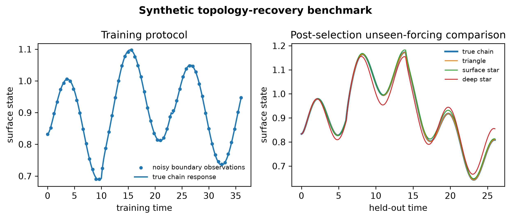
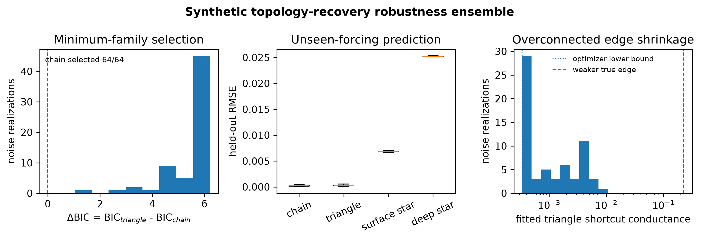
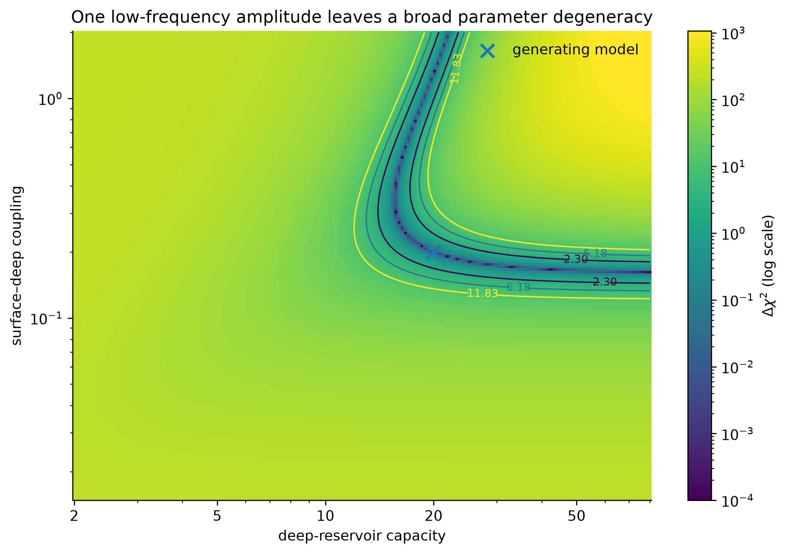
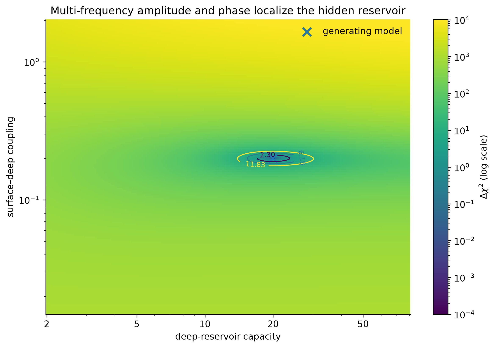
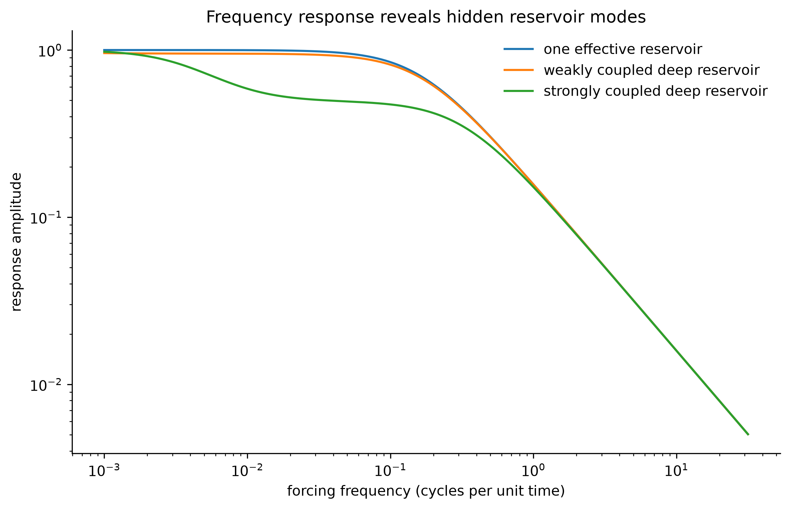
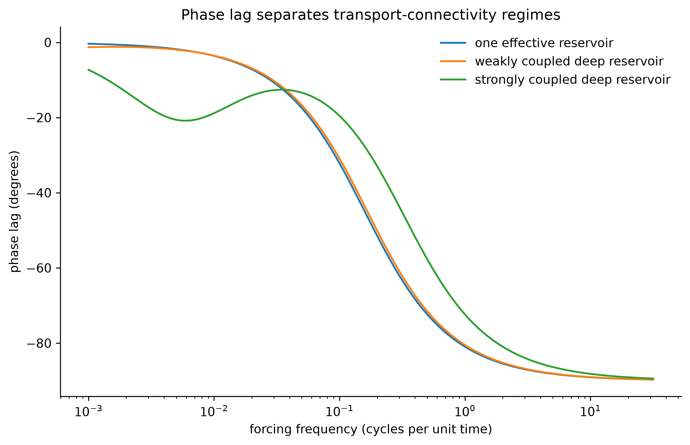

**Version 1.0.1 · Reproducibility supplement · Not peer reviewed**

> **Status statement.** Every result in this supplement is synthetic. No Solar System, exoplanet, laboratory, or mission data are fitted. The tests demonstrate implementation behavior under declared assumptions; they do not validate a planetary topology.

# Purpose and relation to the main paper

The main paper proposes **Solar–Planetary Phase-Partition Theory (SPPT)** and names its inference and validation layer **ASTRA — Astronomical State-Topology and Reservoir Analysis**. SPPT supplies the physical state representation, conservation rules, thermodynamic admissibility conditions, and topology-transition logic. ASTRA asks whether candidate phase-reservoir graphs can be distinguished from boundary observations and whether their added structure produces calibrated predictive improvement.

This supplement documents three narrow implementation tests:

1. a transparent three-reservoir topology-recovery benchmark with training-BIC selection and a distinct post-selection held-out forcing;
2. a 64-seed Monte Carlo robustness repetition of that benchmark;
3. a two-reservoir frequency-domain demonstration of static and single-frequency non-identifiability.

The tests are deliberately small enough to audit line by line. They are not a substitute for equations of state, phase diagrams, atmosphere–interior evolution, radiative transfer, or mission-data likelihoods.

# Three-reservoir topology-recovery benchmark

## Candidate graph families

The benchmark contains three reservoirs, indexed from deep to observable surface:

$$
0=\text{deep},\qquad 1=\text{intermediate},\qquad 2=\text{surface}.
$$

Four connected undirected transport graphs are compared:

| Graph family | Edges | Free conductances |
|---|---|---:|
| Chain | $(0,1),(1,2)$ | 2 |
| Surface star | $(0,2),(1,2)$ | 2 |
| Deep star | $(0,1),(0,2)$ | 2 |
| Triangle | $(0,1),(1,2),(0,2)$ | 3 |

The generating graph is the chain, with normalized conductances

$$
k_{\mathrm{true}}=(0.22,1.40).
$$

Node capacities, surface loss, internal power, and observational noise are

$$
C=(8,3,1),\qquad
\lambda_s=1.2,\qquad
P_d=1.0,\qquad
\sigma_y=2.5\times10^{-3}.
$$

## Dynamics

For graph Laplacian $L_{\mathcal G}(k)$ and surface-loss matrix

$$
\Lambda=\mathrm{diag}(0,0,\lambda_s),
$$

the state satisfies

$$
C\dot{T}
=-\bigl(L_{\mathcal G}+\Lambda\bigr)T
+\begin{bmatrix}P_d\\0\\f(t)\end{bmatrix}.
$$

Only the surface state $T_2(t)$ is observed. The training and held-out forcings are intentionally different:

$$
f_{\mathrm{train}}(t)
=0.35\sin(0.55t)
+0.18\,\mathbf1_{t>10}
-0.12\,\mathbf1_{t>23},
$$

$$
f_{\mathrm{test}}(t)
=0.28\sin(1.05t)
+0.22\sin(0.19t)
+0.20\,\mathbf1_{6<t<14}.
$$

The training window contains 361 samples over $0\le t\le36$; the held-out window contains 261 samples over $0\le t\le26$.

## Fitting and selection

Positive conductances are parameterized as $k_e=\exp\eta_e$ and fitted by nonlinear least squares using only the noisy training surface series. All generation constants, seeds, candidates, and evaluation code are public; the benchmark is not blinded or external validation. Each fit uses a release-frozen 20-start generic design combining low-discrepancy coverage with unit and coordinate-wise decade anchors, together with exact forward sensitivities of the implemented propagator to log conductance. The 20-start design was adopted during release audit after replay of this same synthetic benchmark exposed a missed endpoint under the earlier 12-start design. The added anchors were therefore informed by benchmark behavior, and the reported reruns are regression evidence for the repaired implementation rather than untouched evaluation. A solver result is eligible only when it reports positive termination status, finite parameters and objective, and cost-scaled first-order optimality $\lVert g\rVert_\infty/\max(1,C)\le10^{-4}$; the lowest-cost eligible start is retained. If a non-eligible endpoint has a cost lower by more than $10^{-4}$ of the retained cost scale, the fit fails closed as insufficient optimizer coverage. Every start vector, solver disposition, endpoint, cost, optimality diagnostic, and active-bound mask is retained in both duplicate machine-readable serializations. With residual sum of squares $\mathrm{RSS}$, sample count $n$, and free-conductance count $p$, the benchmark reports

$$
\mathrm{BIC}=n\ln\left(\frac{\mathrm{RSS}}{n}\right)+p\ln n.
$$

This BIC is a small-sample implementation choice, not a universal ASTRA selection law. Its regular-model interpretation is only approximate here because the triangle nests the chain at a conductance boundary. The main framework requires posterior predictive calibration and physically matched controls for real inference.

{#fig:s1 width=100%}

## Exact static degeneracy

At zero external forcing, every connected candidate graph transports the same total internal power to the same surface sink. Consequently, all four have the same surface equilibrium:

$$
T_{s,\mathrm{eq}}=\frac{P_d}{\lambda_s}=\frac{1}{1.2}=0.833333\ldots
$$

Their hidden deep states are not the same.

| Graph family | Surface equilibrium | Deep equilibrium |
|---|---:|---:|
| Chain | 0.833333 | 6.093074 |
| Surface star | 0.833333 | 2.261905 |
| Deep star | 0.833333 | 2.261905 |
| Triangle | 0.833333 | 1.785714 |

This is the benchmark's core inverse-problem fact: a static boundary value can identify total throughput without identifying the internal transport architecture.

## Single-seed recovery

The released realization uses seed 20260801. Results ranked by BIC are:

| Rank | Graph | Fitted conductances | Training RMSE | BIC | Held-out RMSE |
|---:|---|---|---:|---:|---:|
| 1 | Chain | 0.228876; 1.393863 | 0.002500 | -4314.159 | 0.000474 |
| 2 | Triangle | 0.225037; 1.390020; 0.001869 | 0.002499 | -4308.513 | 0.000452 |
| 3 | Surface star | 0.087328; 1.196997 | 0.005059 | -3805.156 | 0.006720 |
| 4 | Deep star | 0.045813; 1.084790 | 0.019802 | -2819.876 | 0.025147 |

The overconnected triangle has a slightly smaller held-out RMSE than the chain in this one noise realization. That does **not** identify the triangle. Its extra shortcut is fitted at $0.001869$, approximately 0.85% of the weaker true chain edge, and the training-BIC penalty selects the two-edge chain. The correct interpretation is minimum-family selection with an overconnected control that collapses toward the generating graph.

# Monte Carlo robustness ensemble

The complete fit was repeated for 64 consecutive independent Gaussian-noise seeds, beginning at 20260801 and preserving all physical and numerical settings. Selection uses training BIC only; the noiseless held-out generating response is compared afterward. The chain was the minimum-BIC graph in 64 of 64 realizations.

The median separation between the overconnected and minimum graph was

$$
\mathrm{median}\left(
\mathrm{BIC}_{\mathrm{triangle}}-
\mathrm{BIC}_{\mathrm{chain}}
\right)=5.8493.
$$

The median triangle shortcut conductance was

$$
7.6485\times10^{-4},
$$

showing systematic shrinkage of the unnecessary edge toward zero under the released optimization and noise scale. The shortcut reaches the declared lower bound $\exp(-8)$ in 29 of 64 realizations, so the distribution is censored. The full output preserves these bound-active fits and does not treat them as interior measurements.

The post-selection unseen-forcing comparison preserves a material negative outcome: the triangle has a smaller held-out RMSE than the chain in 23 of 64 realizations. Mean held-out RMSE is $2.4864\times10^{-4}$ for the chain and $2.6969\times10^{-4}$ for the triangle. The observed $\Delta\mathrm{BIC}$ range is 1.0342 to 6.2157. These facts do not alter the training-BIC winner, but they limit what 64/64 selection establishes.

{#fig:s6 width=100%}

This ensemble does not estimate a general false-positive rate. It holds capacities, sink location, forcing, noise law, and the candidate graph set fixed. The CSV and JSON are alternate serializations of the same 64 runs, not independent evidence. A real ASTRA validation program must vary those assumptions, include misspecified models, and test graph-posterior calibration.

# Frequency-domain identifiability demonstration

## Linear response

For a fixed graph, capacities $C$, transport Laplacian $L_K$, and local-loss matrix $\Lambda$, consider

$$
C\dot{T}=P(t)-\bigl(L_K+\Lambda\bigr)T.
$$

With harmonic forcing $P(t)=\Re(b\,e^{i\omega t})$ and scalar observation $y=c^{\mathsf T}T$, the transfer response is

$$
H(i\omega)
=c^{\mathsf T}
\bigl(i\omega C+L_K+\Lambda\bigr)^{-1}
b.
$$

Amplitude and phase depend on the eigenmodes, capacities, and connectivity. Static gain corresponds only to $\omega=0$ and can leave deep parameters unconstrained.

## Two-reservoir demonstration

The normalized generating model uses

$$
C_s=1,
\qquad C_d=20,
\qquad k=0.2,
\qquad \lambda_s=1.
$$

Its two decay rates and relaxation times are:

| Mode | Decay rate | Relaxation time |
|---:|---:|---:|
| Slow | 0.0083217 | 120.1678 |
| Fast | 1.2016783 | 0.83217 |

A single low-frequency amplitude at $f=0.003$ leaves a broad valley in $(C_d,k)$ space. The best point on the declared grid is $(16.0319,0.271916)$, visibly displaced from the generating pair despite matching that one response feature.

{#fig:s2 width=90%}

Using complex amplitude and phase at 24 logarithmically spaced frequencies localizes the grid minimum near the generating model:

$$
(C_d,k)_{\mathrm{grid\ best}}=(20.1111,0.201304).
$$

{#fig:s3 width=90%}

The mechanism is visible directly in the response curves. Adding a weakly or strongly coupled deep reservoir changes both attenuation and phase lag over a range of forcing frequencies.

{#fig:s4 width=88%}

{#fig:s5 width=88%}

The demonstration does not imply that astronomical observations can freely choose forcing frequencies. In practice, usable variation may come from orbital phase, seasons, eclipses, stellar variability, secular cooling, impacts, atmospheric events, or comparisons across a population. The input spectrum and observation operator must be modeled rather than assumed.

# Numerical implementation validation

The single-run benchmark uses `scipy.integrate.solve_ivp` with maximum step 0.05, relative tolerance $10^{-9}$, and absolute tolerance $10^{-11}$. The 64-seed ensemble uses exact matrix-exponential propagation under a four-substep zero-order-hold approximation to the time-dependent forcing. Every fitted family is evaluated from 20 distinct, fixed, graph-independent multistarts combining low-discrepancy coverage with unit and coordinate-wise decade anchors. A retained fit is rejected if a non-admitted endpoint produces a materially lower cost. As disclosed above, this strengthened start design and its reruns are post-audit regression evidence. Release generation uses CPython 3.12.10, Git for Windows 2.55.0.windows.3, and probed single-thread NumPy and SciPy OpenBLAS Haswell kernels on compatible Windows x86-64 hardware; the byte-identity claim is limited to the exercised release outputs under that complete frozen runtime.

The fast propagator was compared with the high-accuracy solver at the generating parameters:

| Protocol | Maximum surface error | Surface RMSE | Maximum error / noise SD |
|---|---:|---:|---:|
| Training forcing | $9.63\times10^{-6}$ | $6.70\times10^{-6}$ | 0.00385 |
| Held-out forcing | $1.60\times10^{-5}$ | $9.70\times10^{-6}$ | 0.00640 |

Thus the numerical approximation contributes less than 0.7% of the observational-noise standard deviation in the validation cases.

# Automated tests

The release's complete discovered test suite covers:

- conservation of a declared weighted inventory under internal transport and balanced reaction;
- the exact periodic-trap solution and loop-area integral;
- the weak-cut spectral bound;
- ideal electroreduction scale calculations;
- static boundary degeneracy;
- existence of a negative differential transport region in the declared toy closure;
- graph-Laplacian conservation and positive semidefiniteness;
- two-reservoir steady state, step response, poles, and frequency response;
- Fisher-information symmetry and positive semidefiniteness;
- fast-propagator agreement with the high-accuracy benchmark;
- minimum-chain selection in the released seed.
- the complete state-dependent derivative, including $K(1-dT_u/dT_d)$;
- frozen multistart design, convergence and materially-better-endpoint rejection, active-bound reporting, numeric-kernel override and probe checks, and negative release-integrity checks.

Passing tests establish consistency with the implemented equations. They do not establish that the equations are sufficient for a specific planet.

# Reproducibility commands

From the release root, install the exact hash-locked dependencies and run the canonical verification:

```bash
python -m pip install --require-hashes -r requirements-lock.txt
python tools/verify.py --all
```

For a direct scientific replay, `python scripts/make_figures.py` regenerates every figure and benchmark output; the wrapper declares the repository import path and frozen build environment itself. The scripts write data to `data/` and figures to `figures/`. Random seeds, all normalized parameter values, accepted-start counts, first-order optimality values, and active-bound flags are stored in machine-readable outputs.

# Limitations and required extensions

The benchmark is intentionally favorable. Its main limitations are:

1. **Known capacities and sink structure.** Only conductances and graph family are fitted.
2. **Closed candidate set.** The generating graph is present among four candidates.
3. **Linear dynamics.** No state-dependent phase boundary, topology guard, or nonlinear radiation is included.
4. **Single observation channel.** Only the surface state is observed, but its noise is independent Gaussian noise with known scale.
5. **Correct forcing model.** Input timing and amplitude are treated as known.
6. **BIC approximation.** Full Bayesian graph evidence and posterior calibration are not computed.
7. **Boundary-nested control.** The triangle collapses to the chain at a conductance boundary, so regular BIC asymptotics need not hold exactly.
8. **No physical equations of state.** The variables are normalized and not mapped to a planet.
9. **No discrepancy process.** Structural model error is absent.
10. **No adversarial negative controls.** Random graph families, equal-parameter nonlinear fixed graphs, and correlated-noise controls remain future work.
11. **No population validation.** The tests do not establish transfer to exoplanet or Solar System inference.

The next computational milestone is a blinded benchmark suite in which capacities, sink placement, forcing spectrum, phase thresholds, and noise covariance vary; the candidate set sometimes omits the generating graph; and selection is judged by graph-posterior calibration as well as prediction.

# Artifact map

| Artifact | Purpose |
|---|---|
| `src/sppt_core.py` | Conservation, trap, bottleneck, electroreduction, and reduced transport calculations |
| `src/astra_reservoir.py` | Linear ASTRA network, transient, frequency-response, and information tools |
| `src/astra_optimization.py` | Frozen multistart design and explicit optimizer-convergence gate |
| `scripts/synthetic_topology_benchmark.py` | High-accuracy single-run graph benchmark |
| `scripts/benchmark_ensemble.py` | 64-seed robustness ensemble |
| `scripts/generate_astra_figures.py` | Frequency-domain and response demonstrations |
| `tests/` | Automated consistency and numerical-validation checks |
| `data/*.json` and `data/*.csv` | Machine-readable inputs and outputs |
| `figures/supplement_figure_S*.png` | Supplementary visualizations |

# Conclusion

The released synthetic work establishes three limited points. Static surface equilibrium can conceal substantially different internal states; transient forcing can separate several candidate connectivity families; and multi-frequency complex response can reduce a capacity–conductance degeneracy that survives a single response measurement. Within the declared benchmark, training BIC consistently selects the minimum generating graph and an unnecessary edge shrinks toward or reaches its lower bound. Held-out results remain a post-selection comparison and preserve cases favoring the overconnected control.

Those results justify proceeding to harder blinded tests. They do not yet justify an astronomical claim. The scientific threshold remains the same as in the main paper: topology must pay predictive rent under realistic physics, uncertainty, and unseen data.
