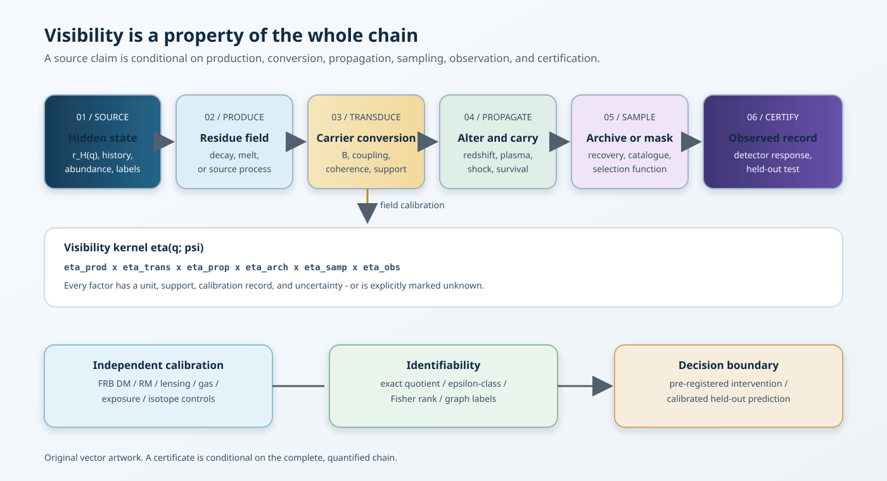
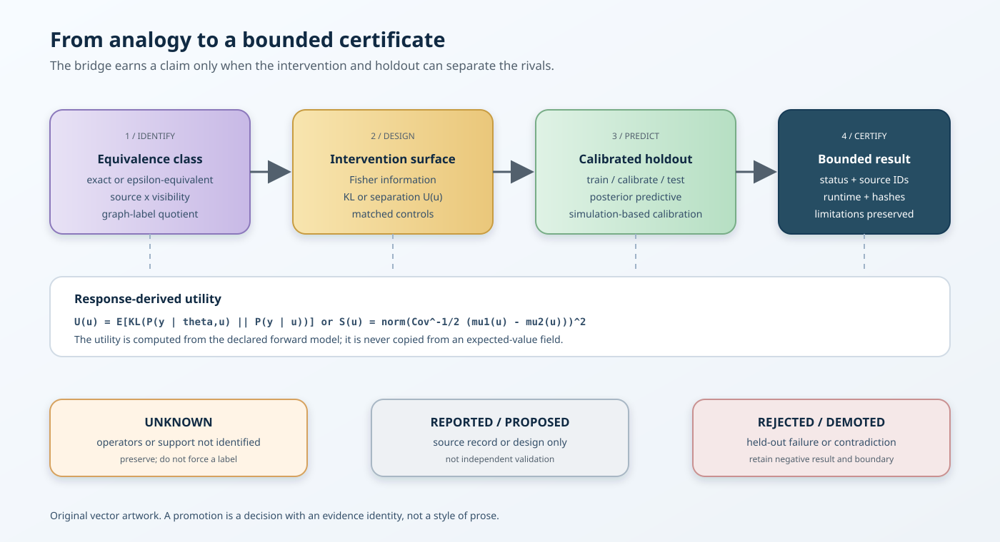

> **Research status.** This is a repository-visible, unpromoted ASTRA
> supplemental research draft. It is not peer reviewed, is not a new SPPT
> equation, and does not report a dark-matter, graviton, axion, or planetary
> detection. It combines two supplied reports into a falsifiable measurement
> framework. The words *established*, *reported*, *inferred*, *proposed*, and
> *unknown* retain their ordinary evidence meanings throughout.

# Abstract

Two recent case studies expose opposite failures of naive observation. In one,
cosmic filaments are proposed as a distributed transducer: a hidden decay may
produce a carrier that is converted by magnetized plasma into photons. In the
other, a Martian meteorite fills an apparent age gap, showing that a missing
class in the terrestrial collection need not be a missing class in the planet's
history. The physical mechanisms are unrelated. The inference problem is the
same.

The observable is produced by a chain rather than by a source in isolation:

$$
  \text{hidden state}
  \longrightarrow \text{production}
  \longrightarrow \text{transduction}
  \longrightarrow \text{propagation}
  \longrightarrow \text{archive or sampling}
  \longrightarrow \text{detector}
  \longrightarrow \text{certificate}.
$$

This draft names the chain an **operator-aware visibility framework**. It
extends the ASTRA bookkeeping idea (source, boundary, archive, observation,
and bounded certificate) without pretending that the analogy is a physical
unification. A source is inferable only relative to an identified visibility
operator. A null result is strong only when the expected visibility is
quantified. A transformed record can be useful rather than lost when the
transformation is modelled and tested.

The framework contributes five practical objects:

1. a typed visibility kernel;
2. a source-versus-visibility identifiability ledger;
3. a multi-messenger calibration protocol for cosmic filaments;
4. a sampling-bias protocol for planetary archives; and
5. a promotion ladder that converts analogy into an executable, held-out test.

All cosmological applications below are conditional proposals. They are not
claims that dark matter decays, that gravitons have been detected, that a
particular Martian rock defines a fourth mantle reservoir, or that the universe
is a computer, ether, or single machine in a literal sense.

# 1. What changed, and what did not

## 1.1 The methodological advance

The useful change is a change in the unit of analysis. A conventional question
asks, “Is the source present?” The framework asks:

* What state or history would produce the residue?
* Which physical carrier transports that residue?
* What medium converts or attenuates it?
* Which archive or sampling process selects the surviving record?
* What detector and nuisance model map the record to a certificate?
* Which combinations of source and visibility parameters are observationally
  equivalent?

This is **operator-aware reconstruction**. It does not add an unknown field to
SPPT and it does not turn a metaphor into a law. It is a reporting and design
layer that can be attached to a domain when the relevant operators have units,
priors, calibration data, and falsification tests.

## 1.2 Explicit non-claims

The following are deliberately outside the admitted scope:

* a detection of dark matter or a measurement of its lifetime;
* a detection of a single graviton or graviton--photon conversion event;
* a detection of an axion or axion--photon conversion event;
* proof that cosmic magnetic fields have any one origin or universal profile;
* proof that NWA 13441 is a unique, pristine, or fourth Martian mantle
  reservoir;
* proof of a shared physical mechanism between cosmic conversion and meteorite
  delivery;
* a replacement for the standard cosmological model, QED, general relativity,
  isotope geochemistry, planetary petrology, or their experimental records; and
* a revision of the immutable SPPT/ASTRA v1.0.6 core or its release identity.

## 1.3 Relationship to SPPT and ASTRA

SPPT remains the phase-reservoir graph and its conservation, transport,
boundary, topology, intervention, and held-out prediction contracts. ASTRA is
the analysis layer that records hidden states, observation boundaries,
provenance, and evidence status. This draft is a namespaced successor method:

$$
  \text{SPPT state model}
  \;+\;
  \text{ASTRA evidence ledger}
  \;+\;
  \text{visibility and sampling operators}.
$$

The plus signs denote typed interfaces, not an assertion that the domains share
a physical substance. No statement in this document is promoted into the
v1.0.6 claim matrix merely by appearing here.

# 2. Two case studies, one inference boundary

## 2.1 Cosmic filaments as conditional transducers

The supplied dark-sector report follows a proposed chain in which an unstable
particle $\chi$ decays to two gravitons, and a graviton can convert to a photon
while traversing a magnetic field. In schematic form,

$$
  \chi \longrightarrow h+h
  \longrightarrow h\leftrightarrow\gamma \text{ in } B
  \longrightarrow \gamma\text{-ray propagation}
  \longrightarrow \text{all-sky background}.
$$

The important result is a conditional null constraint: under a specified
abundance, branching fraction, filament field distribution, coherence length,
propagation model, and background decomposition, an excess gamma-ray component
would not be allowed above a calculated level. This is not a detection of any
link in the chain.

For a short coherent path, the proposed conversion probability has the
schematic scaling

$$
  P_{h\rightarrow\gamma}^{(1)} \propto G B_\perp^2\ell_{\mathrm{coh}}^2,
  \qquad
  N_{\mathrm{fil}}\propto f_{\mathrm{vol}}\,\frac{L}{\ell_{\mathrm{fil}}},
$$

so a cumulative sensitivity can scale approximately as

$$
  P_{h\rightarrow\gamma}^{\mathrm{total}}
  \propto B_\perp^2\ell_{\mathrm{coh}}^2 f_{\mathrm{vol}}L/\ell_{\mathrm{seg}},
$$

where the shorter segment length $\ell_{\mathrm{seg}}$ is explicit; the often-used
linear $\ell_{\mathrm{coh}}$ scaling follows only when $\ell_{\mathrm{seg}}$ is set equal
to the coherence length. These proportionalities are design intuition, not a
substitute for the coupled wave calculation. They reveal why the filament is
part of the instrument. A
stronger cluster field does not automatically dominate if clusters occupy less
volume or provide a shorter coherent path. The expected signal is a compound
function of source abundance, lifetime, branching fraction, magnetic field,
geometry, plasma, redshift, and detector response.

## 2.2 NWA 13441 as a selective archive

The supplied Mars report describes NWA 13441 as an olivine-phyric shergottite
with a reported Sm--Nd errorchron age near $1273\pm21$ Ma. The age lies between
large clusters of younger and much older shergottites. The safe inference is
that the terrestrial collection had not previously sampled that part of the
Martian magmatic record. It is not safe to infer that Mars lacked magmatism in
the interval.

The delivery chain is long and selective:

$$
  \text{mantle source}
  \rightarrow \text{melt and crystallization}
  \rightarrow \text{impact excavation}
  \rightarrow \text{ejection}
  \rightarrow \text{interplanetary transfer}
  \rightarrow \text{terrestrial survival}
  \rightarrow \text{recovery}
  \rightarrow \text{isotope analysis}.
$$

Each arrow can remove, transform, or preferentially retain material. The
reported isotopic composition is compatible with more than one generator,
including a long-lived near-chondritic reservoir and mixing among known
reservoirs. The available record does not yet identify which generator is
correct. A large regression scatter or excluded alteration-affected fractions
should be retained in the uncertainty ledger, not hidden by the headline.

## 2.3 Why the cases should not be physically conflated

Cosmic conversion and meteorite delivery are not evidence of one universal
force. One is a proposed wave conversion in a magnetized medium; the other is a
geological and impact-selection history. Their commonality is structural:

Table: Case-role comparison and inference risks

| Case | Hidden object | Intervening operator | Terminal record | Main risk |
| --- | --- | --- | --- | --- |
| Filament search | decay or hidden-sector residue | magnetic conversion, propagation, exposure | gamma/radio map | source--field degeneracy |
| Martian archive | mantle history | melting, launch, transfer, recovery | small rock collection | archive and sampling bias |

This is exactly the level at which ASTRA can be useful: typed interfaces and
test plans, not unsupported ontology.

# 3. The visibility kernel

## 3.1 Definition

Let $H$ denote a source history, $q$ a latent coordinate (space, time,
frequency, energy, composition, or geometry), and $m$ a messenger or assay.
Define the visibility kernel as an operator composition first:

$$
  \mathcal V_m
  = \mathcal O_m\circ\mathcal S_m\circ\mathcal P_m\circ\mathcal T_m,
  \qquad
  \mathbf y_m=\mathcal V_m[\mathcal R_H]+\mathbf f_m+\boldsymbol\varepsilon_m.
$$

When the operators reduce to independent scalar efficiencies at a declared
resolution, a useful approximation is

$$
  \eta_m(q;\psi)
  = \eta_{\mathrm{prod}}(q)\,
    \eta_{\mathrm{trans}}(q;\psi_T)\,
    \eta_{\mathrm{prop}}(q;\psi_P)\,
    \eta_{\mathrm{arch}}(q;\psi_A)\,
    \eta_{\mathrm{samp}}(q;\psi_S)\,
    \eta_{\mathrm{obs}}(q;\psi_O),
$$

where $\psi$ are nuisance and calibration parameters. This product is not an
independence assumption about the physical processes: it is a conditional
factorization that must be justified by the model and can fail for coupled,
history-dependent, or selection-dependent operators. The factors may be
probabilities, efficiencies, transfer operators, or integral kernels; they need
not all be dimensionless. A unit-bearing forward model should state the measure
and normalization explicitly rather than silently multiplying unlike
quantities.

The expected observable yield under $H$ is

$$
  \Lambda_{H,m}
  = \int r_H(q)\,\eta_m(q;\psi)\,dq,
$$

where $r_H$ is the source or residue field in compatible units. In a discrete
model, write $\boldsymbol{\lambda}_H=\mathbf K_m(\psi)\mathbf r_H$ and record
the matrix, units, resolution, and boundary conditions.

## 3.2 Forward observation model

For a map, spectrum, or assay vector $\mathbf y_m$,

$$
  \mathbf y_m
  = \mathcal O_m\!\left[
      \mathcal P_m\!\left(
        \mathcal T_m[\mathcal R_H]
      \right)
    \right]
    + \mathbf f_m(\nu_m)
    + \boldsymbol\varepsilon_m.
$$

Here $\mathcal T$ is transduction, $\mathcal P$ is propagation and alteration,
$\mathcal O$ is detector or assay response, $\mathbf f$ is a nuisance or
foreground model, and $\boldsymbol\varepsilon$ is measurement error. For a
sample archive, $\mathcal O$ includes laboratory preparation and measurement,
while $\mathcal S$ governs which fragments enter the archive at all.

## 3.3 Absence and the zero-count limit

For a simple Poisson count, $N\sim\operatorname{Poisson}(\Lambda_H)$ and

$$
  P(N=0\mid H)=e^{-\Lambda_H},
  \qquad
  V_0(H)=-\log_{10}P(N=0\mid H)
  =\frac{\Lambda_H}{\ln 10}.
$$

The formula is useful because it forces visibility into the null claim. It is
not universally applicable: clustered counts, correlated backgrounds,
selection on detection, and model uncertainty require a likelihood or point
process appropriate to the data. If $\eta$ is poorly constrained, the null
usually identifies a product or integral of source and visibility parameters,
not the source parameter alone.

## 3.4 Visibility is channel-relative

“Dark” is not an absolute label. A state can be dark to one detector and
visible to another after carrier conversion:

$$
  \text{hidden state}
  \rightarrow \text{charged residue}
  \rightarrow \text{synchrotron},
  \qquad
  \text{hidden state}
  \rightarrow h
  \rightarrow \gamma,
  \qquad
  \text{hidden state}
  \rightarrow a
  \rightarrow \gamma.
$$

These chains are distinct hypotheses. The framework does not combine them into
a common particle. It requires each to specify its own coupling, normalization,
propagation, and rejection tests.

# 4. Identifiability and the source--visibility quotient

## 4.1 Exact and practical equivalence

Let $\theta$ describe source history and $\psi$ describe the visibility field.
Two parameter pairs are **exactly observationally equivalent** on an experiment
$\mathcal E$ if

$$
  \mathcal F_{\mathcal E}(\theta_1,\psi_1)
  =\mathcal F_{\mathcal E}(\theta_2,\psi_2)
$$

for every observable in the declared data space, including uncertainty model
and support. They are **$\epsilon$-equivalent** on a finite design if the
distance between predicted distributions is below a predeclared tolerance:

$$
  d\!\left(P_{\theta_1,\psi_1},P_{\theta_2,\psi_2}\right)\le\epsilon.
$$

The metric $d$ may be a whitened prediction norm, likelihood-ratio distance,
energy distance, or a domain-specific discrepancy. The choice and scale are
part of the protocol, not a post-hoc convenience.

The **visibility quotient** is the set of equivalence classes under this
relation. A result that identifies only a quotient class must not be worded as
identifying a unique source.

## 4.2 Local information and rank

For a differentiable mean response $\boldsymbol\mu(\theta,\psi)$ and covariance
$\mathbf\Sigma$, the local Fisher information is

$$
  \mathbf I(\vartheta)
  = \mathbf J(\vartheta)^\mathsf T
    \mathbf\Sigma^{-1}
    \mathbf J(\vartheta),
  \qquad
  \mathbf J=\frac{\partial\boldsymbol\mu}{\partial\vartheta^\mathsf T},
  \quad \vartheta=(\theta,\psi).
$$

Rank deficiency or a tiny singular value indicates local non-identifiability
under the chosen design. It does not prove global equivalence, and full local
rank does not protect against an unmodelled channel. Report singular values,
scaling, parameter units, and the perturbation size used to estimate $\mathbf J$.

## 4.3 Graph labels and topology quotienting

When the hidden system is a graph, relabeling nodes can produce exactly the same
observables. A graph claim should therefore define the admitted label group $G$
and compare graph hypotheses modulo the action of $G$:

$$
  [G]=\{g\!\cdot G:g\in\mathcal G_{\mathrm{labels}}\}.
$$

For weighted or typed graphs, the quotient must preserve edge direction,
channel type, boundary labels, units, and intervention ports. A graph
isomorphism test is not a proof that two physical systems are equivalent; it
only removes a bookkeeping redundancy before response comparison.

## 4.4 Interventions as designed separation

An intervention $u$ changes forcing, exposure, mode, sampling, or a calibrated
medium parameter. Choose $u$ by the expected separation of rival predictions,
not by a supplied utility number. One practical score is

$$
  U(u)=\mathbb E_{\vartheta\sim\pi}
  \left[
    \operatorname{KL}\!\left(
       P(\mathbf y\mid\vartheta,u)\,\middle\|\,
       P(\mathbf y\mid u)
    \right)
  \right],
$$

or, for two hypotheses, a noise-whitened separation

$$
  S(u)=\left\|
     \mathbf\Sigma_u^{-1/2}
     \left(\boldsymbol\mu_1(u)-\boldsymbol\mu_2(u)\right)
  \right\|_2^2.
$$

The response surface must be generated from the forward model over $u$ and
the admissible parameter set. A hand-entered expected gain is evidence of a
design choice, not evidence that the design works.

# 5. The cosmic web as a calibrated instrument

## 5.1 Typed roles

For a filament ensemble, record the roles separately:

Table: Role ledger for a calibrated filament instrument

| Role | Example quantity | Failure if omitted |
| --- | --- | --- |
| Source | $\rho_{\mathrm{DM}}$, decay rate, branching fraction | false abundance or lifetime claim |
| Transducer | $B_\perp$, coupling, coherence length | source--field degeneracy |
| Propagator | redshift, plasma, pair cascades, attenuation | wrong spectrum or morphology |
| Amplifier or emitter | synchrotron particles, resonance, cascade | wrong energy budget |
| Sampler | filament catalogue, mask, sightline selection | catalogue bias |
| Archive | gamma, radio, FRB, lensing, RM maps | missing or correlated evidence |
| Detector | exposure, PSF, energy response, calibration | invalid significance |
| Certificate | predeclared test statistic and holdout | post-hoc story |

The same physical filament can carry more than one role, but each role gets a
separate field and uncertainty record.

## 5.2 Calibration channels

No filament-mediated search should fix one representative magnetic field and
then treat the result as source-only. The minimum calibration vector should
include, where available,

$$
  \Sigma_F=(\rho_{\mathrm{DM}},n_e,T_e,B_\parallel,B_\perp,
             \ell_{\mathrm{coh}},z,G_F),
$$

with geometry and orientation $G_F$. Candidate tracers have complementary
operators:

$$
  {\mathrm{DM}}_{\mathrm{FRB}}\propto\int n_e\,dl,
  \qquad
  {\mathrm{RM}}\propto\int n_eB_\parallel\,dl,
$$

$$
  I_{\mathrm{sync}}\propto\int n_{e^\pm}B_\perp^{(p+1)/2}\,dl,
  \qquad
  \kappa_{\mathrm{lens}}\sim\int \rho_{\mathrm{total}}\,W_\kappa\,dl.
$$

These observables do not measure the same thing. Their value is in jointly
constraining the nuisance field and exposing incompatible assumptions.

## 5.3 Filament Conversion Tomography protocol

The following is a proposed experiment design, not a result.

### Inputs

1. A filament or web catalogue with a frozen version, selection function,
   redshift range, and geometry uncertainty.
2. Gamma-ray and radio maps with exposure, point-spread, energy/frequency
   response, foreground masks, and time range.
3. FRB dispersion and Faraday-rotation records with source selection and
   calibration metadata.
4. Weak-lensing or CMB-lensing maps and a constrained simulation ensemble.
5. A null-control catalogue with matched converter-proxy strata and
   void-dominated baryon comparison sightlines. A void is not a low-field or
   zero-dark-matter control unless independent magnetic and matter proxies
   establish that interpretation.

### Pre-registration

Before opening the final residual map, freeze:

* the photon or radio spectrum and its mass or coupling dependence;
* the redshift and angular weighting;
* the dependence on $B_\perp^2$, any separately modelled source-column proxy,
  and coherence length;
* the treatment of unknown or partially observed fields;
* primary and secondary cross-correlation statistics;
* the holdout split and nuisance prior; and
* the threshold for rejecting, demoting, or retaining the candidate.

### Primary test

Estimate a joint model for gamma/radio residuals and independent filament
tracers. A candidate conversion signal should produce a predeclared spatial or
tomographic relationship with filament probability and magnetic proxies. It
should not be equally strong in matched low-converter controls after exposure
and foreground adjustment. Void sightlines are a baryon and sampling
comparison; they become a magnetic-control stratum only when an independent
RM-squared or equivalent proxy supports that interpretation.

### Rejection conditions

Demote the candidate if any of the following occurs in a calibrated, held-out
test:

* the residual does not track filament probability when sensitivity is adequate;
* the residual does not scale with independent magnetic-field proxies;
* the energy spectrum or redshift dependence disagrees with the forward model;
* an ordinary source population explains the same morphology and spectrum;
* matched low-converter controls show the same effect, or void controls show
  the same effect after their baryon, magnetic, and selection differences are
  explicitly modelled;
* the required field conflicts with FRB, RM, radio, cascade, or laboratory
  constraints; or
* no single parameter set closes across the abundance, structure, and coupling
  archives.

## 5.4 Interpreting a null

A Fermi-LAT-like null can be a meaningful constraint only after integrating the
field uncertainty. In a simplified model,

$$
  \Phi_\gamma\propto
  \frac{b_{\mathrm{hidden}}}{m_\chi\tau_\chi}
  \int dz\,\rho_\chi(z)B_\perp^2(z)\ell_{\mathrm{coh}}(z)K(E,z).
$$

The null therefore constrains the compound integral. If $b_{\mathrm{hidden}}$ or
$B$ is free over orders of magnitude, a lifetime bound cannot be described as
model-independent. The release of a null certificate should include posterior
or profile sensitivity to each visibility component.

# 6. The planetary archive as a sampling experiment

## 6.1 Archive-entry operator

For an underlying population of Martian source rocks with density $r_M(q)$, let
$\mathcal A$ denote the archive-entry, preservation, recovery, and recognition
operator. Under a declared factorization, let $a(q)$ be the probability of
entering the terrestrial archive and $s(q)$ the probability of being recovered
and recognized. The expected observed sample is

$$
  r_{\mathrm{observed}}(q)=\mathcal A[r_M](q),
  \qquad
  \mathcal A[r_M](q)=r_M(q)\,a(q)\,s(q)\quad\text{only under that factorization}.
$$

A gap in $r_{\mathrm{observed}}$ is evidence against $r_M$ only when $a(q)s(q)$ is
bounded away from zero in the relevant region. For shergottites, impact
history, launch geometry, strength, transit, weathering, human collection, and
recognition are all selection factors.

## 6.2 Competing generators for NWA 13441

The present draft keeps at least two generators visible:

1. a long-lived, weakly mixed near-chondritic mantle reservoir; or
2. mixing of enriched and depleted melts that reproduces a near-chondritic
   isotope value.

The Sm--Nd result is a bounded chronology and compositional constraint, not a
unique source certificate. The following measurements can separate the models:

* Rb--Sr and Lu--Hf isotope systems;
* mineral-scale isotope maps and heterogeneity tests;
* cosmic-ray exposure and noble-gas measurements;
* diffusion and shock-reset modelling;
* comparison with chemically paired and unpaired shergottites;
* impact-launch and ejection-site models; and
* a systematic search for additional rocks in the age interval.

The high-information test is not “find another unusual rock.” It is to obtain
independent isotope trajectories and source context that produce different
predictions under isolation and mixing.

## 6.3 Sampling controls

An archive-aware protocol should report:

* the candidate source population and its unobserved support;
* the transport and preservation mechanisms;
* the recovery and recognition process;
* known and suspected collection biases;
* a missing-not-at-random sensitivity analysis; and
* a proposed observation that would change the source-versus-sampling odds.

This is a direct analogue of the void control in a cosmic-web search: a
comparison class tests whether the apparent signal or gap follows the proposed
operator rather than only the terminal record.

# 7. Genesis and coupling are different archives

A dark-sector hypothesis needs two consistency ledgers.

## 7.1 Genesis archive

Production history can affect power spectra, isocurvature, free-streaming,
halo abundance, cosmic-web topology, CMB distortions, and gravitational-wave
backgrounds. A coupling model that fits a present gamma-ray channel but cannot
produce the observed abundance or structure is incomplete.

## 7.2 Coupling archive

Present interactions can leave gamma rays, radio emission, conversion or
absorption features, scattering, stellar heating or cooling, and other
messenger-specific residues. A genesis model that fits abundance but predicts
an excluded coupling is likewise incomplete.

The joint gate is:

$$
  \boxed{\text{genesis consistency}
  \;+\;
  \text{present-coupling consistency}
  \;+\;
  \text{visibility calibration}.}
$$

No one archive substitutes for the others.

# 8. Field-level and population-level reconstruction

## 8.1 Resolved objects are not the only sample

Galaxy catalogues preferentially contain objects that are luminous, extended,
high surface-brightness, and observable through the survey mask. Line-intensity
mapping and unresolved-background analyses instead estimate aggregate fields.
This can recover information from populations below individual detection
thresholds, but it moves the burden to interloper, foreground, and transfer
models.

An interloper can become a useful tracer when its redshift and line response are
modelled jointly. If that operator is wrong, the same “extra information” can
bias cosmological parameters. Renaming contamination as signal is not a
calibration.

## 8.2 Phases, topology, and spin

The present universe stores information in more than two-point amplitudes.
Candidate archives include Fourier phases, filament connectivity, void
structure, persistent homology, halo histories, and spin alignments. These
channels can help break degeneracies, but they also have selection functions
and simulation-model dependence.

The safe statement is that non-Gaussian and topological summaries are promising
additional observables. Their information gain must be measured against a
frozen baseline on held-out simulations or observations.

## 8.3 Posterior checks are necessary but not sufficient

Simulation-based or field-level inference can be confidently wrong when the
digital twin absorbs model error into nuisance fields. A robust protocol needs:

* seeded train, calibration, and held-out splits;
* posterior-predictive checks at fixed parameters;
* simulation-based calibration with known generators;
* out-of-model and omitted-channel controls;
* nuisance-shift and coverage diagnostics; and
* an explicit failure record when the diagnostic itself is underpowered.

Coverage of one interval is not proof that the forward model is complete.

# 9. The unified protocol

The proposed protocol is a typed sequence rather than a claim about one
physical law.

## Step A: conservation and provenance contract

Declare the state, units, boundaries, source records, artifact hashes,
retrieval dates, and rights. For an archive, record the sampling frame and
missingness mechanism. For a cosmic map, record exposure, mask, calibration,
and simulation version.

## Step B: thermodynamic or budget ledger

Track energy, mass, charge, isotope inventory, photon counts, or the relevant
conserved quantity through each operator. Where a thermodynamic interpretation
is appropriate, record entropy production and exergy separately from analogy.
No conversion efficiency may be counted twice.

## Step C: identifiability class

Compute exact equivalence where possible; otherwise report practical classes
under a named discrepancy metric. Quotient graph labels and nuisance symmetries.
Report Fisher singular values, controllability/observability ranks where a
state-space model applies, and the support of each data channel.

## Step D: designed intervention

Use response surfaces and Fisher or separation metrics to choose forcing,
frequency, sightline, isotope system, field proxy, or matched control. The
intervention must be specified before the held-out result is inspected.

## Step E: calibrated held-out prediction

Fit only on the training split. Calibrate nuisance and uncertainty on the
calibration split. Score held-out data with a predeclared discrepancy, proper
scoring rule, interval coverage, and posterior-predictive check. Preserve
negative synthetic and real results.

## Step F: promotion decision

Use evidence labels:

Table: Evidence labels used by this draft

| Label | Meaning in this draft |
| --- | --- |
| Established | directly supported by a primary record or reproducible measurement |
| Reported | accurately summarized from a named source, without independent replay |
| Inferred | methodological conclusion from multiple records or equations |
| Proposed | a testable design or model extension |
| Unknown | the available evidence cannot distinguish alternatives |
| Rejected | contradicted by a declared test or outside its domain |

Promotion requires source-local support, machine-readable metadata, an exact
runtime or archive identity, an independent replay where claimed, and a
held-out result that beats the declared baseline without leaking evaluation
data into design.

# 10. Concrete research program

The following work packages are ordered by information value and bounded by
the framework's evidence rules.

## WP1: filament field calibration

Build a versioned filament catalogue and infer $B$, $n_e$, coherence length,
geometry, and uncertainty from FRB DM, RM or RM-squared, synchrotron, X-ray,
lensing, and galaxy data. Hold out sky regions and redshift bins. Report the
posterior predictive distribution of each proxy before fitting a hidden-sector
channel.

## WP2: converter-specific forward models

Implement separate models for charged decay products, graviton conversion, and
axion conversion. Each must carry its coupling and units, include propagation
and cascades, and expose the source--visibility quotient. The models must not
share parameters merely because the diagrams look alike.

## WP3: matched filament--void controls

Construct matched sightline pairs by exposure, redshift, angular mask, and
ordinary source density. Vary filament probability and independent field proxy.
Pre-register the expected direction and scale of the effect. A null in a
low-visibility control cannot veto a high-visibility source.

## WP4: Martian archive expansion

Measure independent isotope systems, exposure ages, noble gases, mineral-scale
heterogeneity, and shock histories. Model launch and recovery selection. Score
the isolated-reservoir and mixing generators on samples not used to tune the
source models.

## WP5: bridge benchmark

Create synthetic hidden states with known source and visibility operators,
including deliberately omitted channels, anisotropic transport, nonstationary
sampling, miscalibrated detectors, and hidden-state equivalence. Require the
bridge to return the correct equivalence class or an explicit unknown—not a
forced unique label.

## WP6: adapter boundary to SPPT

Only after WP1--WP5 pass should a successor adapter map a domain-specific
visibility contract onto SPPT's strict incidence and thermodynamic edge types.
The adapter must preserve direction, units, conservation residuals, entropy
inequality, and source-record identity. It must never retrofit a cosmological
analogy into the immutable core.

# 11. Failure modes and safeguards

## 11.1 Source strength mistaken for visibility

**Failure:** A weak limit is reported as a weak source.
**Safeguard:** publish sensitivity to every visibility factor and the posterior
or profile of the compound parameter.

## 11.2 Archive gap mistaken for historical absence

**Failure:** An unsampled age or composition interval is treated as a physical
gap.
**Safeguard:** model archive-entry and recovery selection; seek independent
samples and source context.

## 11.3 Background or interloper relabelled as signal

**Failure:** a flexible nuisance model absorbs or creates a residual.
**Safeguard:** hold out regions, use independent channels, and score an ordinary
source baseline with the same flexibility.

## 11.4 Analogy promoted to mechanism

**Failure:** “instrument,” “pressure,” “memory,” or “conversion” is treated as a
physical law without units.
**Safeguard:** require an equation, observable, calibration, and falsifier.

## 11.5 Post-hoc topology or source selection

**Failure:** the graph, filament sample, or isotope fractions are chosen after
seeing the result.
**Safeguard:** freeze the candidate set, selection function, and holdout before
the final score.

## 11.6 Overconfident nulls

**Failure:** $N=0$ is interpreted as decisive when $\eta$ is unknown.
**Safeguard:** report a visibility-conditional null and state the assumptions
under which veto strength is nontrivial.

# 12. What would count as a genuine advance?

The framework itself is a methods proposal. A future scientific advance would
need to clear a higher bar:

1. a primary record and exact source locator;
2. a unit-consistent forward model with independent implementation or replay;
3. a parameterized visibility field constrained by calibration channels;
4. a source-versus-visibility identifiability analysis;
5. a predeclared intervention or matched control;
6. a held-out prediction that beats an appropriate conventional baseline;
7. posterior-predictive, simulation-based calibration, and omitted-channel
   checks; and
8. a reproducible artifact whose source, runtime, hashes, and rights are public.

Passing these gates would justify a domain-specific result. It would not by
itself prove a universal “cosmic instrument” ontology. The right reward for a
successful bridge is a narrower, stronger claim.

# 13. Evidence ledger for this draft

Table: Draft evidence ledger and next evidence

| Statement | Status | Required next evidence |
| --- | --- | --- |
| A hidden source can become observable after physical conversion | Inferred conditional modelling pattern; channel-specific realizations remain conditional | independent conversion calibration or domain-specific replay |
| Filament conversion can constrain a modelled dark-sector decay | Reported within declared assumptions | joint field calibration and held-out cross-correlation |
| Graviton or axion conversion has been observed in filaments | Unknown / unsupported | event-level or statistically discriminating evidence |
| Cosmic filaments contain baryons and matter | Established in broad terms | improved multi-messenger calibration |
| Filament magnetic fields can be used as a calibrated conversion proxy | Model-conditional and proxy-dependent; not a universal direct measurement | independent RM-squared, synchrotron, lensing, and plasma calibration |
| NWA 13441 fills a sampling gap in known shergottite ages | Reported from the supplied primary-study summary | independent samples and exposure/launch constraints |
| NWA 13441 uniquely identifies a pristine or fourth mantle reservoir | Unknown | multi-isotope and source-context separation of generators |
| Visibility and sampling should be modelled as operators | Inferred methodological contribution | benchmarked bridge with known hidden states |
| The universe and a meteorite collection share one physical mechanism | Rejected as an unsupported physical claim | none unless a new mechanism is proposed and tested |

# 14. Reproducibility and rights boundary

This draft is original synthesis and methods prose offered under CC BY 4.0 only
to the extent the project author holds the relevant rights. The supplied
reports are provenance inputs, not redistributed source articles. Cited papers,
publisher layouts, data, figures, catalogues, and software retain their own
terms. The vector diagrams in figures/ are original project artwork.

The draft should be built from this frozen Markdown source with the pinned
Python, Pandoc, Playwright/Chromium, pikepdf, and font identities recorded in
the companion metadata. The build must not read Git HEAD to generate content;
the source hash, input hashes, and explicit audited base commit are the
identity fields. A PDF is a presentation of this source, not independent
evidence.

The v1.0.6 release, its tag, manifest, claim matrix, and immutable assets are
not modified by this draft. No GitHub Release, Pages route, DOI, or Zenodo
record is implied.

# References and primary-record leads

The following links are leads supplied with the research reports. They are
listed so a future audit can attach source IDs, exact locators, retrieval dates,
and hashes. A link in this draft does not by itself establish entailment.

* [Dark matter decay signals in cosmic filaments](https://arxiv.org/html/2504.08025v1)
* [Observing dark matter decays to gravitons via graviton--photon conversion](https://arxiv.org/abs/2503.19019)
* [Probing the cosmic axion background via axion--photon conversion in filaments](https://arxiv.org/pdf/2607.18372)
* [CMB spectral distortions from resonant conversions in atomic dark sectors](https://arxiv.org/html/2602.13384v1)
* [Probing cosmic magnetism with rotation-measure-squared correlations](https://arxiv.org/html/2512.06584v2)
* [Backlighting the cosmic web with fast radio bursts](https://arxiv.org/html/2604.22105v1)
* [Implications for Martian mantle reservoirs from NWA 13441](https://www.sciencedirect.com/science/article/abs/pii/S0016703726004102)
* [LPSC 2026 abstract on NWA 13441, preliminary context](https://www.hou.usra.edu/meetings/lpsc2026/pdf/1032.pdf) (conference values are not merged with the final paper)
* [Baryons in the darkest sites of the universe](https://arxiv.org/abs/2605.01994)
* [Constraints on annihilating dark matter from gamma-ray cross-correlations](https://arxiv.org/html/2607.10974v1)
* [Searching for Population III stars with line-intensity mapping](https://arxiv.org/html/2607.28713v1)
* [Interlopers as signal in line-intensity mapping](https://arxiv.org/html/2607.24917v1)
* [Primordial tidal-torque imprints](https://www.nature.com/articles/s41550-026-02948-w)
* [Field-level inference of primordial non-Gaussianity](https://arxiv.org/abs/2603.20855)
* [Disentangling modified gravity and galaxy bias](https://arxiv.org/html/2607.03514v1)
* [Cosmic-web topology and neutrino mass](https://arxiv.org/html/2604.09148v1)
* [Confining dark sectors and cosmological perturbations](https://arxiv.org/html/2606.25014v2)
* [Digital twins of the local universe](https://arxiv.org/html/2601.15935v2)
* [Coverage tests for simulation-based inference](https://arxiv.org/html/2605.00980v1)

## Closing principle

> **Infer the source and the visibility field together. Use independent
> messengers to calibrate the converter, matched low-visibility controls to
> test the sampler, and held-out predictions to decide what survives.**

*Ad astra per aspera.*
