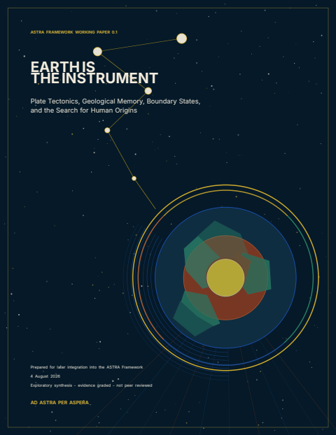

# Earth Is the Instrument - Working Paper 0.1

**Historical edition.** The current edition in this supplemental publication
line is [ASTRA Framework v0.3.0](../v0.3.0/). Version 0.1 remains available for
stable citation and comparison.

**Project-level provenance.** ASTRA was developed by Jacko T. with substantive
ChatGPT assistance; Jacko T. remains responsible for the work and its
publication. The name draws inspiration from the Kansas motto *Ad Astra Per
Aspera* and OpenAI's 1 August 2026 public description of an internal version of
Astra. The project is independent and unaffiliated. See the repository's full
[name, assistance, responsibility, and no-affiliation
disclosure](../../../README.md#name-assistance-and-independence).

[Read or download the normalized PDF (44 pages, about 710 KiB)](ASTRA_Earth_Is_the_Instrument_Working_Paper_v0.1.pdf)

## Status and relationship to SPPT/ASTRA

This is a **supplemental exploratory working paper**, version 0.1, dated
4 August 2026. It is evidence graded and **not peer reviewed**. It develops a
boundary-state reading of plate tectonics, geological memory, origin-of-life
environments, the archaeological record, and candidate historical instruments.

This paper preceded the current v0.3.0 supplemental framework. Neither edition
is part of the core reference line: v0.1 **does not amend or supersede
SPPT/ASTRA v1.0.6**, enter the v1.0.6 claim-admission matrix, provide empirical
validation of SPPT/ASTRA, or inherit the verification status of the reference
release.

## Text-first reading guide

The PDF is a fixed-layout illustrated document. Its text is searchable, its
fonts are embedded, and it has working bookmarks and links, but it is **not a
tagged PDF**: headings, lists, tables, formulas, links, and figures do not carry
a semantic structure tree or figure alternatives. This Markdown page is the
immediate text-first companion, not a claim that the PDF itself is accessible.

The paper's central proposal is that Earth is an active coupled system whose
interfaces can store history, select pathways, transform matter, and determine
which evidence survives. It treats plate boundaries as evolving subsystems;
connects geological environments to chemical selection; describes geology as
both archive and censor; and proposes tests that distinguish physical
possibility from demonstrated historical operation.

### Contents

1. A ground reading
2. Seven signals from 2026
3. Plate tectonics as a planetary boundary system
4. Before biology: a distributed geological nursery
5. Life becomes geology
6. Geology as archive and censor
7. The submerged human archive
8. Monuments as reorganized geology
9. Candidate origin stories
10. The ASTRA research program
11. Conclusions
12. Compact claim ledger, audit questions, and references

### Evidence vocabulary

| Label | Meaning in this working paper |
|---|---|
| Established | Repeated observation or strong support from direct measurement and mature theory. |
| Strong inference | The best explanation of convergent evidence, with revisable details. |
| Plausible | Physically and historically coherent, with partial supporting evidence. |
| Open | Not excluded, but not materially favored by current evidence. |
| Constrained | Possible only in narrow forms because expected evidence is absent or contradictory. |
| Unsupported | No positive evidence currently requires the claim. |

### Figure descriptions

1. **Seven 2026 signals:** seven labeled research areas surround an interface
   node, illustrating the shared lesson that interfaces can select pathways,
   retain history, and reorganize effects without implying one shared mechanism.
2. **Plate-boundary classes:** side-by-side diagrams compare divergent,
   convergent or subduction, and transform settings while noting that real
   margins combine stress, fluids, mineral reactions, and changing geometry.
3. **Distributed geological nursery:** cosmic inventory and multiple geological
   environments connect to coupled replicators, showing an origin network rather
   than one privileged location.
4. **Boundary-state ladder:** a vertical sequence runs from planetary
   differentiation through tectonic and living interfaces to external memory,
   material cosmologies, and a spacefaring phase.
5. **Geology as archive and censor:** a narrowing funnel follows lived history
   through deposition, preservation, exposure, and recognition to the much
   smaller observed record.
6. **Monuments as reorganized geology:** geological and ecological materials
   pass through quarrying, sorting, heating, carving, plating, and dyeing into
   the Giza complex and the Ark-Tabernacle literary/material tradition.
7. **Candidate origin stories:** a text-labeled matrix grades candidate stories
   across physics, geochemistry, biology, archaeology, and distinctive
   predictions; the labels carry the meaning, not color alone.
8. **ASTRA instrument test:** an operational chain runs from source through
   coupling, state change, output, residue, and prospective prediction, with a
   failed prediction required to revise the mechanism rather than the evidence.

## Editorial and scientific notes for 0.1

- The abstract's phrase "published or reported in August 2026" should be read as
  **available by August 2026**. Several cited papers were accepted or published
  in June or July. The DOI links are the authoritative status records.
- References 1 and 2 were accepted Physical Review Letters papers at the
  document date. Reference 3 was online ahead of its assigned September 2026
  issue. Those statuses are more precise than treating all three as ordinary
  August issue publications.
- The repeated caption form `Figure 2.1.:` is an editorial punctuation defect;
  it does not change the figure numbering or meaning.
- The Ark-Tabernacle discussion analyzes literary and material traditions. It
  does not establish the historicity of a particular artifact or demonstrate an
  electrical device.

These notes preserve the supplied scientific text while making known boundaries
visible to readers rather than silently rewriting the immutable v0.1 PDF.

## Integrity and normalization

The supplied file
`ASTRA_Earth_Is_The_Instrument_Working_Paper_0.1_cover_geometry_fixed.pdf`
had SHA-256
`1982d988981e046ed3b083835144fb83d4e98b2dca92454903472c265f4e7220`.
The published PDF has SHA-256
`d0eaf61661e69395a6f3895167abb55d7b801480391f672966d359194e9b46d0`.

The publication normalization corrected the visible page-label sequence,
redirected ten premature navigation targets to their visibly typeset headings,
and replaced repair-history metadata with stable document metadata. It did not
alter page text or graphics. All 44 source and published pages were rendered at
the same resolution and compared pixel-for-pixel with no differences.

Checksums are in [SHA256SUMS.txt](SHA256SUMS.txt). The versioned public release is
[earth-instrument-wp-0.1](https://github.com/jkolantree/astra/releases/tag/earth-instrument-wp-0.1).
The repository also preserves an [archived copy of the immutable release
body](../../../RELEASE_NOTES_earth-instrument-wp-0.1.md).

## Citation

The repository-level `CITATION.cff` describes the core SPPT/ASTRA v1.0.6
reference release, not this historical supplemental paper. Cite v0.1 as:

> ASTRA Framework Working Paper. (2026). *Earth Is the Instrument: Plate
> Tectonics, Geological Memory, Boundary States, and the Search for Human
> Origins*. Working Paper 0.1. GitHub.
> https://github.com/jkolantree/astra/releases/tag/earth-instrument-wp-0.1

## Rights and provenance

The repository owner supplied the PDF and explicitly authorized its public
distribution as an ASTRA supplemental resource. Version 0.1 does not contain a
separate copyright or reuse license, so **no reuse license is asserted for the
PDF or cover image**. Cited publications remain under their own terms. The cover
page and diagrams embedded in the PDF are distributed as supplied; `cover.png`
is a 480 by 622 pixel rendering derived from the supplied PDF's first page. No
independent rights or provenance claim is made for that companion image.

The PDF embeds subsets of Inter and EB Garamond under the SIL Open Font
License 1.1, Latin Modern Math under the GUST Font License, and DejaVu Sans
under the DejaVu, Bitstream Vera, and Arev terms. Exact copyright notices and
local license text or pointers are in [FONT_NOTICES.txt](FONT_NOTICES.txt).
The release publishes that notice alongside the PDF; redistribute them
together.

To report a reading or accessibility problem, use the public
[accessibility issue form](https://github.com/jkolantree/astra/issues/new?template=accessibility.yml)
after removing secrets, private paths, account details, and non-public data.
