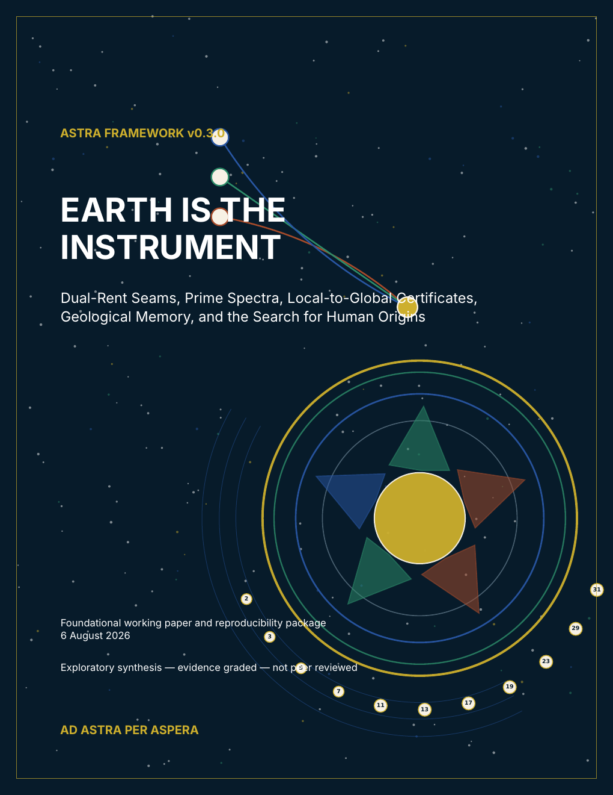

# ASTRA Framework v0.3.0 — *Earth Is the Instrument*

**Current supplemental edition · immutable GitHub prerelease · foundational
working paper · evidence graded · not peer reviewed · separate from SPPT/ASTRA
v1.0.6.**

This edition develops the separately versioned *Earth Is the Instrument*
working-paper line through dual-rent seams, local-to-global certificates,
geological memory, evidence independence, and an exact arithmetic-seam
laboratory. Version 0.3.0 supersedes the internal v0.2.1 predecessor preserved
inside its release archive, **only within this supplemental publication line**;
no public v0.2.1 tag or GitHub Release was created. It does not amend or
supersede the immutable SPPT/ASTRA v1.0.6 reference release, enter its
claim-admission matrix, or inherit its verification status.

## Read and use the work

- [Open the versioned overview and complete file map](https://jkolantree.github.io/astra/resources/earth-is-the-instrument/v0.3.0/)
- [Start with the reflowable public ground reading](https://jkolantree.github.io/astra/resources/earth-is-the-instrument/v0.3.0/ground-reading/)
- [Use the accessible browser audit worksheet](https://jkolantree.github.io/astra/resources/earth-is-the-instrument/v0.3.0/audit-form/)
- [Read or download the complete framework PDF (171 pages)](ASTRA_Framework_v0.3.0_Earth_Is_The_Instrument.pdf)
- [Download the compact public ground reading (2 pages)](ASTRA_v0.3.0_Public_Ground_Reading.pdf)
- [Download the printable audit form (1 page)](ASTRA_Dual_Rent_Local_to_Global_Audit_Form_v0.3.0.pdf)
- [Read the internal verification report (3 pages)](ASTRA_v0.3.0_Verification_Report.pdf)
- [Read the post-publication documentation errata](ERRATA.md)
- [Read the archived immutable release-body record](../../../RELEASE_NOTES_earth-instrument-framework-v0.3.0.md)
- [Read the release-time publication-boundary audit](PUBLICATION_AUDIT.md)
- [Read the embedded-font and license notices](FONT_NOTICES.txt)
- [Download the complete source and reproducibility archive from the versioned release](https://github.com/jkolantree/astra/releases/tag/earth-instrument-framework-v0.3.0)

The complete archive is a GitHub Release asset rather than a Git-tracked
binary. It keeps the editable source, claim and source ledgers, visual manifest,
code, tests, generated data, failure archive, build records, and internal
checksums together.

## Name, assistance, and independence

ASTRA is the project's own acronym for **Astronomical State-Topology and
Reservoir Analysis**. This independent framework was developed by Jacko T. with
substantive assistance from OpenAI's ChatGPT, including literature organization,
adversarial review, equation checking, code drafting, visual design, editing,
document production, accessibility review, and release engineering. Jacko T.
selected the questions and final wording, reviewed and approved the released
work, and remains responsible for its sources, claims, interpretations, errors,
omissions, code, and publication decisions. Model output is not a citation,
experiment, proof, independent verification, peer review, or scientific
evidence; the evidentiary basis is the cited literature, declared calculations,
data, tests, and bounded certificates.

The name ASTRA draws inspiration from the Kansas state motto, [*Ad Astra Per
Aspera* — "To the Stars Through Difficulties"](https://www.kansas.gov/kbi/about/kbiseal.shtml),
and from [OpenAI's 1 August 2026 public description](https://openai.com/index/ten-advances-in-mathematics/)
of an internal version of Astra as "our next major model". These are dated
naming references only; they do not claim a product launch, release timing,
priority, affiliation, or endorsement.

ASTRA is not affiliated with, sponsored by, endorsed by, reviewed by, operated
by, or produced for OpenAI or the State of Kansas; use of ChatGPT does not imply
OpenAI endorsement. These references are descriptive acknowledgments only. This
publication neither claims nor contests exclusive rights in the word *Astra*
and places no restriction on unrelated uses. The "ASTRA Coherence Cell" named
in the paper is Jacko T.'s role-based review architecture, not a separate
institution, employer, committee, or roster of external reviewers.

The main framework PDF discloses language-model assistance and authorial
responsibility on its Document status page. The three compact companion PDFs do
not carry that disclosure; this release-level acknowledgment supplies the
shared provenance and responsibility statement for the package as a whole.
The [post-publication errata](ERRATA.md) record and correct the original
overstatement without changing authored PDF or manuscript-source bytes; the
archived release-body record preserves the historical wording.

## What v0.3.0 adds

- **Dual-rent seams:** dynamical rent asks whether intervention changes the
  reachable future; epistemic rent asks whether a seam and protocol improve or
  weaken discrimination among candidate generators.
- **Equifinality triad:** process equifinality, observation equifinality, and
  boundary amplification are kept distinct because they require different
  experimental repairs.
- **Local-to-global certificate stack:** local response, fibers,
  closure/infinity, arithmetic reduction, and formal replay are audited
  separately.
- **Arithmetic seam laboratory:** exact rational and modular calculations
  replay a three-variable Keller-map collision and a bounded prime-difference
  search.
- **Public failure memory:** rejected, narrowed, and still-exposed claims remain
  visible rather than being renamed away.

## Scientific and mathematical boundary

The physical, biological, geological, archaeological, and arithmetic examples
are calibration cases. They do not establish one hidden mechanism, directed
seeding, separate insertion of modern humans, a recent global industrial
predecessor, intentional operation of ancient electrical devices, or empirical
validation of SPPT/ASTRA. This working paper is not empirical validation of
SPPT/ASTRA.

The exact higher-dimensional Jacobian example does not settle the open
two-dimensional case. Prime reductions and a finite search are bounded
certificates, not characteristic-zero or unrestricted Diophantine proofs. The
synthetic benchmarks fit no planet, excavation, genome, historical text, or
mission dataset. The paper's specialist matrix assigns disciplinary
responsibilities; it does not mean that the named researchers, institutions,
or fields reviewed or endorsed ASTRA.

## Verification and accessibility

The package's internal report records **24 PASS, 2 PARTIAL, and 0 FAIL** gates.
The partial gates concern unavailable byte-identical foundational inputs and
functional reconstructions of earlier computational files. This is an internal
release audit, not external scientific review or endorsement.

The four PDFs in this directory are text based, searchable, tagged, and use
embedded fonts. The main paper contains bookmarks, links, and figure
alternatives. The four PDFs are not claimed as PDF/UA-conformant or fully
accessible: mathematical semantics and some heading/table relationships remain
incomplete, some fixed-layout text is very small, and the audit PDF is a static
printable worksheet rather than an interactive form. The browser-readable Pages
companions are the primary reflowable entry points.

The normalized package passed **29 isolated regression tests** and the public
fail-closed release gate passed **90 of 90 checks**. It records an exact tested
Python environment and supported dependency ranges, but it does not freeze a
complete TeX environment, so byte-identical PDF rebuilding on arbitrary systems
is not claimed. Source mirrors and stable public aliases preserve two drafting
lineages without publishing private object identifiers; byte identity with the
absent foundational originals is not claimed.

The tag-bound [SHA256SUMS.txt](SHA256SUMS.txt) covers all ten release payloads,
including the complete archive, its dedicated checksum and verification
sidecars, the four PDFs, cover, notices, and publication audit.

## Normalized archive identity

- Filename: `ASTRA_Framework_v0.3.0_Dual_Rent_Arithmetic_Seams.zip`
- Size: **35,343,563 bytes**
- Members: **341**
- SHA-256: `b2a1072c14f1afff43a161b57620cdd2f6ad19b03884e7b5d8fbdd023333e09d`

The supplier's original candidate archive had SHA-256
`2f8c26c92826c0464ae88048d9c3e68a4404ee5d9b8f46a660a0733ccddd75ab`.
Pre-publication normalization corrected release metadata, public identifiers,
ledger reverse mappings, input validation, reproducibility isolation, and
accessibility disclosures while preserving the four authored PDFs byte for
byte. The release-time [publication audit](PUBLICATION_AUDIT.md) records the
scope and a verifier-independent extraction replay; it is not an external
scientific audit.

## Citation

The repository-level `CITATION.cff` describes the core SPPT/ASTRA v1.0.6
reference release, not this supplemental line. Cite v0.3.0 as:

> Jacko T. (2026). *Earth Is the Instrument: Dual-Rent Seams, Prime Spectra,
> Local-to-Global Certificates, Geological Memory, and the Search for Human
> Origins*. ASTRA Framework v0.3.0. GitHub.
> https://github.com/jkolantree/astra/releases/tag/earth-instrument-framework-v0.3.0

## Rights and reporting

The package declares original text and figures under CC BY 4.0 and source code
under MIT. Cited publications, names, data, trademarks, embedded fonts, and
other third-party material retain their own terms. The repository
[license map](../../../LICENSE_MAP.md) and the release's accompanying notices
state the file-level boundaries.

Report scientific, reproducibility, or accessibility concerns through the
[public issue forms](https://github.com/jkolantree/astra/issues/new/choose)
after removing secrets, private paths, account details, and non-public data.

**Ad Astra Per Aspera.**
